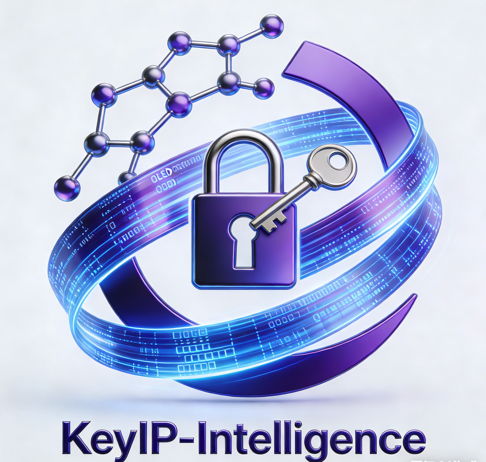

<p align="center">
  
</p>

<h1 align="center">KeyIP-Intelligence</h1>

<p align="center">
  <strong>面向OLED有机材料领域的AI驱动知识产权全生命周期智能管理平台</strong>
</p>

<p align="center">
  <a href="#"></a>
  <a href="#"></a>
  <a href="#"></a>
  <a href="#"></a>
  <a href="#"></a>
  <a href="README.md"></a>
</p>

<p align="center">
  <a href="docs/architecture.md">架构设计</a> |
  <a href="docs/apis.md">API参考</a> |
  <a href="CONTRIBUTING.md">贡献指南</a> |
  <a href="LICENSE">许可证</a>
</p>

---

## 使命宣言

KeyIP-Intelligence 是全球首个专为 OLED 有机材料领域构建的开源**分子级知识产权智能平台**。它将深度化学结构理解、专利法律推理与材料科学知识深度融合，提供通用工具无法实现的全生命周期IP管理能力。

该平台解决了一个根本性的缺口：现有专利分析工具将化学视为文本。它们无法区分苯环上一个取代基位置差异的两个分子——而在OLED材料领域，这种差异可能意味着自由实施与专利侵权之间的分界线。KeyIP-Intelligence 在原子级别弥合了这一缺口。

---

## 为什么选择 KeyIP-Intelligence？

### 行业痛点

OLED有机材料领域面临着独特而严峻的知识产权挑战：

| 挑战 | 描述 | 影响 |
|:-----|:-----|:-----|
| **分子级专利壁垒** | 头部企业利用Markush通式结构构建密集的专利围栏，单个通式可覆盖数百万个具体化合物 | 新进入者无法在缺乏深度化学分析的情况下评估自由实施空间 |
| **跨法域复杂性** | 单一材料可能被横跨CNIPA、USPTO、EPO、JPO、KIPO的专利族覆盖，且各法域权利要求范围存在差异 | 人工跟踪5个以上法域容易出错且效率低下 |
| **构效关系盲区** | 微小的取代基变化可能同时剧烈改变材料性能和专利覆盖范围 | 通用工具无法捕捉这些关键区别 |
| **生命周期管理负担** | 跨多国管理数百件专利的期限、年金和法律状态变更 | 期限遗漏将导致不可逆的专利权丧失 |
| **竞争情报滞后** | 竞争对手的战略性申请需要数周甚至数月才能被传统监测手段发现 | 发现延迟压缩了防御应对的时间窗口 |

### KeyIP-Intelligence 的解决方案

KeyIP-Intelligence 构建在四种能力的交叉点上，这是现有任何平台都不具备的组合：

```

化学结构理解能力  x  专利法律智能
x                    x
材料科学知识      x  全生命周期管理

```

**性能基准目标：**

| 指标 | KeyIP-Intelligence 目标 | 行业基线（通用工具） |
|:-----|:------------------------|:-------------------|
| 分子相似度检索（10万分子库） | < 800ms（P99） | 5-15秒（基于关键词） |
| 侵权风险评估准确率 | > 82%（OLED专用测试集） | ~55%（纯文本匹配） |
| 新专利检测延迟 | < 24小时（自公开日起） | 7-30天（定期告警） |
| Markush结构覆盖范围计算 | 支持（凸包估计法） | 不支持 |
| 权利要求要素分解准确率 | > 78%（ClaimBERT v1） | 仅支持人工分析 |
| 期限计算正确率 | 100%（规则引擎验证） | 人工计算，易出错 |

---

## 核心功能

### 1. AI专利挖掘工作台
- **可专利性预评估**：输入分子结构（SMILES/InChI），获得针对全球OLED专利语料库的新颖性和创造性评分
- **专利空白区发现**：利用降维分子指纹图谱可视化展示未被专利覆盖的分子空间区域
- **化学实体抽取**：从专利文档中自动提取分子结构、性能数据和工艺参数

### 2. 实时侵权监测中心
- **分子结构相似度告警**：持续监测新公开专利，进行结构级匹配（Tanimoto系数、GNN嵌入）
- **权利要求覆盖分析**：自动分解独立权利要求并展开Markush结构
- **竞争对手追踪**：持续监控关键竞争对手在所有主要专利局的申请活动

### 3. 专利组合优化器
- **专利星图**：交互式分子空间可视化，展示组合覆盖范围、空白区域和竞争对手位置
- **价值评估引擎**：对每件专利资产进行多维度评分（技术、法律、商业、战略）
- **预算优化**：成本-价值分析，提供维护、放弃或加强的建议

### 4. 全生命周期管理台
- **多法域期限引擎**：自动计算中国、美国、欧洲、日本、韩国的法定期限，支持节假日感知日历
- **年金管理**：费用计算、多币种预算编制和缴费工作流集成
- **法律状态同步**：每日从专利局API同步，基于状态机的法律状态追踪

### 5. 合作伙伴生态门户
- **安全协作空间**：为专利代理机构提供隔离工作空间，支持RBAC、加密文件共享和数字水印
- **开放API平台**：基于OAuth 2.0的RESTful API，支持第三方集成

### 6. 管理驾驶舱与智能报告
- **战略全景**：一页式组合健康度、竞争定位和风险/机会面板
- **自然语言查询**：用自然语言提问，从知识图谱获取结构化答案
- **一键报告生成**：自动生成FTO报告、侵权分析和年度IP综述（PDF/DOCX）

---

## 架构概览

KeyIP-Intelligence 采用四层架构，各层职责严格分离：

```

+-------------------------------------------------------------------+
|                       应用层                                       |
|  专利挖掘 | 侵权监测 | 组合优化 | 生命周期管理 | 合作伙伴门户 | ...       |
+-------------------------------------------------------------------+
|                       智能层                                       |
|  MolPatent-GNN | ClaimBERT | StrategyGPT | ChemExtractor | ...    |
+-------------------------------------------------------------------+
|                       数据层                                       |
|  专利知识图谱 | 分子结构库 | 材料性能库 | 引用网络库                     |
+-------------------------------------------------------------------+
|                     基础设施层                                      |
|  OpenSearch | Milvus | Kafka | MinIO | Keycloak | Prometheus      |
+----------------------------------------------------------------- -+

````

完整的架构设计、组件分解、数据流图和部署拓扑，请参阅 **[docs/architecture.md](docs/architecture.md)**。

完整的OpenAPI规范，请参阅 **[docs/apis.md](docs/apis.md)**。

---

## 快速开始

### 前置条件

- Go 1.22 或更高版本
- Docker 和 Docker Compose（用于基础设施服务）
- Make（可选，用于构建自动化）

### 安装

```bash
# 克隆仓库
git clone https://github.com/turtacn/KeyIP-Intelligence.git
cd KeyIP-Intelligence

# 构建项目
make build

# 或直接安装
go install github.com/turtacn/KeyIP-Intelligence/cmd/keyip@latest
````

### 使用 Docker Compose 快速启动

```bash
# 启动所有基础设施服务（PostgreSQL、Neo4j、OpenSearch、Redis、Kafka、MinIO）
docker-compose up -d

# 执行数据库迁移
make migrate

# 启动API服务器
make run-api

# 启动后台工作进程
make run-worker
```

### 基本使用

**通过CLI进行分子相似度检索：**

```bash
# 分子相似度检索
keyip search molecule \
  --smiles "c1ccc2c(c1)c1ccccc1n2-c1ccc(-c2ccc3c(c2)c2ccccc2n3C)cc1" \
  --threshold 0.70 \
  --offices CNIPA,USPTO,EPO \
  --limit 20

# 评估分子的侵权风险
keyip assess infringement \
  --smiles "c1ccc2c(c1)c1ccccc1n2-c1ccccc1" \
  --target-patent "CN115000001A" \
  --include-equivalents

# 查看即将到期的期限
keyip lifecycle deadlines --days 90 --jurisdiction CN,US,EP
```

**编程方式使用（Go客户端）：**

```go
package main

import (
    "context"
    "fmt"
    "log"

    "github.com/turtacn/KeyIP-Intelligence/pkg/client"
    "github.com/turtacn/KeyIP-Intelligence/pkg/types/molecule"
)

func main() {
    c, err := client.New(client.Config{
        BaseURL: "http://localhost:8080",
        APIKey:  "your-api-key",
    })
    if err != nil {
        log.Fatal(err)
    }

    // 检索具有相似分子结构的专利
    results, err := c.Molecules().SimilaritySearch(context.Background(), &molecule.SimilaritySearchRequest{
        SMILES:     "c1ccc2c(c1)c1ccccc1n2-c1ccccc1",
        Threshold:  0.70,
        Offices:    []string{"CNIPA", "USPTO", "EPO"},
        MaxResults: 20,
    })
    if err != nil {
        log.Fatal(err)
    }

    for _, r := range results.Hits {
        fmt.Printf("专利: %s | 相似度: %.2f | 风险: %s\n",
            r.PatentNumber, r.SimilarityScore, r.InfringementRisk)
    }
}
```

**REST API 示例：**

```bash
# 通过API进行分子相似度检索
curl -X POST http://localhost:8080/api/v1/molecules/similarity-search \
  -H "Authorization: Bearer ${TOKEN}" \
  -H "Content-Type: application/json" \
  -d '{
    "molecule": {
      "format": "smiles",
      "value": "c1ccc2c(c1)c1ccccc1n2-c1ccccc1"
    },
    "search_params": {
      "similarity_threshold": 0.70,
      "max_results": 20,
      "patent_offices": ["CNIPA", "USPTO", "EPO"]
    },
    "analysis_options": {
      "include_claim_analysis": true,
      "include_infringement_risk": true
    }
  }'
```

---

## 项目结构

```
KeyIP-Intelligence/
├── cmd/                    # 应用入口
│   ├── keyip/              # CLI工具
│   ├── apiserver/          # API服务器
│   └── worker/             # 后台工作进程
├── internal/               # 私有应用代码
│   ├── domain/             # 领域模型与业务逻辑
│   ├── application/        # 应用服务（用例）
│   ├── infrastructure/     # 外部系统适配器
│   ├── interfaces/         # HTTP处理器、gRPC、CLI
│   └── config/             # 配置管理
├── pkg/                    # 公共库
│   ├── client/             # Go客户端SDK
│   ├── types/              # 共享类型定义
│   └── errors/             # 错误类型与错误码
├── api/                    # API规范（OpenAPI）
├── deployments/            # Docker、Kubernetes清单
├── docs/                   # 文档
├── scripts/                # 构建与工具脚本
├── test/                   # 集成测试与端到端测试
└── web/                    # 前端应用（React）
```

完整的文件清单和详细架构，请参阅 **[docs/architecture.md](docs/architecture.md)**。

---

## 贡献指南

我们欢迎来自开发者、化学家、专利从业者和材料科学家的贡献。KeyIP-Intelligence 处于多个学科的交叉点，多元化的专业知识使平台更加强大。

请阅读 **[CONTRIBUTING.md](CONTRIBUTING.md)** 了解以下详情：

* 行为准则
* 开发环境搭建
* 编码规范与提交约定
* Pull Request 流程
* Issue 报告指南

### 开发快速入门

```bash
# 安装开发依赖
make dev-setup

# 运行单元测试
make test

# 运行代码检查
make lint

# 运行集成测试（需要Docker）
make test-integration

# 生成API文档
make docs
```

---

## 路线图

| 阶段           | 时间线     | 重点                            |
| :----------- | :------ | :---------------------------- |
| **第一阶段：奠基期** | 第1-8月   | 知识图谱、分子检索、侵权检测、生命周期管理MVP      |
| **第二阶段：扩展期** | 第9-18月  | 组合优化器、管理驾驶舱、StrategyGPT、私有化部署 |
| **第三阶段：生态期** | 第19-30月 | 合作伙伴门户、开放API平台、国际化、插件市场       |

---

## 许可证

KeyIP-Intelligence 基于 **Apache License 2.0** 开源许可。完整许可文本请参阅 [LICENSE](LICENSE)。

---

## 致谢

KeyIP-Intelligence 的构建离不开众多优秀开源项目的支撑：

- [RDKit](https://www.rdkit.org/) — 化学信息学工具包（BSD）
- [DeepChem](https://deepchem.io/) — 分子机器学习（MIT）
- [ChemDataExtractor](http://chemdataextractor.org/) — 化学数据抽取（MIT）
- [Neo4j](https://neo4j.com/) — 图数据库
- [OpenSearch](https://opensearch.org/) — 搜索与分析引擎（Apache 2.0）
- [Milvus](https://milvus.io/) — 向量数据库（Apache 2.0）

---

<p align="center">
  <sub>为OLED材料社区而建。分子级别的精准。</sub>
</p>