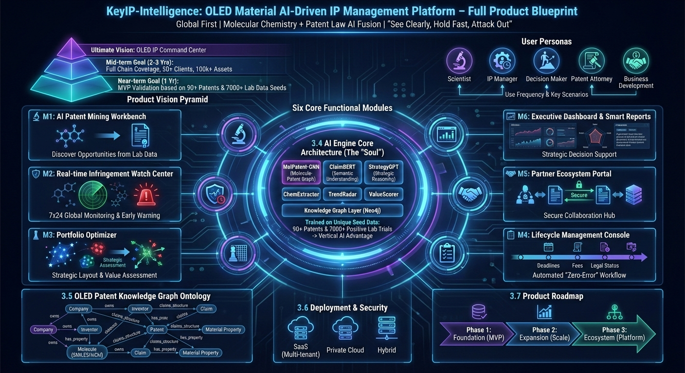

<p align="center">
  
</p>

<h1 align="center">KeyIP-Intelligence</h1>

<p align="center">
  <strong>AI-Driven Intellectual Property Lifecycle Intelligence Platform for OLED Organic Materials</strong>
</p>

<p align="center">
  <a href="#"></a>
  <a href="#"></a>
  <a href="#"></a>
  <a href="#"></a>
  <a href="#"></a>
  <a href="README-zh.md"></a>
</p>

<p align="center">
  <a href="docs/architecture.md">Architecture</a> |
  <a href="docs/apis.md">API Reference</a> |
  <a href="CONTRIBUTING.md">Contributing</a> |
  <a href="LICENSE">License</a>
</p>

---

## Mission Statement

KeyIP-Intelligence is the first open-source platform purpose-built for **molecular-level intellectual property intelligence** in the OLED organic materials domain. It fuses deep chemical structure understanding with patent law reasoning and materials science knowledge to deliver a full-lifecycle IP management system that no general-purpose tool can match.

The platform addresses a fundamental gap: existing patent analytics tools treat chemistry as text. They cannot distinguish between two molecules that differ by a single substituent on a phenyl ring — a difference that, in OLED materials, can mean the boundary between freedom-to-operate and patent infringement. KeyIP-Intelligence closes this gap by operating at the atomic level.

<p align="center">
  
</p>

---

## Why KeyIP-Intelligence?

### The Industry Problem

The OLED organic materials sector faces a uniquely challenging IP landscape:

| Challenge | Description | Impact |
|:----------|:------------|:-------|
| **Molecular-level patent barriers** | Major players construct dense patent fences using Markush structures that can cover millions of specific compounds | New entrants cannot assess freedom-to-operate without deep chemical analysis |
| **Cross-jurisdictional complexity** | A single material may be covered by patent families across CNIPA, USPTO, EPO, JPO, and KIPO with divergent claim scopes | Manual tracking across 5+ jurisdictions is error-prone and slow |
| **Structure-activity blind spots** | A minor substituent change can dramatically alter both material performance and patent coverage | General-purpose tools miss these critical distinctions |
| **Lifecycle management overhead** | Managing deadlines, annuities, and legal status changes across hundreds of patents in multiple countries | Missed deadlines lead to irreversible patent loss |
| **Competitive intelligence lag** | Competitors file strategically; detecting new filings takes weeks or months with traditional monitoring | Late detection narrows the window for defensive action |

### How KeyIP-Intelligence Solves This

KeyIP-Intelligence is built on the intersection of four capabilities that no existing platform combines:

```

Chemical Structure Understanding  x  Patent Law Intelligence
x                              x
Materials Science Knowledge       x  Full Lifecycle Management

```

**Performance Benchmarks (Target):**

| Metric | KeyIP-Intelligence Target | Industry Baseline (General Tools) |
|:-------|:--------------------------|:----------------------------------|
| Molecular similarity search (100K molecules) | < 800ms (P99) | 5-15s (keyword-based) |
| Infringement risk assessment accuracy | > 82% (on curated OLED test set) | ~55% (text-only matching) |
| New patent detection latency | < 24 hours from publication | 7-30 days (periodic alerts) |
| Markush structure coverage computation | Supported (convex hull estimation) | Not supported |
| Claim element decomposition accuracy | > 78% (ClaimBERT v1) | Manual only |
| Deadline calculation correctness | 100% (rule-engine verified) | Manual, error-prone |

---

## Key Features

### 1. AI Patent Mining Workbench
- **Patentability pre-assessment**: Input a molecular structure (SMILES/InChI), receive novelty and inventive step scoring against the global OLED patent corpus
- **Patent white-space discovery**: Visualize unclaimed regions in molecular space using dimensionality-reduced fingerprint maps
- **Chemical entity extraction**: Automatically extract molecular structures, performance data, and process parameters from patent documents

### 2. Real-Time Infringement Watch Center
- **Molecular similarity alerting**: Continuous monitoring of newly published patents with structure-level matching (Tanimoto, GNN embedding)
- **Claim coverage analysis**: Automated decomposition of independent claims with Markush structure expansion
- **Competitor tracking**: Persistent surveillance of assignee filing activity across all major patent offices

### 3. Portfolio Optimizer
- **Patent constellation map**: Interactive molecular-space visualization of portfolio coverage, gaps, and competitor positions
- **Value assessment engine**: Multi-dimensional scoring (technical, legal, commercial, strategic) for every patent asset
- **Budget optimization**: Cost-value analysis with recommendations for maintenance, abandonment, or reinforcement

### 4. Lifecycle Management Console
- **Multi-jurisdiction deadline engine**: Automatic computation of statutory deadlines across CN, US, EP, JP, KR with holiday-aware calendars
- **Annuity management**: Fee calculation, multi-currency budgeting, and payment workflow integration
- **Legal status synchronization**: Daily sync from patent office APIs with state-machine-based status tracking

### 5. Partner Ecosystem Portal
- **Secure collaboration spaces**: Isolated workspaces for patent agencies with RBAC, encrypted file sharing, and digital watermarking
- **Open API platform**: RESTful APIs with OAuth 2.0 for third-party integration

### 6. Executive Dashboard & Smart Reports
- **Strategic overview**: One-page portfolio health, competitive positioning, and risk/opportunity panels
- **Natural language query**: Ask questions in plain language, receive structured answers from the knowledge graph
- **One-click report generation**: Automated FTO reports, infringement analyses, and annual IP reviews in PDF/DOCX

---

## Architecture Overview

KeyIP-Intelligence follows a four-layer architecture with strict separation of concerns:

```
+-------------------------------------------------------------------+
|                    Application Layer                              |
|  Patent Mining | Infringement Watch | Portfolio | Lifecycle | ... |
+-------------------------------------------------------------------+
|                    Intelligence Layer                             |
|  MolPatent-GNN | ClaimBERT | StrategyGPT | ChemExtractor | ...    |
+-------------------------------------------------------------------+
|                       Data Layer                                  |
|  Patent KG (Neo4j) | Molecule DB | Property DB | Citation Net     |
+-------------------------------------------------------------------+
|                   Infrastructure Layer                            |
|  OpenSearch | Milvus | Kafka | MinIO | Keycloak | Prometheus      |
+-------------------------------------------------------------------+
````

For the complete architecture design, component breakdown, data flow diagrams, and deployment topology, see **[docs/architecture.md](docs/architecture.md)**.

For the full OpenAPI specification, see **[docs/apis.md](docs/apis.md)**.

---

## Getting Started

### Prerequisites

- Go 1.22 or later
- Docker and Docker Compose (for infrastructure services)
- Make (optional, for build automation)

### Installation

```bash
# Clone the repository
git clone https://github.com/turtacn/KeyIP-Intelligence.git
cd KeyIP-Intelligence

# Build the project
make build

# Or install directly
go install github.com/turtacn/KeyIP-Intelligence/cmd/keyip@latest
````

### Quick Start with Docker Compose

```bash
# Start all infrastructure services (PostgreSQL, Neo4j, OpenSearch, Redis, Kafka, MinIO)
docker-compose up -d

# Run database migrations
make migrate

# Start the API server
make run-api

# Start the monitoring worker
make run-worker
```

### Basic Usage

**Search for structurally similar patents via CLI:**

```bash
# Molecular similarity search
keyip search molecule \
  --smiles "c1ccc2c(c1)c1ccccc1n2-c1ccc(-c2ccc3c(c2)c2ccccc2n3C)cc1" \
  --threshold 0.70 \
  --offices CNIPA,USPTO,EPO \
  --limit 20

# Check infringement risk for a molecule
keyip assess infringement \
  --smiles "c1ccc2c(c1)c1ccccc1n2-c1ccccc1" \
  --target-patent "CN115000001A" \
  --include-equivalents

# List upcoming deadlines
keyip lifecycle deadlines --days 90 --jurisdiction CN,US,EP
```

**Programmatic usage (Go client):**

```go
package main

import (
    "context"
    "fmt"
    "log"

    "github.com/turtacn/KeyIP-Intelligence/pkg/client"
    "github.com/turtacn/KeyIP-Intelligence/pkg/types/molecule"
)

func main() {
    c, err := client.New(client.Config{
        BaseURL: "http://localhost:8080",
        APIKey:  "your-api-key",
    })
    if err != nil {
        log.Fatal(err)
    }

    // Search for patents with similar molecular structures
    results, err := c.Molecules().SimilaritySearch(context.Background(), &molecule.SimilaritySearchRequest{
        SMILES:    "c1ccc2c(c1)c1ccccc1n2-c1ccccc1",
        Threshold: 0.70,
        Offices:   []string{"CNIPA", "USPTO", "EPO"},
        MaxResults: 20,
    })
    if err != nil {
        log.Fatal(err)
    }

    for _, r := range results.Hits {
        fmt.Printf("Patent: %s | Similarity: %.2f | Risk: %s\n",
            r.PatentNumber, r.SimilarityScore, r.InfringementRisk)
    }
}
```

**REST API example:**

```bash
# Molecular similarity search via API
curl -X POST http://localhost:8080/api/v1/molecules/similarity-search \
  -H "Authorization: Bearer ${TOKEN}" \
  -H "Content-Type: application/json" \
  -d '{
    "molecule": {
      "format": "smiles",
      "value": "c1ccc2c(c1)c1ccccc1n2-c1ccccc1"
    },
    "search_params": {
      "similarity_threshold": 0.70,
      "max_results": 20,
      "patent_offices": ["CNIPA", "USPTO", "EPO"]
    },
    "analysis_options": {
      "include_claim_analysis": true,
      "include_infringement_risk": true
    }
  }'
```

---

## Project Structure

```
KeyIP-Intelligence/
├── cmd/                    # Application entry points
│   ├── keyip/              # CLI tool
│   ├── apiserver/          # API server
│   └── worker/             # Background worker
├── internal/               # Private application code
│   ├── domain/             # Domain models and business logic
│   ├── application/        # Application services (use cases)
│   ├── infrastructure/     # External system adapters
│   ├── interfaces/         # HTTP handlers, gRPC, CLI
│   └── config/             # Configuration management
├── pkg/                    # Public libraries
│   ├── client/             # Go client SDK
│   ├── types/              # Shared type definitions
│   └── errors/             # Error types and codes
├── api/                    # API specifications (OpenAPI)
├── deployments/            # Docker, Kubernetes manifests
├── docs/                   # Documentation
├── scripts/                # Build and utility scripts
├── test/                   # Integration and E2E tests
└── web/                    # Frontend application (React)
```

For the complete file listing and detailed architecture, see **[docs/architecture.md](docs/architecture.md)**.

---

## Contributing

We welcome contributions from developers, chemists, patent professionals, and materials scientists. KeyIP-Intelligence sits at the intersection of multiple disciplines, and diverse expertise makes the platform stronger.

Please read **[CONTRIBUTING.md](CONTRIBUTING.md)** for details on:

* Code of conduct
* Development setup
* Coding standards and commit conventions
* Pull request process
* Issue reporting guidelines

### Development Quick Start

```bash
# Install development dependencies
make dev-setup

# Run unit tests
make test

# Run linter
make lint

# Run integration tests (requires Docker)
make test-integration

# Generate API documentation
make docs
```

---

## Roadmap

| Phase                   | Timeline    | Focus                                                                               |
| :---------------------- | :---------- | :---------------------------------------------------------------------------------- |
| **Phase 1: Foundation** | Month 1-8   | Knowledge graph, molecular search, infringement detection, lifecycle management MVP |
| **Phase 2: Expansion**  | Month 9-18  | Portfolio optimizer, executive dashboard, StrategyGPT, private deployment           |
| **Phase 3: Ecosystem**  | Month 19-30 | Partner portal, open API platform, internationalization, plugin marketplace         |

---

## License

KeyIP-Intelligence is licensed under the **Apache License 2.0**. See [LICENSE](LICENSE) for the full text.

---

## Acknowledgments

KeyIP-Intelligence builds upon the work of many outstanding open-source projects:

* [RDKit](https://www.rdkit.org/) — Cheminformatics toolkit (BSD)
* [DeepChem](https://deepchem.io/) — Molecular machine learning (MIT)
* [ChemDataExtractor](http://chemdataextractor.org/) — Chemical data extraction (MIT)
* [Neo4j](https://neo4j.com/) — Graph database
* [OpenSearch](https://opensearch.org/) — Search and analytics (Apache 2.0)
* [Milvus](https://milvus.io/) — Vector database (Apache 2.0)

---

<p align="center">
  <sub>Built for the OLED materials community. Precision at the molecular level.</sub>
</p>