# KeyIP-Intelligence：智能知识产权生命周期管理平台 — 完整产品蓝图

---

## 一、市场全景与竞品深度分析

### 1.1 问题的本质：为什么OLED材料领域需要一个"专属"的IP智能平台？

在深入竞品分析之前，我们需要先理解一个根本性的矛盾——**OLED有机材料领域的知识产权管理，本质上是一场"分子级别的信息战"**。

想象一下：一个OLED发光材料的专利，其核心权利要求可能仅仅是一个苯环上取代基位置的微小差异。传统的专利检索工具用关键词匹配，就像用渔网去捞针——网眼太大，关键信息全部漏掉。而通用的AI专利平台虽然引入了语义搜索，但它们不懂化学结构，不理解OLED材料的构效关系，更无法判断一个分子骨架的微小修饰是否构成实质性的技术规避。

这就是钥熠公司面临的真实战场：**三星SDI、LG化学、出光兴产、默克、UDC（Universal Display Corporation）等巨头构建了层层叠叠的专利壁垒**，每一个新材料的商业化都需要在这些壁垒的缝隙中找到通路。而钥熠拥有的90+件专利和7000+正例试验数据，既是防御的盾牌，也是进攻的矛尖——但前提是，你必须精确地知道盾牌该举在哪里，矛尖该刺向何方。

这就是KeyIP-Intelligence存在的根本理由。

---

### 1.2 全球竞品全景扫描

我对全球范围内的专利分析、IP管理、材料信息学三大赛道进行了系统性梳理，筛选出与KeyIP-Intelligence定位最相关的15个平台/工具，按照"通用IP管理"、"AI专利分析"、"材料科学AI"、"开源工具链"四个象限进行分类：

#### 核心竞品对比矩阵

| 维度           | PatSnap 智慧芽        | Orbit Intelligence (Questel) | Derwent Innovation (Clarivate) | IPRally     | Anaqua    | Citrine Informatics | Lens.org (开源) | RDKit + DeepChem (开源) |
| :----------- | :----------------- | :--------------------------- | :----------------------------- | :---------- | :-------- | :------------------ | :------------ | :-------------------- |
| **定位**       | 全球专利大数据分析平台        | 专利检索与分析                      | 专利研究与引文分析                      | AI驱动专利检索    | 企业IP资产管理  | 材料信息学平台             | 开放专利检索        | 化学信息学工具包              |
| **AI能力**     | 语义搜索、专利价值评估、技术趋势预测 | 语义聚类、专利地图                    | 引文网络、Derwent分类                 | 图神经网络专利相似度  | 工作流自动化    | 材料性能预测ML            | 基础全文检索        | 分子指纹、QSAR建模           |
| **化学结构支持**   | 有限（Markush结构检索）    | 支持化学结构检索                     | 支持（通过Derwent化学索引）              | 不支持         | 不支持       | 材料组成分析              | 不支持           | 核心能力                  |
| **OLED领域适配** | ★★☆☆☆ 通用型          | ★★★☆☆ 化学检索较强                 | ★★★☆☆ 化学索引深                    | ★★☆☆☆ 通用型   | ★☆☆☆☆ 管理型 | ★★★★☆ 材料预测强         | ★☆☆☆☆ 基础型     | ★★★★★ 分子级分析           |
| **生命周期管理**   | 部分支持               | 部分支持                         | 不支持                            | 不支持         | 核心能力      | 不支持                 | 不支持           | 不支持                   |
| **侵权监测**     | 支持（Alert功能）        | 支持（Monitoring）               | 支持（Alert）                      | 相似度排序       | 不支持       | 不支持                 | 不支持           | 不支持                   |
| **私有化部署**    | 企业版支持              | 企业版支持                        | 不支持                            | 不支持         | 支持        | 支持                  | 自托管可行         | 完全本地                  |
| **开源/商业**    | 商业                 | 商业                           | 商业                             | 商业          | 商业        | 商业                  | 开源（CC BY 4.0） | 开源（BSD）               |
| **年费量级（估）**  | ¥15-80万            | ¥20-100万                     | ¥30-120万                       | ¥10-50万     | ¥50-200万  | 定制报价                | 免费            | 免费                    |
| **核心短板**     | 化学结构理解浅、无材料预测      | 无AI预测、无材料科学能力                | 老旧架构、无ML能力                     | 无化学理解、无管理功能 | 无分析能力、纯管理 | 无专利分析、无IP管理         | 功能极简          | 无专利功能、需大量开发           |

#### 补充竞品速览

| 工具/平台                             | 类型 | 核心亮点                | 与KeyIP关联度     |
| :-------------------------------- | :- | :------------------ | :------------ |
| **CPA Global (Clarivate)**        | 商业 | 全球最大IP服务商，年金管理、续费提醒 | 生命周期管理参考      |
| **Patentfield** (日本)              | 商业 | AI专利检索，日本专利覆盖强      | 日本OLED专利检索参考  |
| **Amplified AI / Specifio**       | 商业 | AI辅助专利撰写            | 专利挖掘-撰写环节参考   |
| **IPlytics**                      | 商业 | 标准必要专利(SEP)分析       | 显示标准相关专利参考    |
| **PQAI** (开源)                     | 开源 | 专利质量AI评估            | 专利价值评估模块参考    |
| **Patent2Net** (开源)               | 开源 | 专利网络可视化             | 专利地图可视化参考     |
| **ChemDataExtractor** (开源)        | 开源 | 从文献自动提取化学数据         | 专利挖掘-文献解析核心参考 |
| **MaterialsProject API** (开源)     | 开源 | 材料属性数据库与API         | 材料性能数据源参考     |
| **Schrödinger Materials Science** | 商业 | 计算材料科学模拟            | 分子性能预测参考      |
| **BIOVIA (Dassault)**             | 商业 | 材料建模与实验数据管理         | 实验数据管理参考      |

---

### 1.3 竞品深度洞察：每个玩家的"阿喀琉斯之踵"

**PatSnap（智慧芽）** — 中国市场占有率最高的专利分析平台，拥有1.7亿+专利数据，语义搜索和专利地图做得不错。但它的致命弱点在于：**对化学结构的理解停留在Markush结构检索层面**，无法进行真正的分子相似度计算。对于OLED材料这种"差之毫厘、谬以千里"的领域，这等于是瞎子摸象。

**Orbit Intelligence（Questel）** — 化学结构检索能力在通用平台中算最强的，支持子结构检索和Markush解析。但它的AI能力薄弱，本质上还是一个"高级搜索引擎"，无法做到主动的专利挖掘推荐和侵权风险预测。

**IPRally** — 用图神经网络做专利相似度匹配，技术路线很前沿。但它完全不理解化学，把一个OLED发光材料专利和一个LED封装专利判为高度相似的情况时有发生。

**Citrine Informatics** — 材料信息学领域的标杆，能做材料性能预测和逆向设计。但它完全不涉及知识产权，是一个纯粹的材料科学平台。

**关键洞察：市场上不存在一个平台能同时做到"懂化学结构 + 懂专利法 + 懂材料科学 + 全生命周期管理"。这四个能力的交叉点，就是KeyIP-Intelligence的蓝海。**

这就像是——PatSnap是一把瑞士军刀，什么都能切但都不够深；Citrine是一把手术刀，切得精准但只能切材料；而KeyIP-Intelligence要做的，是一把**专门为OLED材料专利战场锻造的激光手术刀**。

---

### 1.4 开源技术栈深度评估

KeyIP-Intelligence的技术底座可以充分利用以下开源项目，大幅降低研发成本：

| 开源项目                           | 许可证        | 用途映射               | 成熟度       | 集成复杂度 |
| :----------------------------- | :--------- | :----------------- | :-------- | :---- |
| **RDKit**                      | BSD        | 分子指纹计算、子结构匹配、化学相似度 | ★★★★★ 工业级 | 中等    |
| **DeepChem**                   | MIT        | 分子性质预测、图神经网络       | ★★★★☆     | 中高    |
| **ChemDataExtractor**          | MIT        | 从专利/论文自动提取化学实体和性质  | ★★★★☆     | 中等    |
| **CDDD**                       | MIT        | 连续分子描述符，分子空间映射     | ★★★☆☆     | 高     |
| **Lens.org API**               | CC BY 4.0  | 全球专利和学术文献检索        | ★★★★★     | 低     |
| **Patent2Net**                 | GPL        | 专利引用网络分析与可视化       | ★★★☆☆     | 中等    |
| **PQAI**                       | Apache 2.0 | 专利质量评估、现有技术检索      | ★★★☆☆     | 中等    |
| **Hugging Face Transformers**  | Apache 2.0 | 专利文本NLP、语义搜索       | ★★★★★     | 中等    |
| **MaterialsProject API**       | 开放         | OLED材料属性数据查询       | ★★★★★     | 低     |
| **Elasticsearch / OpenSearch** | Apache 2.0 | 专利全文索引与检索引擎        | ★★★★★     | 中等    |
| **Apache Airflow**             | Apache 2.0 | 数据管道编排、定时任务        | ★★★★★     | 中等    |
| **Keycloak**                   | Apache 2.0 | 身份认证与权限管理          | ★★★★★     | 低     |
| **MinIO**                      | AGPL/商业    | 对象存储（专利文档、分子文件）    | ★★★★★     | 低     |

---

## 二、顶级参考实现借鉴与架构启示

### 2.1 从六个标杆项目中提炼的设计哲学

在设计KeyIP-Intelligence的产品蓝图之前，我深入研究了六个在各自领域代表最高水准的产品，从中提炼出可迁移的设计原则：

#### 参考实现一：PatSnap 的"连接"哲学

PatSnap最值得学习的不是它的搜索功能，而是它的"**连接思维**"——它把专利数据、公司数据、技术趋势、投融资信息全部打通，让用户在一个界面里看到完整的竞争图景。KeyIP-Intelligence应该借鉴这种思维，但把"连接"的粒度从"公司-专利"下沉到"**分子结构-专利-材料性能-商业价值**"四层连接。

#### 参考实现二：IPRally 的图神经网络路线

IPRally用图神经网络（GNN）来理解专利之间的语义关系，这个技术路线非常适合OLED材料领域。因为分子本身就是图结构——原子是节点，化学键是边。KeyIP-Intelligence可以构建一个**双层图网络**：底层是分子图（原子-键），上层是专利图（专利-引用-权利要求），两层之间通过"分子-专利"映射关系连接。这种架构天然适合做"给定一个新分子，找到所有相关专利"的查询。

#### 参考实现三：Citrine Informatics 的逆向设计范式

Citrine最革命性的功能是**逆向设计**——你告诉系统"我需要一个发光效率>95%、寿命>50000小时的蓝光OLED材料"，系统会反向推荐候选分子结构。KeyIP-Intelligence应该把这个范式引入专利领域：**"我需要一个能绕开UDC专利壁垒、同时满足蓝光效率要求的分子骨架"**——这才是OLED材料研发人员真正的需求。

#### 参考实现四：Anaqua 的企业级IP管理工作流

Anaqua在IP生命周期管理方面是行业标杆，它的工作流引擎支持从发明披露、专利申请、审查答复到年金缴纳的全流程自动化。KeyIP-Intelligence的生命周期管理模块应该达到Anaqua的专业度，但要更轻量、更适合中型企业。

#### 参考实现五：ChemDataExtractor 的文献智能解析

剑桥大学开发的ChemDataExtractor能从非结构化的科学文献中自动提取化学实体、性质数据和关系。这是KeyIP-Intelligence"专利挖掘"功能的技术基石——从海量专利文本中自动识别分子结构、材料性能数据、制备工艺参数。

#### 参考实现六：Elasticsearch 的实时监测架构

Elasticsearch的Watcher功能 + Percolator查询模式，天然适合做"侵权监测"——预先定义监测规则（分子骨架、技术关键词、竞争对手），当新专利进入系统时自动匹配并触发告警。这比PatSnap的定期邮件Alert要实时得多。

---

### 2.2 架构设计总纲

综合以上参考实现，KeyIP-Intelligence的技术架构应该是一个"**四层蛋糕**"：

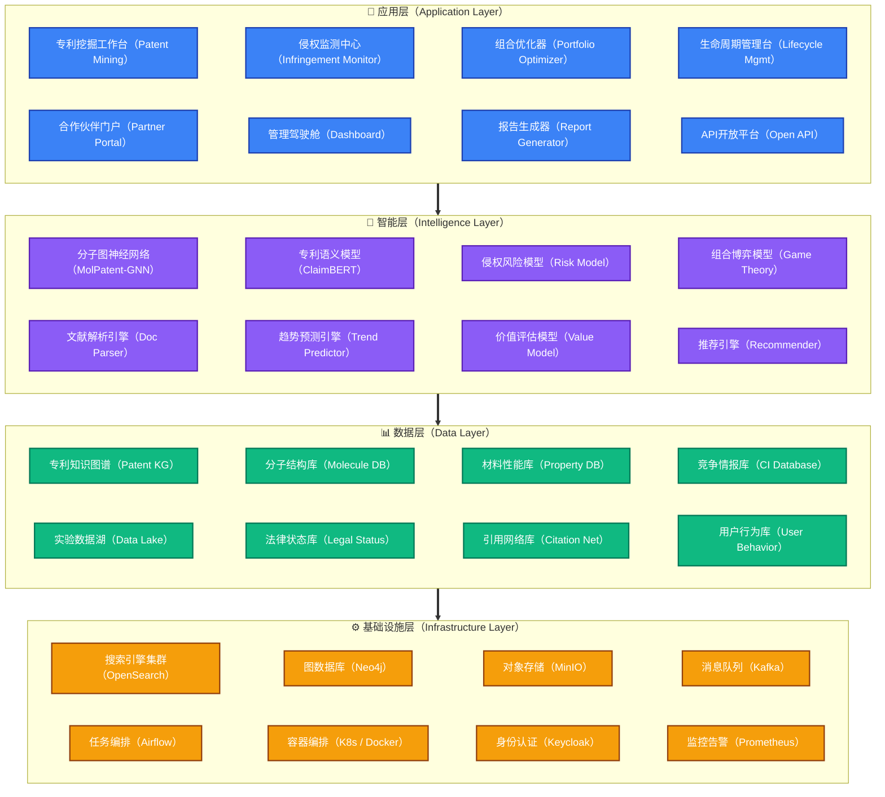
```mermaid
graph TD
    %% KeyIP-Intelligence 平台四层技术架构
    
    %% 图例（Legend）置顶
    %%subgraph LEGEND[图例（Legend）]
    %%    direction LR
    %%    LG1[🎯 应用层]:::appStyle
    %%    LG2[🧠 智能层]:::intStyle
    %%    LG3[📊 数据层]:::dataStyle
    %%    LG4[⚙️ 基础设施层]:::infraStyle
    %%    LG1 ~~~ LG2 ~~~ LG3 ~~~ LG4
    %%end

    %% 应用层
    subgraph AL[🎯 应用层（Application Layer）]
        AL1[专利挖掘工作台（Patent Mining）]:::appStyle
        AL2[侵权监测中心（Infringement Monitor）]:::appStyle
        AL3[组合优化器（Portfolio Optimizer）]:::appStyle
        AL4[生命周期管理台（Lifecycle Mgmt）]:::appStyle
        AL5[合作伙伴门户（Partner Portal）]:::appStyle
        AL6[管理驾驶舱（Dashboard）]:::appStyle
        AL7[报告生成器（Report Generator）]:::appStyle
        AL8[API开放平台（Open API）]:::appStyle
        AL1 ~~~ AL2 ~~~ AL3 ~~~ AL4
        AL5 ~~~ AL6 ~~~ AL7 ~~~ AL8
    end

    %% 智能层
    subgraph IL[🧠 智能层（Intelligence Layer）]
        IL1[分子图神经网络（MolPatent-GNN）]:::intStyle
        IL2[专利语义模型（ClaimBERT）]:::intStyle
        IL3[侵权风险模型（Risk Model）]:::intStyle
        IL4[组合博弈模型（Game Theory）]:::intStyle
        IL5[文献解析引擎（Doc Parser）]:::intStyle
        IL6[趋势预测引擎（Trend Predictor）]:::intStyle
        IL7[价值评估模型（Value Model）]:::intStyle
        IL8[推荐引擎（Recommender）]:::intStyle
        IL1 ~~~ IL2 ~~~ IL3 ~~~ IL4
        IL5 ~~~ IL6 ~~~ IL7 ~~~ IL8
    end

    %% 数据层
    subgraph DL[📊 数据层（Data Layer）]
        DL1[专利知识图谱（Patent KG）]:::dataStyle
        DL2[分子结构库（Molecule DB）]:::dataStyle
        DL3[材料性能库（Property DB）]:::dataStyle
        DL4[竞争情报库（CI Database）]:::dataStyle
        DL5[实验数据湖（Data Lake）]:::dataStyle
        DL6[法律状态库（Legal Status）]:::dataStyle
        DL7[引用网络库（Citation Net）]:::dataStyle
        DL8[用户行为库（User Behavior）]:::dataStyle
        DL1 ~~~ DL2 ~~~ DL3 ~~~ DL4
        DL5 ~~~ DL6 ~~~ DL7 ~~~ DL8
    end

    %% 基础设施层
    subgraph INF[⚙️ 基础设施层（Infrastructure Layer）]
        INF1[搜索引擎集群（OpenSearch）]:::infraStyle
        INF2[图数据库（Neo4j）]:::infraStyle
        INF3[对象存储（MinIO）]:::infraStyle
        INF4[消息队列（Kafka）]:::infraStyle
        INF5[任务编排（Airflow）]:::infraStyle
        INF6[容器编排（K8s / Docker）]:::infraStyle
        INF7[身份认证（Keycloak）]:::infraStyle
        INF8[监控告警（Prometheus）]:::infraStyle
        INF1 ~~~ INF2 ~~~ INF3 ~~~ INF4
        INF5 ~~~ INF6 ~~~ INF7 ~~~ INF8
    end

    %% 层间依赖
    AL ==> IL
    IL ==> DL
    DL ==> INF

    %% 样式定义
    classDef appStyle fill:#3B82F6,stroke:#1E40AF,color:#FFF,stroke-width:2px
    classDef intStyle fill:#8B5CF6,stroke:#5B21B6,color:#FFF,stroke-width:2px
    classDef dataStyle fill:#10B981,stroke:#047857,color:#FFF,stroke-width:2px
    classDef infraStyle fill:#F59E0B,stroke:#92400E,color:#FFF,stroke-width:2px

```

---

## 三、KeyIP-Intelligence 完整产品蓝图

### 3.1 产品愿景与定位

> **一句话定位：** KeyIP-Intelligence是全球首个专为OLED有机材料领域打造的AI驱动知识产权全生命周期智能管理平台，将分子级化学理解与专利法律智能深度融合，帮助OLED材料企业在全球专利博弈中实现"看得清、守得住、攻得出"。

**产品愿景金字塔：**

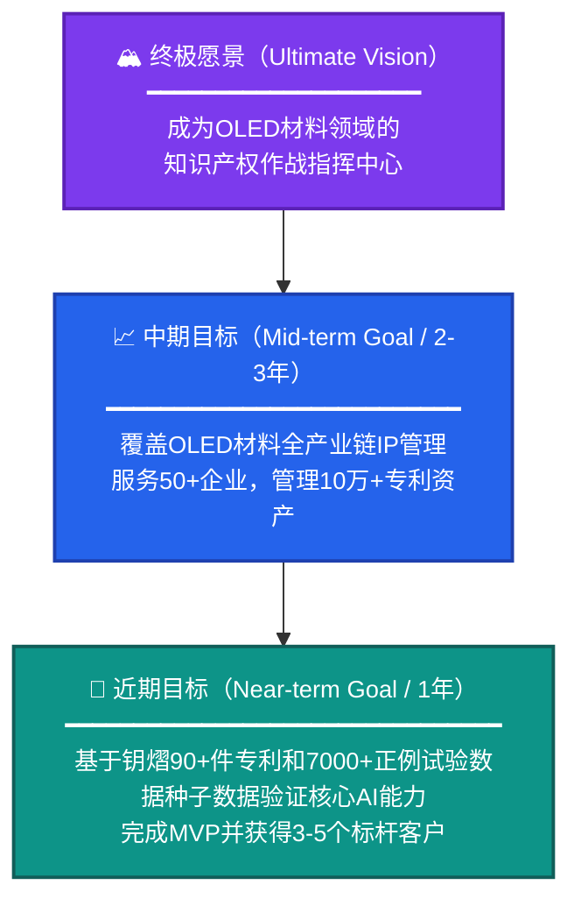
```mermaid
graph TD
    %% ============================================
    %% 产品愿景金字塔（Product Vision Pyramid）
    %% ============================================

    V1["🏔️ 终极愿景（Ultimate Vision）<br/>━━━━━━━━━━━━━━━━━━━━<br/>成为OLED材料领域的<br/>知识产权作战指挥中心"]
    V2["📈 中期目标（Mid-term Goal / 2-3年）<br/>━━━━━━━━━━━━━━━━━━━━━━━━━━<br/>覆盖OLED材料全产业链IP管理<br/>服务50+企业，管理10万+专利资产"]
    V3["🚀 近期目标（Near-term Goal / 1年）<br/>━━━━━━━━━━━━━━━━━━━━━━━━━━━━━━━━<br/>基于钥熠90+件专利和7000+正例试验数据种子数据验证核心AI能力<br/>完成MVP并获得3-5个标杆客户"]

    V1 --> V2 --> V3

    %% 样式定义
    classDef topStyle fill:#7C3AED,stroke:#5B21B6,color:#FFFFFF,stroke-width:2px,font-size:14px
    classDef midStyle fill:#2563EB,stroke:#1E40AF,color:#FFFFFF,stroke-width:2px,font-size:14px
    classDef baseStyle fill:#0D9488,stroke:#115E59,color:#FFFFFF,stroke-width:2px,font-size:14px

    %% 应用样式
    class V1 topStyle
    class V2 midStyle
    class V3 baseStyle

```

---

### 3.2 用户角色画像

| 角色        | 典型人物            | 核心痛点                       | 使用频率 | 关键场景                |
| :-------- | :-------------- | :------------------------- | :--- | :------------------ |
| **研发科学家** | OLED材料合成研究员     | "我设计了一个新分子，不知道是否侵权"        | 每日   | 分子自由度检查、专利规避设计      |
| **IP经理**  | 知识产权部门负责人       | "90个专利的年金、期限、法律状态管理让我焦头烂额" | 每日   | 生命周期管理、费用预算、组合分析    |
| **战略决策者** | CTO / VP of R&D | "我需要知道我们的专利布局在全球竞争中处于什么位置" | 每周   | 竞争态势分析、布局策略、投资决策    |
| **专利代理人** | 合作专利事务所律师       | "撰写OLED材料专利需要精准的现有技术检索"    | 每周   | 现有技术检索、权利要求优化、FTO分析 |
| **商务拓展**  | BD / 许可谈判人员     | "哪些专利可以对外许可？许可费该定多少？"      | 每月   | 专利价值评估、许可机会识别       |

---

### 3.3 六大核心功能模块详细蓝图

---

#### 模块一：🔬 AI专利挖掘工作台（Patent Mining Workbench）

**模块哲学：** 不是"搜索专利"，而是"发现机会"。传统专利检索是被动的——你知道要找什么才能找到。KeyIP的专利挖掘是主动的——AI分析你的实验数据和文献，主动告诉你"这里有一个可以申请专利的发现，你可能还没意识到"。

**功能清单：**

| 功能             | 描述                                    | 技术实现路径                       | 优先级 |
| :------------- | :------------------------------------ | :--------------------------- | :-- |
| **分子结构智能解析**   | 从专利PDF/论文中自动识别并提取分子结构（SMILES/InChI格式） | ChemDataExtractor + 自训练OCR模型 | P0  |
| **可专利性预评估**    | 输入一个新分子结构，自动评估其新颖性、创造性、实用性            | RDKit分子指纹 + 专利库相似度检索 + LLM推理 | P0  |
| **专利空白区发现**    | 在OLED材料分子空间中识别"无人区"——尚未被专利覆盖的分子骨架区域   | CDDD分子空间映射 + 专利覆盖热力图         | P0  |
| **实验数据→专利线索**  | 分析实验室ELN数据，自动识别具有专利价值的实验结果            | 规则引擎 + ML异常检测                | P1  |
| **文献趋势雷达**     | 追踪全球OLED材料领域的研究前沿，预测未来6-12个月的专利热点     | 论文/专利时序分析 + 趋势预测模型           | P1  |
| **AI辅助权利要求生成** | 基于分子结构和技术方案，自动生成权利要求初稿                | Fine-tuned LLM（基于钥熠90+件专利和7000+正例试验数据训练）  | P2  |
| **发明披露智能表单**   | 引导研发人员结构化描述发明点，自动关联现有技术               | 表单引擎 + 语义匹配                  | P1  |

**场景故事：**

> 🎬 **场景：周一早晨，研发实验室**
>
> 张博士上周合成了一个新的蓝光OLED主体材料，实验数据显示其量子效率达到了22%，比现有材料提升了15%。他打开KeyIP-Intelligence的专利挖掘工作台，将分子结构（以SMILES格式）粘贴到输入框中。
>
> 系统在8秒内完成分析，返回一份可视化报告：
>
> * **新颖性评分：87/100** — 在全球320万条OLED相关专利中，未发现完全相同的结构
> * **最近似专利：** UDC的US10,xxx,xxx（相似度72%），差异在于苯环3号位的取代基
> * **创造性评估：** 该取代基变化带来的量子效率提升具有"意料之外的技术效果"，创造性较强
> * **建议：** ⚡ 建议立即启动专利申请流程，并考虑同时保护2号位和4号位的类似取代方案以构建防御性专利簇
>
> 张博士点击"一键生成发明披露"，系统自动填充了技术背景、现有技术对比、发明点描述，他只需要补充实验细节即可提交给IP部门。
>
> **整个过程从"发现→评估→启动申请"仅用了20分钟，而传统流程需要2-3周。**

---

#### 模块二：🛡️ 实时侵权监测中心（Infringement Watch Center）

**模块哲学：** 侵权监测不应该是"事后灭火"，而应该是"全天候雷达"。就像军事预警系统一样，KeyIP的侵权监测中心7×24小时扫描全球专利数据库的每一次更新，在威胁形成之前就发出预警。

**功能清单：**

| 功能            | 描述                                     | 技术实现路径                    | 优先级 |
| :------------ | :------------------------------------- | :------------------------ | :-- |
| **全球专利实时流监测** | 接入USPTO、EPO、CNIPA、JPO、KIPO等主要专利局的公开数据流 | Kafka流处理 + 各局API/爬虫       | P0  |
| **分子结构相似度告警** | 当新公开专利包含与钥熠专利相似的分子结构时自动告警              | RDKit Tanimoto相似度 + 子结构匹配 | P0  |
| **语义侵权风险评估**  | 不仅比较分子结构，还分析权利要求的语义覆盖范围                | 专利Claim解析 + LLM推理         | P0  |
| **竞争对手动态追踪**      | 持续监控三星SDI、LG化学、UDC、出光兴产等关键竞争对手的专利活动 | 申请人监控 + 发明人追踪 + 受让人变更检测   | P0  |
| **FTO（自由实施）分析引擎** | 针对钥熠即将商业化的材料，自动生成FTO风险报告            | 权利要求要素分解 + 逐要素比对 + 等同原则分析 | P0  |
| **专利悬崖预警**        | 监控关键竞争专利的到期时间，提前提醒"窗口期"机会           | 法律状态追踪 + 时间线计算            | P1  |
| **诉讼/无效动态监控**     | 追踪全球OLED材料领域的专利诉讼和无效宣告案件            | 法院数据库 + PTAB/EPO异议数据接入    | P1  |
| **风险热力图仪表盘**      | 以可视化热力图展示钥熠各产品线面临的侵权风险等级            | D3.js/ECharts + 风险评分模型    | P1  |
| **自动化规避方案建议**     | 当检测到高风险专利时，AI自动建议分子结构修改方案以规避侵权      | 分子生成模型 + 约束优化（保持性能、规避结构）  | P2  |

**场景故事：**

> 🎬 **场景：周三下午3:17，IP经理的手机震动**
>
> 李经理收到KeyIP-Intelligence推送的一条红色告警：
>
> 📱 **[高风险] 三星SDI新公开专利 KR10-2024-0xxxxx**
>
> * 公开日期：2024-xx-xx
> * 分子结构相似度：**89%**（与钥熠专利CN115xxx的核心分子骨架高度相似）
> * 差异分析：三星在咔唑基团的9号位引入了螺芴结构，其余骨架完全一致
> * 权利要求覆盖范围：独立权利要求1采用Markush结构，**可能覆盖钥熠正在开发的第三代蓝光主体材料**
> * 风险等级：🔴 高（建议立即评估）
>
> 李经理点击告警，进入详细分析页面。系统已经自动完成了：
>
> 1. 三星该专利的完整权利要求树解析
> 2. 与钥熠相关专利的逐要素对比表
> 3. 三种可能的规避方案（附分子结构修改建议和预估性能影响）
> 4. 该专利的优先权链和同族专利分布（已在美国、欧洲、中国同步申请）
>
> 李经理将报告一键分享给CTO和外部专利代理人，并在系统中创建了一个"应对任务"，设定了7天内完成评估的截止日期。
>
> **从威胁出现到启动应对，全程不超过30分钟。而在没有KeyIP的时代，这个三星专利可能要等到3个月后的季度专利检索中才会被发现——届时可能已经错过了最佳应对窗口。**

---

#### 模块三：♟️ 专利组合优化器（Portfolio Optimizer）

**模块哲学：** 专利不是越多越好，而是要"布局精准"。就像围棋一样，每一颗棋子都应该有战略意图——有的是为了围地（防御），有的是为了攻击（进攻），有的是为了连接（协同）。KeyIP的组合优化器就是OLED材料专利战场上的"AI棋手"。

**功能清单：**

| 功能              | 描述                               | 技术实现路径                     | 优先级 |
| :-------------- | :------------------------------- | :------------------------- | :-- |
| **专利组合全景视图**    | 以分子空间地图的形式展示钥熠90+件专利和7000+正例试验数据的覆盖范围和空白区域    | 分子空间降维（t-SNE/UMAP）+ 专利覆盖叠加 | P0  |
| **防御性布局建议**     | 识别钥熠核心技术周围的"防御缺口"，建议补充申请方向       | 图分析（专利引用网络）+ 空白区检测         | P0  |
| **进攻性布局路径**     | 分析竞争对手的技术路线，建议"卡位"专利申请方向         | 竞争对手技术路线图重建 + 博弈论模型        | P1  |
| **专利价值评估**      | 多维度评估每件专利的技术价值、法律价值、商业价值         | 引用分析 + 权利要求质量评分 + 市场关联度    | P0  |
| **组合健康度评分**     | 定期生成专利组合的"体检报告"，包括覆盖度、集中度、老化度等指标 | 多维指标体系 + 雷达图可视化            | P1  |
| **许可/转让机会识别**   | 识别钥熠专利组合中可对外许可或交叉许可的高价值资产        | 市场需求匹配 + 专利价值排序            | P2  |
| **预算优化建议**      | 基于专利价值评估，建议哪些专利值得继续维护、哪些可以放弃     | 成本-价值分析 + 优化算法             | P1  |
| **What-If 模拟器** | 模拟"如果放弃某专利/如果竞争对手获得某专利"的影响       | 蒙特卡洛模拟 + 场景分析              | P2  |

**场景故事：**

> 🎬 **场景：季度战略会议，会议室大屏幕**
>
> CTO王总打开KeyIP-Intelligence的组合优化器，大屏幕上呈现出一幅"OLED材料专利星图"：
>
> 🗺️ 星图上，每个亮点代表一件专利，颜色代表所有者（蓝色=钥熠，红色=UDC，黄色=三星SDI，绿色=出光兴产），位置由分子结构相似度决定——结构越相似的专利距离越近。
>
> 王总一眼就看到了几个关键信息：
>
> 1. **蓝光主体材料区域**：钥熠的12件专利形成了一个紧密的蓝色星团，但西北方向有一个明显的"缺口"——那里是螺芴类蓝光主体的分子空间，目前只有UDC的3件专利零星分布
>
> 2. **红光材料区域**：钥熠仅有2件专利，而三星SDI有15件，形成了密集的红色壁垒
>
> 3. **空穴传输层材料**：出光兴产的绿色星团几乎覆盖了整个区域，但有一条"走廊"——基于三苯胺衍生物的新型空穴传输材料——目前无人布局
>
> 系统自动生成了三条战略建议：
>
> * 🛡️ **防御优先**：在螺芴类蓝光主体区域补充3-5件专利，封堵缺口，保护核心技术
> * ⚔️ **进攻机会**：三苯胺衍生物空穴传输材料的"走廊"是战略要地，建议抢先布局
> * 💰 **成本优化**：红光材料区域的2件专利价值评分较低（32/100），且被三星壁垒包围，建议评估是否放弃以节省年金
>
> 王总当场拍板："蓝光防御和空穴传输进攻，列入下季度研发计划。红光那两件，让IP部门做详细评估。"
>
> **一场30分钟的会议，做出了过去需要外部咨询公司花费3个月、收费50万才能给出的战略决策。**

---

#### 模块四：📋 全生命周期管理台（Lifecycle Management Console）

**模块哲学：** 专利管理的日常工作80%是"不能出错的琐事"——期限计算、费用缴纳、法律状态变更、文件归档。这些工作不需要创造力，但需要100%的准确率，因为一次疏忽就可能导致专利失效。KeyIP的生命周期管理台就是要把这80%的琐事自动化，让IP团队把精力集中在真正需要人类判断力的20%上。

**功能清单：**

| 功能              | 描述                                      | 技术实现路径                 | 优先级 |
| :-------------- | :-------------------------------------- | :--------------------- | :-- |
| **多法域期限自动计算**   | 自动计算中国、美国、欧洲、日本、韩国等主要法域的所有法定期限          | 各国专利法规则引擎 + 节假日日历      | P0  |
| **智能提醒系统**      | 多级提醒（90天/60天/30天/7天/紧急），支持邮件、企业微信、钉钉、短信 | 事件驱动架构 + 多渠道通知         | P0  |
| **年金费用管理**      | 自动计算各国年金费用，生成年度预算表，支持在线缴费（对接代理机构）       | 费用数据库 + 汇率API + 代理机构接口 | P0  |
| **法律状态实时同步**    | 自动从各国专利局同步法律状态变更（授权、驳回、无效、转让等）          | 专利局API + 定时爬取 + 状态机    | P0  |
| **文档智能归档**      | 自动分类和归档专利相关文档（申请文件、OA答复、证书等）            | MinIO存储 + 文档分类ML + OCR | P1  |
| **审查意见智能分析**    | 自动解析审查意见通知书，提取关键驳回理由，建议答复策略             | LLM + 审查意见模板库          | P1  |
| **发明人/权利人变更管理** | 追踪发明人离职、权利转让等变更，自动触发相关流程                | HR系统集成 + 工作流引擎         | P2  |
| **合规审计日志**      | 完整记录所有操作和决策，满足ISO 27001和企业合规要求          | 不可篡改审计日志 + 区块链存证（可选）   | P1  |
| **多币种费用报表**     | 支持人民币、美元、欧元、日元、韩元等多币种费用统计和报表            | 汇率API + 报表引擎           | P1  |

**场景故事：**

> 🎬 **场景：每月1号早上9:00，IP经理的工作台**
>
> 李经理打开KeyIP-Intelligence的生命周期管理台，首页的"月度仪表盘"清晰地展示：
>
> 📊 **本月概览**
>
> * 待缴年金：5件（中国2件、美国1件、欧洲1件、日本1件），合计预估费用 ¥47,800
> * 即将到期的OA答复：2件（中国1件剩余23天、美国1件剩余45天）
> * 法律状态变更：3件（1件中国专利已授权🎉、1件欧洲专利进入实审、1件日本专利收到第一次OA）
> * 组合健康度：92/100（较上月+2，主要因为新授权1件）
>
> 李经理点击"待缴年金"，系统已经自动：
>
> 1. 计算了每件专利的精确费用（含汇率换算）
> 2. 根据专利价值评估标注了优先级（3件标记为"必须维护"，2件标记为"建议评估"）
> 3. 生成了缴费指令草稿，可一键发送给合作的专利代理机构
>
> 对于那2件"建议评估"的专利，系统附上了理由："该专利的核心技术已被钥熠更新一代的专利CN116xxx所覆盖，且近3年无被引用记录，维护的边际价值较低。"
>
> 李经理审核后，批准了3件的缴费指令，并将2件转给CTO做最终决策。
>
> **整个月度管理工作在15分钟内完成。而在使用Excel管理的时代，这至少需要2个工作日。**

---

#### 模块五：🤝 合作伙伴生态门户（Partner Ecosystem Portal）

**模块哲学：** 知识产权管理从来不是一个人的战斗。专利代理机构、外部律师、材料行业同行、学术合作伙伴——每一个角色都需要在合适的时间获得合适的信息，同时确保敏感信息不被泄露。KeyIP的合作伙伴门户就是这个"信息安全交换中心"。

**功能清单：**

| 功能             | 描述                                  | 技术实现路径                                | 优先级 |
| :------------- | :---------------------------------- | :------------------------------------ | :-- |
| **专利代理机构协作空间** | 为每个合作代理机构提供独立的工作空间，支持任务分配、文件交换、进度追踪 | 多租户架构 + RBAC权限 + Keycloak             | P0  |
| **安全文件共享**     | 支持加密文件传输、水印标记、访问权限控制、下载次数限制         | 端到端加密 + 数字水印 + 访问控制                   | P0  |
| **外部律师评审工作流**  | 支持将FTO报告、侵权分析报告发送给外部律师评审，并收集反馈      | 工作流引擎 + 评审批注功能                        | P1  |
| **行业同行数据交换**   | 在保护各方商业秘密的前提下，支持与材料行业同行进行专利数据的有限交换  | 联邦学习 / 安全多方计算（MPC）                    | P2  |
| **合作伙伴绩效看板**   | 追踪各代理机构的响应速度、申请成功率、费用效率等KPI         | 数据聚合 + 可视化看板                          | P1  |
| **API开放平台**    | 为合作伙伴提供标准化API，支持与其自有系统集成            | RESTful API + OAuth 2.0 + API Gateway | P1  |
| **合作伙伴认证体系**   | 建立合作伙伴认证和分级体系，不同级别享有不同的平台功能和数据权限    | 认证流程 + 分级权限模型                         | P2  |

**场景故事：**

> 🎬 **场景：与日本专利代理机构的跨时区协作**
>
> 钥熠需要在日本申请一件OLED空穴传输材料的专利。李经理在KeyIP中创建了一个"日本申请任务"，系统自动：
>
> 1. 在合作伙伴门户中为东京的山田专利事务所创建了一个安全工作空间
> 2. 将中文申请文件（带数字水印和"仅供山田事务所使用"标记）推送到工作空间
> 3. 自动生成了日本申请的期限计算表和费用预估
> 4. 设置了关键里程碑提醒（翻译完成、提交申请、受理通知等）
>
> 山田事务所的佐藤律师登录门户后，看到的是一个简洁的任务面板——只包含与他相关的信息，钥熠的其他专利数据完全不可见。他完成翻译后上传日文稿件，系统自动通知李经理审核。
>
> 整个跨国协作过程中，**没有一封邮件来回、没有一个附件在公共网络上裸奔、没有一次"你发的那个文件我找不到了"的尴尬**。

---

#### 模块六：📊 管理驾驶舱与智能报告（Executive Dashboard & Smart Reports）

**模块哲学：** 数据只有在被正确的人、在正确的时间、以正确的方式看到时，才能转化为决策。管理驾驶舱不是"把所有数据堆在一个页面上"，而是"在你需要做决策的那一刻，把最关键的信息以最直观的方式呈现"。

**功能清单：**

| 功能               | 描述                                             | 技术实现路径                        | 优先级 |
| :--------------- | :--------------------------------------------- | :---------------------------- | :-- |
| **CEO/CTO战略仪表盘** | 一页纸展示专利组合全貌：总量、分布、价值、风险、趋势                     | ECharts/D3.js + 实时数据聚合        | P0  |
| **竞争态势雷达**       | 实时展示钥熠vs主要竞争对手在各技术领域的专利力量对比                    | 雷达图 + 竞争力指数模型                 | P0  |
| **技术趋势预测**       | 基于全球OLED专利和论文数据，预测未来12-24个月的技术发展方向             | 时序分析 + NLP趋势检测                | P1  |
| **一键生成专业报告**     | 支持生成FTO报告、侵权分析报告、组合分析报告、年度IP报告等                | 报告模板引擎 + LLM自动撰写 + PDF/DOCX导出 | P0  |
| **自然语言查询**       | 支持用自然语言提问，如"UDC去年在蓝光材料领域申请了多少专利？"              | LLM + Text-to-SQL/Graph Query | P1  |
| **定制化看板**        | 允许用户自定义仪表盘布局和数据源                               | 拖拽式看板编辑器                      | P2  |
| **数据导出与集成**      | 支持导出为Excel/CSV/PDF，支持与BI工具（Power BI、Tableau）集成 | 标准导出API + BI连接器               | P1  |

**场景故事：**

> 🎬 **场景：董事会汇报前夜**
>
> 王总CTO需要在明天的董事会上汇报公司的知识产权战略。他打开KeyIP-Intelligence的管理驾驶舱，在自然语言查询框中输入：
>
> 💬 *"生成一份2024年度IP战略报告，重点包括：专利组合增长情况、与UDC和三星的竞争力对比、主要风险和机会、2025年建议预算"*
>
> 系统在3分钟内生成了一份28页的专业报告（PDF格式），包含：
>
> * 📈 专利组合从78件增长到93件，增长率19%，高于行业平均12%
> * 🆚 竞争力雷达图：在蓝光主体材料领域，钥熠的专利密度已超过出光兴产，但仍落后于UDC
> * ⚠️ 三大风险：三星在空穴传输层的快速布局、UDC的Markush专利覆盖范围扩大、欧洲统一专利法院带来的诉讼风险
> * 💡 三大机会：螺芴类蓝光材料的空白区、柔性OLED封装材料的新兴领域、与京东方的交叉许可可能性
> * 💰 2025年建议预算：专利申请¥180万、年金维护¥65万、FTO分析¥30万、合计¥275万
>
> 王总快速浏览后，微调了几处措辞，直接用于第二天的董事会汇报。
>
> **一份过去需要IP团队加班两周才能完成的年度报告，现在3分钟自动生成。**

---

### 3.4 AI引擎核心技术架构

这是KeyIP-Intelligence区别于所有竞品的"灵魂"——一个专为OLED材料专利领域训练的垂直AI引擎。

#### AI引擎技术栈全景

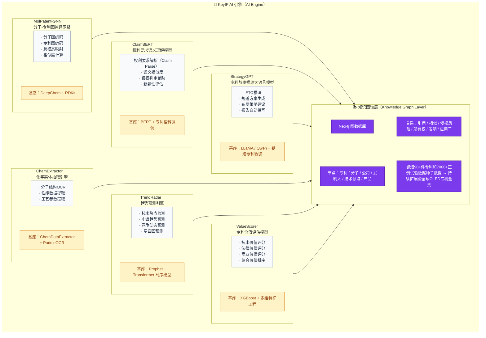
```mermaid
graph TD
    %% ============================================
    %% KeyIP AI 引擎架构（AI Engine Architecture）
    %% ============================================

    %%%% 图例（Legend）— 置顶
    %%subgraph LEGEND[图例（Legend）]
    %%    LG1[🔵 核心模型] ~~~ LG2[🟢 辅助引擎] ~~~ LG3[🟣 知识图谱层]
    %%end

    subgraph ENGINE[🧠 KeyIP AI 引擎（AI Engine）]

        %% ── 第一行：三大核心模型 ──
        subgraph M1[MolPatent-GNN<br/>分子-专利图神经网络]
            M1A["· 分子图编码<br/>· 专利图编码<br/>· 跨模态映射<br/>· 相似度计算"]
            M1B["基座：DeepChem + RDKit"]
            M1A ~~~ M1B
        end

        subgraph M2[ClaimBERT<br/>权利要求语义理解模型]
            M2A["· 权利要求解析（Claim Parse）<br/>· 语义相似度<br/>· 侵权判定辅助<br/>· 新颖性评估"]
            M2B["基座：BERT + 专利语料微调"]
            M2A ~~~ M2B
        end

        subgraph M3[StrategyGPT<br/>专利战略推理大语言模型]
            M3A["· FTO推理<br/>· 规避方案生成<br/>· 布局策略建议<br/>· 报告自动撰写"]
            M3B["基座：LLaMA / Qwen + 钥熠专利微调"]
            M3A ~~~ M3B
        end

        M1 ~~~ M2 ~~~ M3

        %% ── 第二行：三大辅助引擎 ──
        subgraph E1[ChemExtractor<br/>化学实体抽取引擎]
            E1A["· 分子结构OCR<br/>· 性能数据提取<br/>· 工艺参数提取"]
            E1B["基座：ChemDataExtractor + PaddleOCR"]
            E1A ~~~ E1B
        end

        subgraph E2[TrendRadar<br/>趋势预测引擎]
            E2A["· 技术热点检测<br/>· 申请趋势预测<br/>· 竞争动态预测<br/>· 空白区预测"]
            E2B["基座：Prophet + Transformer 时序模型"]
            E2A ~~~ E2B
        end

        subgraph E3[ValueScorer<br/>专利价值评估模型]
            E3A["· 技术价值评分<br/>· 法律价值评分<br/>· 商业价值评分<br/>· 综合价值排序"]
            E3B["基座：XGBoost + 多维特征工程"]
            E3A ~~~ E3B
        end

        E1 ~~~ E2 ~~~ E3

        %% ── 底层：知识图谱 ──
        subgraph KG[📚 知识图谱层（Knowledge Graph Layer）]
            KG1["Neo4j 图数据库"]
            KG2["节点：专利 / 分子 / 公司 / 发明人 / 技术领域 / 产品"]
            KG3["关系：引用 / 相似 / 侵权风险 / 所有权 / 发明 / 应用于"]
            KG4["钥熠90+件专利和7000+正例试验数据种子数据 → 持续扩展至全球OLED专利全集"]
            KG1 ~~~ KG2
            KG3 ~~~ KG4
        end

    end

    %% 层间依赖
    %% LEGEND ~~~ ENGINE
    M1 & M2 & M3 --> KG
    E1 & E2 & E3 --> KG

    %% 样式定义
    classDef coreModel fill:#3B82F6,stroke:#1E40AF,color:#FFFFFF,stroke-width:2px
    classDef auxEngine fill:#10B981,stroke:#047857,color:#FFFFFF,stroke-width:2px
    classDef kgStyle fill:#7C3AED,stroke:#5B21B6,color:#FFFFFF,stroke-width:2px
    classDef detailNode fill:#F8FAFC,stroke:#94A3B8,color:#1E293B,stroke-width:1px
    classDef baseNode fill:#FEF3C7,stroke:#D97706,color:#92400E,stroke-width:1px

    %% 应用样式
    class M1A,M2A,M3A detailNode
    class M1B,M2B,M3B baseNode
    class E1A,E2A,E3A detailNode
    class E1B,E2B,E3B baseNode
    class KG1,KG2,KG3,KG4 kgStyle
    class LG1 coreModel
    class LG2 auxEngine
    class LG3 kgStyle

```

#### 种子数据训练策略：从90+件专利和7000+正例试验数据到行业垂直AI

这是KeyIP-Intelligence最核心的竞争壁垒构建路径。钥熠的90+件专利和7000+正例试验数据虽然数量不大，但它们是**经过真实研发验证的、高质量的、带有完整上下文的种子数据**——这比从公开数据库随机抓取的10万件专利更有价值。

| 训练阶段         | 数据源                                         | 模型目标              | 预期效果                      |
| :----------- | :------------------------------------------ | :---------------- | :------------------------ |
| **阶段一：种子训练** | 钥熠90+件专利和7000+正例试验数据（全文+分子结构+实验数据+审查历史）                 | 建立OLED材料专利的"基础语感" | 模型理解OLED材料专利的特有表述方式和技术逻辑  |
| **阶段二：领域扩展** | 全球OLED材料相关专利约15万件（USPTO/EPO/CNIPA/JPO/KIPO） | 扩展到全行业知识覆盖        | 模型能识别任意OLED材料专利的技术要点和权利范围 |
| **阶段三：跨域增强** | 有机化学、光电材料、显示技术等相邻领域专利约50万件                  | 增强跨领域关联理解         | 模型能发现OLED材料与相邻领域的技术交叉机会   |
| **阶段四：持续学习** | 每日新增专利 + 用户反馈 + 专家标注                        | 模型持续进化            | 模型准确率持续提升，形成数据飞轮          |

**关键洞察：** 这个训练策略的精妙之处在于——**种子数据的质量决定了模型的"审美"**。用钥熠自己的专利训练出来的模型，天然理解钥熠的技术路线和专利撰写风格，这是任何通用模型无法替代的。随着数据飞轮转动，模型会越来越"懂"OLED材料专利，形成竞争对手难以复制的垂直AI优势。

---

### 3.5 数据架构与知识图谱设计

#### OLED材料专利知识图谱：KeyIP的"大脑"

如果说AI引擎是KeyIP-Intelligence的"思维能力"，那么知识图谱就是它的"记忆与认知结构"。一个精心设计的知识图谱，能让AI引擎在回答"这个分子是否侵犯某件专利？"这类问题时，不是简单地做文本匹配，而是像一个经验丰富的专利律师那样——沿着分子结构→技术方案→权利要求→法律状态→商业影响的逻辑链条进行推理。

#### 知识图谱本体模型（Ontology）

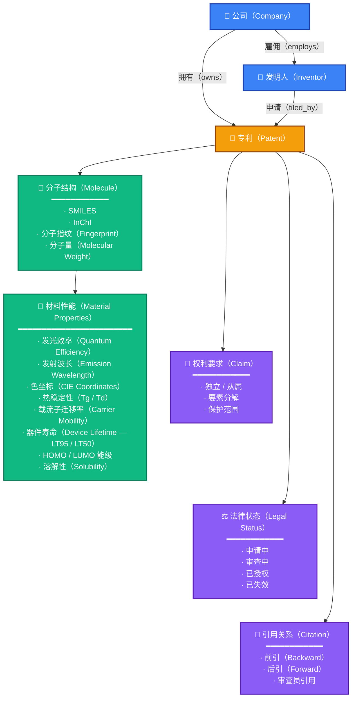
```mermaid
graph TD
    %% ============================================
    %% 专利知识图谱数据模型（Patent Knowledge Graph）
    %% ============================================

    %%%% 图例（Legend）— 置顶
    %%subgraph LEGEND[图例（Legend）]
    %%    LG1[🏢 组织实体] ~~~ LG2[📄 核心资产] ~~~ LG3[🔬 化学数据] ~~~ LG4[📝 法律与引用]
    %%end

    %% ── 顶层：公司与发明人 ──
    COMP["🏢 公司（Company）"]
    INV["👤 发明人（Inventor）"]

    %% ── 核心节点：专利 ──
    PAT["📄 专利（Patent）"]

    %% ── 专利下属实体 ──
    MOL["🔬 分子结构（Molecule）<br/>━━━━━━━━━━━━<br/>· SMILES<br/>· InChI<br/>· 分子指纹（Fingerprint）<br/>· 分子量（Molecular Weight）"]
    CLM["📝 权利要求（Claim）<br/>━━━━━━━━━━━━<br/>· 独立 / 从属<br/>· 要素分解<br/>· 保护范围"]
    LEG["⚖️ 法律状态（Legal Status）<br/>━━━━━━━━━━━━<br/>· 申请中<br/>· 审查中<br/>· 已授权<br/>· 已失效"]
    CIT["🔗 引用关系（Citation）<br/>━━━━━━━━━━━━<br/>· 前引（Backward）<br/>· 后引（Forward）<br/>· 审查员引用"]

    %% ── 底层：材料性能 ──
    PROP["🧪 材料性能（Material Properties）<br/>━━━━━━━━━━━━━━━━━━━━━━━━<br/>· 发光效率（Quantum Efficiency）<br/>· 发射波长（Emission Wavelength）<br/>· 色坐标（CIE Coordinates）<br/>· 热稳定性（Tg / Td）<br/>· 载流子迁移率（Carrier Mobility）<br/>· 器件寿命（Device Lifetime — LT95 / LT50）<br/>· HOMO / LUMO 能级<br/>· 溶解性（Solubility）"]

    %% ── 关系连线 ──
    COMP -->|"拥有（owns）"| PAT
    COMP -->|"雇佣（employs）"| INV
    INV -->|"申请（filed_by）"| PAT

    PAT --> MOL
    PAT --> CLM
    PAT --> LEG
    PAT --> CIT

    MOL --> PROP

    %% 布局辅助
    %% LEGEND ~~~ COMP
    MOL ~~~ CLM ~~~ LEG ~~~ CIT

    %% 样式定义
    classDef orgStyle fill:#3B82F6,stroke:#1E40AF,color:#FFFFFF,stroke-width:2px
    classDef coreStyle fill:#F59E0B,stroke:#92400E,color:#FFFFFF,stroke-width:2px
    classDef chemStyle fill:#10B981,stroke:#047857,color:#FFFFFF,stroke-width:2px
    classDef legalStyle fill:#8B5CF6,stroke:#5B21B6,color:#FFFFFF,stroke-width:2px
    classDef propStyle fill:#0D9488,stroke:#115E59,color:#FFFFFF,stroke-width:2px

    %% 应用样式
    class COMP,INV orgStyle
    class PAT coreStyle
    class MOL,PROP chemStyle
    class CLM,LEG,CIT legalStyle
    class LG1 orgStyle
    class LG2 coreStyle
    class LG3 chemStyle
    class LG4 legalStyle

```

#### 核心实体与关系定义

| 实体类型                  | 属性示例                                          | 预估数据量（初期）    | 预估数据量（成熟期） |
| :-------------------- | :-------------------------------------------- | :----------- | :--------- |
| **专利 (Patent)**       | 专利号、标题、摘要、全文、申请日、公开日、授权日、法律状态、IPC分类           | 15万件（OLED相关） | 50万件+      |
| **分子结构 (Molecule)**   | SMILES、InChI、分子指纹(Morgan/MACCS)、分子量、LogP、TPSA | 5万个（从专利提取）   | 20万个+      |
| **权利要求 (Claim)**      | 类型(独立/从属)、要素列表、保护范围标注、Markush结构解析             | 60万条         | 200万条+     |
| **公司 (Company)**      | 名称、国家、类型(材料商/面板厂/设备商)、专利组合规模                  | 500家         | 2000家+     |
| **发明人 (Inventor)**    | 姓名、所属机构、技术领域、发明数量、H-index                     | 3万人          | 10万人+      |
| **材料性能 (Property)**   | 性能类型、数值、测试条件、数据来源                             | 10万条         | 100万条+     |
| **技术领域 (TechDomain)** | 领域名称、层级关系、关联IPC                               | 200个         | 500个+      |

#### 关系类型定义

| 关系                       | 起点→终点   | 语义                     | 应用场景        |
| :----------------------- | :------ | :--------------------- | :---------- |
| `CONTAINS_MOLECULE`      | 专利→分子   | 专利中公开了该分子结构            | 分子-专利关联检索   |
| `CLAIMS_STRUCTURE`       | 权利要求→分子 | 权利要求保护了该分子（含Markush覆盖） | 侵权判定        |
| `SIMILAR_TO`             | 分子→分子   | 结构相似度>阈值               | 规避设计、相似专利发现 |
| `CITES`                  | 专利→专利   | 引用关系                   | 技术脉络追踪、价值评估 |
| `OWNED_BY`               | 专利→公司   | 当前权利人                  | 竞争分析        |
| `INVENTED_BY`            | 专利→发明人  | 发明人关系                  | 人才追踪、技术团队分析 |
| `HAS_PROPERTY`           | 分子→材料性能 | 该分子具有某性能数据             | 构效关系分析、性能预测 |
| `COMPETES_WITH`          | 公司→公司   | 竞争关系                   | 竞争态势分析      |
| `POTENTIAL_INFRINGEMENT` | 分子→专利   | AI判定的潜在侵权风险            | 侵权预警        |
| `DESIGN_AROUND`          | 分子→分子   | 规避设计关系                 | 规避方案推荐      |

#### 知识图谱构建管道

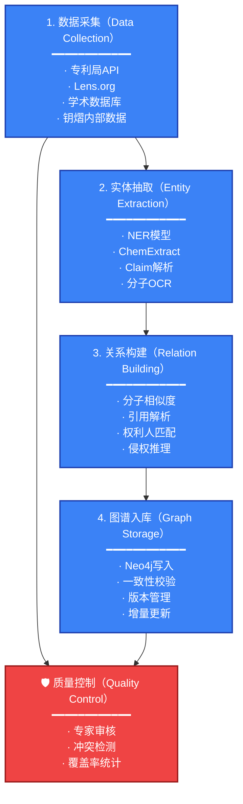
```mermaid
graph TD
    %% ============================================
    %% 知识图谱构建流水线（KG Construction Pipeline）
    %% ============================================

    %% ── 步骤1：数据采集 ──
    S1["1. 数据采集（Data Collection）<br/>━━━━━━━━━━━━<br/>· 专利局API<br/>· Lens.org<br/>· 学术数据库<br/>· 钥熠内部数据"]

    %% ── 步骤2：实体抽取 ──
    S2["2. 实体抽取（Entity Extraction）<br/>━━━━━━━━━━━━<br/>· NER模型<br/>· ChemExtract<br/>· Claim解析<br/>· 分子OCR"]

    %% ── 步骤3：关系构建 ──
    S3["3. 关系构建（Relation Building）<br/>━━━━━━━━━━━━<br/>· 分子相似度<br/>· 引用解析<br/>· 权利人匹配<br/>· 侵权推理"]

    %% ── 步骤4：图谱入库 ──
    S4["4. 图谱入库（Graph Storage）<br/>━━━━━━━━━━━━<br/>· Neo4j写入<br/>· 一致性校验<br/>· 版本管理<br/>· 增量更新"]

    %% ── 质量控制（贯穿全流程） ──
    QC["🛡️ 质量控制（Quality Control）<br/>━━━━━━━━━━━━<br/>· 专家审核<br/>· 冲突检测<br/>· 覆盖率统计"]

    %% ── 主流程 ──
    S1 --> S2 --> S3 --> S4

    %% ── 质量控制回路 ──
    S1 --> QC
    S4 --> QC

    %% 样式定义
    classDef stepStyle fill:#3B82F6,stroke:#1E40AF,color:#FFFFFF,stroke-width:2px
    classDef qcStyle fill:#EF4444,stroke:#991B1B,color:#FFFFFF,stroke-width:2px

    %% 应用样式
    class S1,S2,S3,S4 stepStyle
    class QC qcStyle

```

---

### 3.6 部署架构与交付模式

KeyIP-Intelligence支持三种部署模式，满足不同客户的安全和成本需求：

#### 三种部署模式对比

| 维度       | SaaS多租户版              | 私有云专属版              | 混合部署版            |
| :------- | :-------------------- | :------------------ | :--------------- |
| **目标客户** | 中小型OLED材料企业、专利代理机构    | 大型材料企业、对数据安全要求极高的客户 | 核心数据本地、AI能力云端的客户 |
| **数据存储** | KeyIP云端（阿里云/AWS），租户隔离 | 客户自有数据中心或私有云        | 敏感数据本地，公开数据云端    |
| **AI模型** | 共享基础模型 + 租户微调层        | 完全独立的模型实例           | 本地推理 + 云端训练      |
| **更新频率** | 持续更新（CI/CD）           | 季度更新包               | 云端持续 + 本地季度      |
| **起步成本** | ¥5-15万/年              | ¥80-200万（首年含实施）     | ¥40-100万（首年含实施）  |
| **运维责任** | KeyIP全托管              | 客户运维 + KeyIP技术支持    | 共同运维             |
| **适合规模** | 专利<500件               | 专利>500件             | 专利200-1000件      |
| **合规优势** | 标准合规                  | 满足等保三级、数据出境限制       | 灵活满足各类合规要求       |

#### SaaS版技术架构

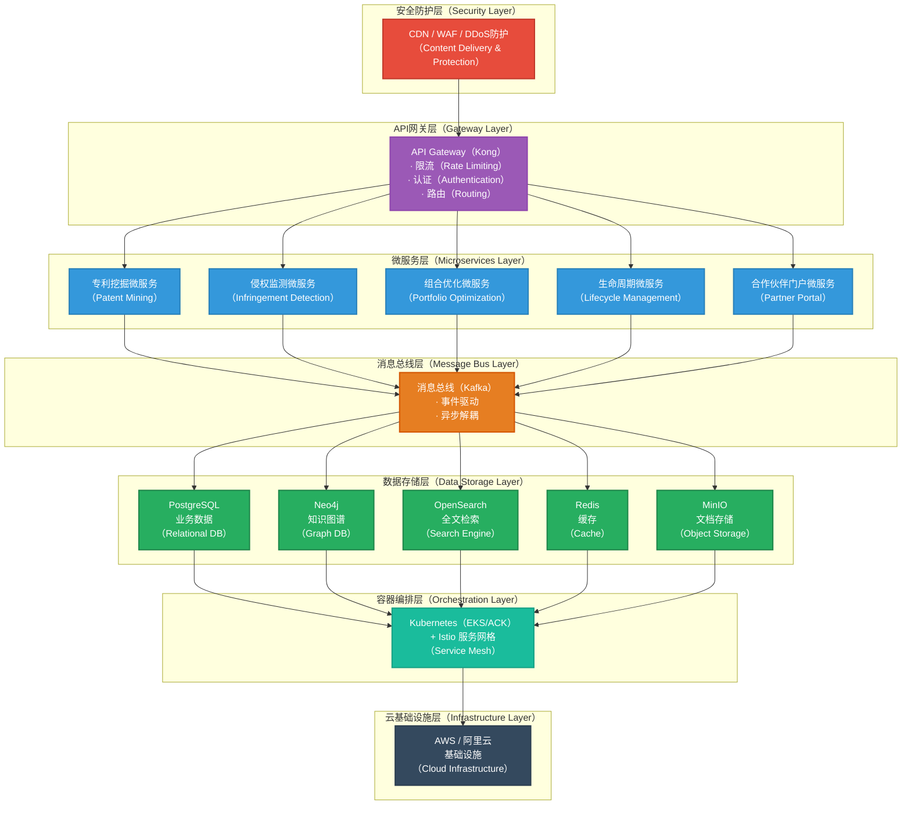
```mermaid
graph TD
    %% ============================================================
    %% 专利智能管理平台 - 技术架构图
    %% ============================================================

    %%%% 图例（Legend）
    %%subgraph LEGEND[图例（Legend）]
    %%    direction LR
    %%    L1[🛡️ 安全层]
    %%    L2[🚪 网关层]
    %%    L3[⚙️ 服务层]
    %%    L4[📨 消息层]
    %%    L5[💾 数据层]
    %%    L6[☸️ 编排层]
    %%    L7[☁️ 基础设施层]
    %%end

    %% 安全层
    subgraph SEC[安全防护层（Security Layer）]
        CDN[CDN / WAF / DDoS防护<br/>（Content Delivery & Protection）]
    end

    %% 网关层
    subgraph GW[API网关层（Gateway Layer）]
        KONG[API Gateway（Kong）<br/>· 限流（Rate Limiting）<br/>· 认证（Authentication）<br/>· 路由（Routing）]
    end

    %% 微服务层
    subgraph MS[微服务层（Microservices Layer）]
        direction LR
        MS1[专利挖掘微服务<br/>（Patent Mining）]
        MS2[侵权监测微服务<br/>（Infringement Detection）]
        MS3[组合优化微服务<br/>（Portfolio Optimization）]
        MS4[生命周期微服务<br/>（Lifecycle Management）]
        MS5[合作伙伴门户微服务<br/>（Partner Portal）]
    end

    %% 消息层
    subgraph MQ[消息总线层（Message Bus Layer）]
        KAFKA[消息总线（Kafka）<br/>· 事件驱动<br/>· 异步解耦]
    end

    %% 数据层
    subgraph DATA[数据存储层（Data Storage Layer）]
        direction LR
        PG[PostgreSQL<br/>业务数据<br/>（Relational DB）]
        NEO[Neo4j<br/>知识图谱<br/>（Graph DB）]
        ES[OpenSearch<br/>全文检索<br/>（Search Engine）]
        REDIS[Redis<br/>缓存<br/>（Cache）]
        MINIO[MinIO<br/>文档存储<br/>（Object Storage）]
    end

    %% 编排层
    subgraph ORCH[容器编排层（Orchestration Layer）]
        K8S[Kubernetes（EKS/ACK）<br/>+ Istio 服务网格<br/>（Service Mesh）]
    end

    %% 基础设施层
    subgraph INFRA[云基础设施层（Infrastructure Layer）]
        CLOUD[AWS / 阿里云<br/>基础设施<br/>（Cloud Infrastructure）]
    end

    %% 层级连接关系
    CDN --> KONG
    KONG --> MS1
    KONG --> MS2
    KONG --> MS3
    KONG --> MS4
    KONG --> MS5
    MS1 --> KAFKA
    MS2 --> KAFKA
    MS3 --> KAFKA
    MS4 --> KAFKA
    MS5 --> KAFKA
    KAFKA --> PG
    KAFKA --> NEO
    KAFKA --> ES
    KAFKA --> REDIS
    KAFKA --> MINIO
    PG --> K8S
    NEO --> K8S
    ES --> K8S
    REDIS --> K8S
    MINIO --> K8S
    K8S --> CLOUD

    %% 样式定义
    classDef securityStyle fill:#e74c3c,stroke:#c0392b,stroke-width:2px,color:#fff
    classDef gatewayStyle fill:#9b59b6,stroke:#8e44ad,stroke-width:2px,color:#fff
    classDef serviceStyle fill:#3498db,stroke:#2980b9,stroke-width:2px,color:#fff
    classDef messageStyle fill:#e67e22,stroke:#d35400,stroke-width:2px,color:#fff
    classDef dataStyle fill:#27ae60,stroke:#1e8449,stroke-width:2px,color:#fff
    classDef orchStyle fill:#1abc9c,stroke:#16a085,stroke-width:2px,color:#fff
    classDef infraStyle fill:#34495e,stroke:#2c3e50,stroke-width:2px,color:#fff
    classDef legendStyle fill:#ecf0f1,stroke:#bdc3c7,stroke-width:1px,color:#2c3e50

    %% 应用样式
    class CDN securityStyle
    class KONG gatewayStyle
    class MS1,MS2,MS3,MS4,MS5 serviceStyle
    class KAFKA messageStyle
    class PG,NEO,ES,REDIS,MINIO dataStyle
    class K8S orchStyle
    class CLOUD infraStyle
    class L1,L2,L3,L4,L5,L6,L7 legendStyle

```

#### 私有化部署最小硬件要求

| 组件          | 最小配置                             | 推荐配置                             | 说明                              |
| :---------- | :------------------------------- | :------------------------------- | :------------------------------ |
| **应用服务器**   | 8核CPU, 32GB RAM, 500GB SSD × 2台  | 16核CPU, 64GB RAM, 1TB NVMe × 3台  | 运行微服务和Web应用                     |
| **AI推理服务器** | NVIDIA T4 GPU × 1, 64GB RAM      | NVIDIA A100 GPU × 1, 128GB RAM   | 运行AI模型推理                        |
| **数据库服务器**  | 16核CPU, 128GB RAM, 2TB NVMe × 2台 | 32核CPU, 256GB RAM, 4TB NVMe × 3台 | PostgreSQL + Neo4j + OpenSearch |
| **存储**      | 10TB NAS/SAN                     | 50TB NAS/SAN + 备份                | 专利文档和分子文件存储                     |
| **网络**      | 千兆内网                             | 万兆内网 + 冗余                        | 服务间通信                           |

---

### 3.7 产品路线图（Roadmap）

#### 三阶段演进路径

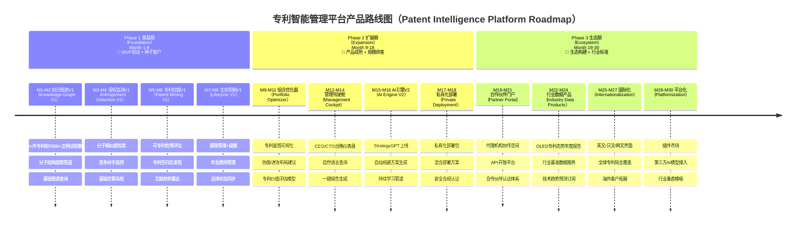
```mermaid
timeline
    %% ============================================================
    %% 专利智能管理平台 - 产品路线图（Product Roadmap）
    %% ============================================================
    
    title 专利智能管理平台产品路线图（Patent Intelligence Platform Roadmap）
    
    section Phase 1 奠基期<br>（Foundation）<br>Month 1-8<br>🎯 MVP验证 + 种子客户
        M1-M2 知识图谱V1<br>（Knowledge Graph V1）
            : 钥熠90+件专利和7000+正例试验数据入图
            : 分子结构提取管道
            : 基础图谱查询
        M3-M4 侵权监测V1<br>（Infringement Detection V1）
            : 分子相似度检索
            : 竞争对手监控
            : 基础告警系统
        M5-M6 专利挖掘V1<br>（Patent Mining V1）
            : 可专利性预评估
            : 专利空白区发现
            : 文献趋势雷达
        M7-M8 生命周期V1<br>（Lifecycle V1）
            : 期限管理+提醒
            : 年金费用管理
            : 法律状态同步
    
    section Phase 2 扩展期<br>（Expansion）<br>Month 9-18<br>🎯 产品成熟 + 规模获客
        M9-M11 组合优化器<br>（Portfolio Optimizer）
            : 专利星图可视化
            : 防御/进攻布局建议
            : 专利价值评估模型
        M12-M14 管理驾驶舱<br>（Management Cockpit）
            : CEO/CTO战略仪表盘
            : 自然语言查询
            : 一键报告生成
        M15-M16 AI引擎V2<br>（AI Engine V2）
            : StrategyGPT上线
            : 自动规避方案生成
            : 持续学习管道
        M17-M18 私有化部署<br>（Private Deployment）
            : 私有化部署包
            : 混合部署方案
            : 安全合规认证
    
    section Phase 3 生态期<br>（Ecosystem）<br>Month 19-30<br>🎯 生态构建 + 行业标准
        M19-M21 合作伙伴门户<br>（Partner Portal）
            : 代理机构协作空间
            : API开放平台
            : 合作伙伴认证体系
        M22-M24 行业数据产品<br>（Industry Data Products）
            : OLED专利态势年度报告
            : 行业基准数据服务
            : 技术趋势预测订阅
        M25-M27 国际化<br>（Internationalization）
            : 英文/日文/韩文界面
            : 全球专利局全覆盖
            : 海外客户拓展
        M28-M30 平台化<br>（Platformization）
            : 插件市场
            : 第三方AI模型接入
            : 行业垂直模板
```

#### 详细里程碑表

| 里程碑              | 时间       | 交付物                 | 成功标准                  |
| :--------------- | :------- | :------------------ | :-------------------- |
| **M1: 技术验证**     | Month 2  | 分子相似度检索原型 + 知识图谱原型  | 在钥熠90+件专利和7000+正例试验数据上，分子检索准确率>85% |
| **M2: 内部Alpha**  | Month 4  | 侵权监测 + 专利挖掘内部测试版    | 钥熠IP团队日常使用，收集反馈       |
| **M3: 封闭Beta**   | Month 6  | 四大核心模块集成版           | 3-5个种子客户试用，NPS>40     |
| **M4: 公开发布V1.0** | Month 8  | SaaS版正式上线           | 10个付费客户，ARR>¥100万     |
| **M5: 产品成熟V2.0** | Month 14 | 全模块 + 管理驾驶舱 + AI V2 | 30个付费客户，ARR>¥500万     |
| **M6: 生态启动V3.0** | Month 20 | 合作伙伴门户 + API平台      | 5家代理机构入驻，ARR>¥1000万   |
| **M7: 行业标杆V4.0** | Month 28 | 国际化 + 平台化           | 50+客户，海外客户占比>20%      |

---

### 3.8 商业模式与定价策略

#### 收入模型设计

KeyIP-Intelligence采用"**基础订阅 + 增值模块 + 专业服务**"的三层收入模型，这个设计的核心逻辑是：**用低门槛的基础订阅获客，用高价值的增值模块提升ARPU，用专业服务建立深度绑定**。

| 收入层      | 产品/服务                 | 定价模式      | 目标毛利率  |
| :------- | :-------------------- | :-------- | :----- |
| **基础订阅** | 生命周期管理 + 基础检索         | 按专利数量阶梯定价 | 80%+   |
| **增值模块** | AI专利挖掘 + 侵权监测 + 组合优化  | 按模块订阅     | 75%+   |
| **数据服务** | OLED专利态势报告 + 趋势预测     | 按报告/订阅    | 85%+   |
| **专业服务** | FTO深度分析 + 布局咨询 + 定制开发 | 按项目/人天    | 50-60% |
| **生态分成** | 合作伙伴交易撮合佣金            | 交易额的5-15% | 90%+   |

#### SaaS订阅定价方案

| 方案         | 启航版 (Starter) | 远航版 (Professional) | 旗舰版 (Enterprise)  |
| :--------- | :------------ | :----------------- | :---------------- |
| **目标客户**   | 初创材料企业、高校实验室  | 中型材料企业             | 大型材料集团、面板厂商       |
| **专利管理数量** | ≤50件          | ≤500件              | 不限                |
| **用户数**    | 3人            | 15人                | 不限                |
| **生命周期管理** | ✅ 基础版         | ✅ 完整版              | ✅ 完整版 + 定制工作流     |
| **专利检索**   | ✅ 关键词 + 基础语义  | ✅ 分子结构 + 高级语义      | ✅ 全部检索能力          |
| **AI专利挖掘** | ❌             | ✅ 基础版（月50次）        | ✅ 无限制 + 定制模型      |
| **侵权监测**   | ❌             | ✅ 5个监控主题           | ✅ 无限监控 + 实时告警     |
| **组合优化**   | ❌             | ✅ 基础分析             | ✅ 完整版 + What-If模拟 |
| **管理驾驶舱**  | ❌             | ✅ 标准看板             | ✅ 定制看板 + 自然语言查询   |
| **合作伙伴门户** | ❌             | ❌                  | ✅                 |
| **报告生成**   | 基础模板          | 专业模板               | 定制模板 + AI撰写       |
| **数据导出**   | CSV           | CSV + Excel + PDF  | 全格式 + BI集成        |
| **技术支持**   | 邮件（48h响应）     | 在线（8h响应）           | 专属客户成功经理（2h响应）    |
| **部署方式**   | SaaS          | SaaS / 混合          | SaaS / 混合 / 私有化   |
| **年费（参考）** | ¥5.8万/年       | ¥18.8万/年           | ¥58万起/年（按需定制）     |

---

## 四、功能与特性的客户语言描述

> 以下内容以客户视角撰写，适用于产品官网、销售材料、客户提案等场景。每个特性都配有真实业务场景，帮助客户直观理解价值。

---

### 🔬 AI专利挖掘：让每一个实验发现都不被埋没

**您是否遇到过这样的情况？**

研发团队辛苦合成了一个性能优异的新材料，却因为没有及时评估专利价值而错过了申请窗口。等到竞争对手发表了类似结构的论文，才追悔莫及——"这个分子我们半年前就做出来了！"

**KeyIP-Intelligence如何帮助您：**

想象一下，您的研发人员在实验室合成了一个新的OLED发光材料。他只需要将分子结构输入KeyIP，系统会在几秒钟内完成以下工作：

* **新颖性扫描**：在全球320万+OLED相关专利中搜索，告诉您这个分子是否已经被他人公开或保护。不是简单的关键词匹配——KeyIP理解分子结构，能识别出"骨架相同但取代基不同"的近似专利
* **创造性评估**：分析您的分子相比现有技术的改进点，评估这些改进是否足以支撑一件高质量专利
* **空白区发现**：在分子空间地图上标注出尚未被专利覆盖的区域，这些就是您的"蓝海机会"
* **一键启动申请**：自动生成发明披露表初稿，预填技术背景和现有技术对比，您的研发人员只需补充实验细节

**客户实际收益：**

> "过去我们平均每年申请8-10件专利，使用KeyIP后第一年就增加到了15件——不是因为我们做了更多实验，而是因为很多有价值的发现以前被忽略了。" — 某OLED材料企业IP总监

---

### 🛡️ 实时侵权监测：7×24小时的专利安全卫士

**您是否担心过这些问题？**

* 竞争对手是否正在申请与我们核心技术高度相似的专利？
* 我们即将量产的新材料，是否会踩到海外巨头的专利地雷？
* 全球每天公开数千件化学专利，我们的IP团队根本看不过来

**KeyIP-Intelligence如何帮助您：**

KeyIP的侵权监测中心就像一个永不休息的"专利雷达站"。它每天自动扫描全球五大专利局（中国CNIPA、美国USPTO、欧洲EPO、日本JPO、韩国KIPO）的最新公开专利，用AI进行三层过滤：

* **第一层：技术领域过滤** — 只关注OLED材料相关的专利，过滤掉99%的噪音
* **第二层：分子结构匹配** — 用化学信息学算法计算新公开专利中的分子结构与您的核心技术的相似度，精确到原子级别
* **第三层：权利要求分析** — AI解读权利要求的保护范围，评估是否可能覆盖您的技术方案

当检测到高风险专利时，系统会立即推送告警到您的手机和邮箱，并附上：

* 风险等级评估（红/黄/绿）
* 与您的技术的详细对比分析
* 初步的规避方案建议
* 建议的应对时间窗口

**客户实际收益：**

> "去年KeyIP帮我们提前4个月发现了一件韩国竞争对手的专利申请，其Markush结构可能覆盖我们正在开发的第二代空穴传输材料。我们及时调整了分子设计方案，避免了可能的侵权风险和至少6个月的研发返工。" — 某OLED材料企业CTO

---

### ♟️ 专利组合优化：从"有专利"到"有战略"

**您是否思考过这些问题？**

* 我们的90+件专利和7000+正例试验数据，真的形成了有效的保护网吗？还是只是一堆散落的棋子？
* 下一件专利应该申请什么方向，才能最大化组合的战略价值？
* 哪些专利值得继续花钱维护，哪些可以放弃以节省预算？

**KeyIP-Intelligence如何帮助您：**

KeyIP的组合优化器将您的专利组合转化为一幅直观的"专利星图"——每件专利是一颗星，位置由分子结构决定，亮度由价值评分决定，颜色区分您和竞争对手。

在这幅星图上，您可以一眼看到：

* **您的防线在哪里最坚固**：专利密集的区域，竞争对手难以突破
* **您的防线在哪里有缺口**：专利稀疏的区域，需要补充布局
* **竞争对手的弱点在哪里**：他们的专利空白区，就是您的进攻机会
* **哪些专利是"明星资产"**：高价值、高被引、核心位置的专利
* **哪些专利是"沉默成本"**：低价值、无被引、边缘位置的专利

系统还会基于博弈论模型，为您生成具体的布局建议：

* 🛡️ 防御建议："在XX分子骨架区域补充2-3件专利，可将防御覆盖率从72%提升至91%"
* ⚔️ 进攻建议："竞争对手A在XX领域的专利将于2026年到期，建议提前布局替代技术"
* 💰 优化建议："以下5件专利的维护成本/价值比超过阈值，建议评估是否放弃，预计年节省¥12万"

**客户实际收益：**

> "KeyIP的组合优化器让我们第一次真正'看见'了自己的专利布局。过去我们以为蓝光材料领域布局很完善，结果发现有一个关键的分子骨架区域完全没有覆盖——而那恰好是竞争对手正在发力的方向。我们立即启动了3件补充申请，避免了一个重大的战略漏洞。" — 某OLED材料企业VP of R&D

---

### 📋 全生命周期管理：让IP团队从"救火队员"变成"战略参谋"

**您的IP团队是否把大量时间花在了这些事情上？**

* 在Excel表格里追踪几十件专利的期限和费用
* 手动查询各国专利局的法律状态变更
* 反复确认年金缴费是否到账、是否遗漏
* 在邮件中翻找与代理机构的往来文件
* 每次董事会前加班两周准备IP报告

**这些工作重要吗？** 当然重要——一次年金遗漏就可能导致一件核心专利失效。**但这些工作需要您最优秀的IP人才来做吗？** 绝对不需要。

**KeyIP-Intelligence如何帮助您：**

KeyIP的生命周期管理台，本质上是一个"永远不会犯错、永远不会遗忘的IP管家"。它接管了所有需要100%准确率但不需要创造力的工作：

* **智能期限日历**：自动计算中国、美国、欧洲、日本、韩国等所有法域的法定期限，精确到每一个节假日调整。不是简单的日期提醒——系统理解各国专利法的期限规则差异，比如美国的PTA（专利期限调整）、欧洲的异议期、中国的恢复权利期限
* **多级预警机制**：90天→60天→30天→7天→紧急，每一级的提醒方式逐步升级（系统通知→邮件→企业微信/钉钉→短信→电话通知）。您可以为不同重要级别的专利设置不同的预警策略——核心专利从120天就开始提醒，边缘专利30天提醒即可
* **年金费用一站式管理**：自动计算各国年金金额（含汇率实时换算），生成年度/季度费用预算表，支持一键生成缴费指令发送给合作代理机构。系统还会结合专利价值评估，标注哪些专利"值得维护"、哪些"建议评估是否放弃"
* **法律状态实时同步**：每天自动从各国专利局拉取最新的法律状态变更，任何变化（授权、驳回、转让、无效宣告等）都会实时反映在系统中，无需人工查询
* **审查意见智能助手**：当收到审查意见通知书时，AI自动解析驳回理由，关联相关现有技术文献，并建议答复策略。您的IP团队不再需要从零开始分析每一份OA——AI已经完成了80%的基础工作

**客户实际收益：**

> "我们的IP团队只有3个人，管理着120多件专利在5个国家的生命周期。在使用KeyIP之前，光是期限管理和年金缴费就占了一个人的全部工作量。现在这些工作基本自动化了，那位同事终于有时间做她真正擅长的事——专利布局分析和FTO评估。团队的战略产出提升了至少40%。" — 某OLED材料企业IP经理

---

### 🤝 合作伙伴生态：打破信息孤岛，构建协同网络

**您是否经历过这些协作痛点？**

* 给代理机构发了申请文件，两周后才发现对方收到的是旧版本
* 外部律师做FTO分析需要查看部分专利数据，但您不放心把整个数据库的权限开放给他
* 与行业同行探讨交叉许可的可能性，但双方都不愿意先亮出自己的底牌
* 多家代理机构同时服务，质量参差不齐，却缺乏客观的评估标准

**KeyIP-Intelligence如何帮助您：**

KeyIP的合作伙伴门户，是一个建立在"最小权限原则"之上的安全协作空间。每个合作伙伴只能看到与其工作相关的数据，不多也不少：

* **专利代理机构**：看到分配给他们的申请任务、相关技术背景资料、期限要求，但看不到您的整体专利组合和战略规划
* **外部律师**：看到需要评审的FTO报告和相关专利数据，但看不到您的实验数据和未公开的发明
* **行业合作伙伴**：在安全计算环境中进行专利数据的有限比对，双方都不需要暴露原始数据

所有文件交换都带有数字水印和访问审计日志——谁在什么时间查看了什么文件、下载了几次，一目了然。

系统还提供合作伙伴绩效看板，帮助您客观评估每家代理机构的服务质量：

* 📊 平均响应时间、申请成功率、OA答复质量评分、费用效率
* 📈 趋势对比：各代理机构的绩效变化趋势
* 🏆 排名：在同类任务中，哪家代理机构表现最优

**客户实际收益：**

> "我们同时与4家专利代理机构合作，过去全靠邮件和微信沟通，文件版本混乱、进度不透明。KeyIP的合作伙伴门户让一切变得井井有条——每个任务的状态、每份文件的版本、每个期限的倒计时，所有人看到的都是同一个'真相'。代理机构也很喜欢这个系统，因为他们不用再反复问我们要资料了。" — 某OLED材料企业IP总监

---

### 📊 管理驾驶舱：一张图看清全局，一句话获取答案

**您是否有过这样的困扰？**

* 董事会问"我们的专利布局在全球处于什么水平？"，您需要花两周时间准备报告
* CTO问"UDC去年在蓝光材料领域有什么新动向？"，您需要翻阅大量数据才能回答
* 财务问"明年的IP预算应该是多少？"，您需要逐件专利计算费用

**KeyIP-Intelligence如何帮助您：**

KeyIP的管理驾驶舱，是为决策者设计的"一屏全览"界面。它不是简单地把数据堆在一起——而是经过AI提炼，把最关键的信息以最直观的方式呈现：

* **战略全景视图**：一张图展示您的专利组合在全球OLED材料领域的位置——覆盖了哪些技术方向、在哪些国家有保护、与主要竞争对手的力量对比如何
* **风险预警面板**：实时显示当前面临的TOP 5风险——可能是一件新公开的竞争专利、一个即将到期的关键期限、或一个正在扩大的布局缺口
* **机会发现面板**：AI识别的TOP 5机会——可能是一个无人布局的技术空白区、一件即将到期的竞争专利带来的市场机会、或一个潜在的许可收入来源
* **自然语言查询**：直接用中文提问，比如"三星SDI在柔性OLED封装材料领域有多少件有效专利？"，系统秒级返回答案和可视化图表
* **一键报告生成**：选择报告类型（年度IP报告、竞争分析报告、FTO报告等），AI在3-5分钟内生成专业级报告，支持PDF/DOCX/PPT格式导出

**客户实际收益：**

> "以前每次董事会前，我的团队都要加班两周准备IP报告。现在我在会议前30分钟打开KeyIP，用自然语言问几个问题，再一键生成报告，就全搞定了。董事们还夸报告比以前更专业、更有洞察力——他们不知道这是AI写的。" — 某OLED材料企业CTO

---

## 五、安全合规与数据治理

### 5.1 安全架构设计

对于一个管理企业核心知识产权的平台，安全不是"附加功能"，而是"生存前提"。KeyIP-Intelligence的安全架构遵循"**纵深防御**"原则——即使某一层被突破，后续层仍能提供保护。

#### 安全防护层次

| 防护层          | 措施                                | 技术实现                              | 防护目标     |
| :----------- | :-------------------------------- | :-------------------------------- | :------- |
| **网络层**      | WAF防火墙、DDoS防护、IP白名单、VPN接入         | Cloudflare/阿里云WAF + VPN Gateway   | 防止外部网络攻击 |
| **传输层**      | 全链路TLS 1.3加密、证书固定                 | Let's Encrypt + 证书管理              | 防止数据传输窃听 |
| **认证层**      | 多因素认证(MFA)、SSO单点登录、OAuth 2.0      | Keycloak + TOTP/FIDO2             | 防止未授权访问  |
| **授权层**      | 基于角色的访问控制(RBAC) + 基于属性的访问控制(ABAC) | Keycloak + OPA(Open Policy Agent) | 最小权限原则   |
| **数据层**      | 静态加密(AES-256)、字段级加密、数据脱敏          | 数据库透明加密 + 应用层加密                   | 防止数据泄露   |
| **应用层**      | 输入验证、SQL注入防护、XSS防护、CSRF防护         | OWASP最佳实践 + 安全编码规范                | 防止应用层攻击  |
| **审计层**      | 全操作审计日志、不可篡改存储、异常行为检测             | ELK Stack + 区块链存证(可选)             | 事后追溯与合规  |
| **物理层（私有化）** | 硬件安全模块(HSM)、安全启动、磁盘加密             | TPM + LUKS                        | 防止物理接触攻击 |

#### 数据分级与保护策略

| 数据级别      | 示例                  | 加密要求            | 访问控制        | 留存策略         |
| :-------- | :------------------ | :-------------- | :---------- | :----------- |
| **🔴 绝密** | 未公开发明、实验原始数据、战略规划   | AES-256 + 字段级加密 | 仅指定个人 + MFA | 永久保留，删除需多人审批 |
| **🟠 机密** | 专利申请草稿、FTO分析报告、内部评估 | AES-256         | 部门级 + 审批    | 保留10年        |
| **🟡 内部** | 已公开专利数据、内部分析报告      | 传输加密            | 公司级         | 保留5年         |
| **🟢 公开** | 已公开专利信息、公开统计数据      | 传输加密            | 无限制         | 按需           |

### 5.2 合规认证路线图

| 认证/标准             | 适用范围  | 计划时间          | 说明             |
| :---------------- | :---- | :------------ | :------------- |
| **等保二级**          | SaaS版 | Phase 1 (M6)  | 中国网络安全等级保护基本要求 |
| **等保三级**          | 私有化版  | Phase 2 (M14) | 服务政府背景客户的必要条件  |
| **ISO 27001**     | 全平台   | Phase 2 (M16) | 国际信息安全管理体系认证   |
| **SOC 2 Type II** | SaaS版 | Phase 3 (M22) | 服务海外客户的信任基础    |
| **GDPR合规**        | 欧洲业务  | Phase 3 (M24) | 欧洲数据保护法规       |
| **数据出境安全评估**      | 跨境数据  | Phase 2 (M18) | 中国数据出境合规要求     |

---

## 六、技术选型与开源优先策略

### 6.1 完整技术栈选型

KeyIP-Intelligence的技术选型遵循三个原则：**开源优先**（降低成本、避免锁定）、**云原生**（弹性伸缩、高可用）、**AI原生**（AI不是附加功能，而是架构的一部分）。

#### 基础设施层

| 组件          | 选型                   | 许可证              | 选型理由                | 备选方案             |
| :---------- | :------------------- | :--------------- | :------------------ | :--------------- |
| **容器编排**    | Kubernetes (K8s)     | Apache 2.0       | 行业标准，生态最丰富          | Docker Swarm     |
| **服务网格**    | Istio                | Apache 2.0       | 微服务间通信治理、可观测性       | Linkerd          |
| **CI/CD**   | GitLab CI + ArgoCD   | MIT / Apache 2.0 | GitOps工作流，声明式部署     | Jenkins + FluxCD |
| **基础设施即代码** | Terraform + Ansible  | MPL 2.0 / GPL    | 多云支持，可复现部署          | Pulumi           |
| **监控告警**    | Prometheus + Grafana | Apache 2.0       | 云原生监控标准             | Datadog (商业)     |
| **日志管理**    | Loki + Grafana       | AGPL             | 轻量级，与Prometheus生态集成 | ELK Stack        |
| **分布式追踪**   | Jaeger               | Apache 2.0       | OpenTelemetry兼容     | Zipkin           |

#### 数据层

| 组件        | 选型                           | 许可证                | 选型理由                       | 备选方案               |
| :-------- | :--------------------------- | :----------------- | :------------------------- | :----------------- |
| **关系数据库** | PostgreSQL 16                | PostgreSQL License | 最强大的开源关系数据库，JSON支持优秀       | MySQL 8            |
| **图数据库**  | Neo4j Community / Apache AGE | GPL / Apache 2.0   | 知识图谱核心存储，Cypher查询语言成熟      | JanusGraph         |
| **全文检索**  | OpenSearch                   | Apache 2.0         | Elasticsearch的开源分支，避免许可证风险 | Meilisearch        |
| **向量数据库** | Milvus                       | Apache 2.0         | 分子指纹和文本嵌入的相似度检索            | Qdrant / Weaviate  |
| **缓存**    | Redis (Valkey)               | BSD / BSD          | 高性能缓存，会话管理                 | Dragonfly          |
| **消息队列**  | Apache Kafka                 | Apache 2.0         | 专利数据流实时处理                  | RabbitMQ / Pulsar  |
| **对象存储**  | MinIO                        | AGPL / 商业          | S3兼容，私有化部署友好               | SeaweedFS          |
| **数据湖**   | Apache Iceberg + Trino       | Apache 2.0         | 实验数据和历史专利数据的分析查询           | Delta Lake + Spark |

#### 应用层

| 组件        | 选型                          | 许可证                    | 选型理由                            | 备选方案             |
| :-------- | :-------------------------- | :--------------------- | :------------------------------ | :--------------- |
| **后端框架**  | Python FastAPI + Go (高性能服务) | MIT / BSD              | Python生态对AI/化学信息学支持最好，Go处理高并发   | Java Spring Boot |
| **前端框架**  | React 18 + TypeScript       | MIT                    | 组件生态丰富，TypeScript保证代码质量         | Vue 3            |
| **可视化库**  | ECharts + D3.js + 3Dmol.js  | Apache 2.0 / BSD / BSD | ECharts做图表，D3做专利地图，3Dmol做分子3D展示 | Plotly           |
| **API网关** | Kong                        | Apache 2.0             | 插件丰富，支持限流/认证/日志                 | APISIX           |
| **身份认证**  | Keycloak                    | Apache 2.0             | 企业级IAM，支持SAML/OIDC/LDAP         | Authentik        |
| **工作流引擎** | Temporal                    | MIT                    | 比Airflow更适合业务工作流，支持长时间运行        | Camunda          |
| **任务调度**  | Apache Airflow              | Apache 2.0             | 数据管道编排，DAG可视化                   | Prefect          |
| **报告生成**  | WeasyPrint + python-docx    | BSD / MIT              | PDF/DOCX报告生成                    | Puppeteer        |

#### AI/ML层

| 组件          | 选型                                   | 许可证                            | 选型理由                      | 备选方案               |
| :---------- | :----------------------------------- | :----------------------------- | :------------------------ | :----------------- |
| **化学信息学**   | RDKit                                | BSD                            | 工业级分子操作库，分子指纹/子结构匹配/相似度计算 | Open Babel         |
| **深度学习框架**  | PyTorch 2.x                          | BSD                            | AI研究和工业界的主流选择             | TensorFlow         |
| **分子图神经网络** | DeepChem + PyG (PyTorch Geometric)   | MIT / MIT                      | 分子性质预测和分子图编码              | DGL                |
| **化学实体抽取**  | ChemDataExtractor + PaddleOCR        | MIT / Apache 2.0               | 从专利文本和图片中提取化学信息           | OSCAR4             |
| **大语言模型**   | Qwen2.5 / LLaMA 3 (本地) + GPT-4o (云端) | Apache 2.0 / Meta License / 商业 | 本地模型保护数据安全，云端模型处理非敏感任务    | DeepSeek / ChatGLM |
| **模型服务**    | vLLM + Triton Inference Server       | Apache 2.0 / BSD               | 高性能LLM推理和模型服务             | TGI (HuggingFace)  |
| **向量嵌入**    | BGE-M3 (BAAI) / text-embedding-3     | MIT / 商业                       | 多语言专利文本嵌入                 | E5 / Cohere        |
| **ML实验管理**  | MLflow                               | Apache 2.0                     | 模型版本管理、实验追踪、模型注册          | Weights & Biases   |
| **特征工程**    | Feast                                | Apache 2.0                     | 特征存储，保证训练和推理的特征一致性        | Hopsworks          |

---

### 6.2 关键技术创新点

以下是KeyIP-Intelligence区别于所有竞品的五个核心技术创新，也是构建长期技术壁垒的关键：

#### 创新一：双层图神经网络（Dual-Layer GNN）

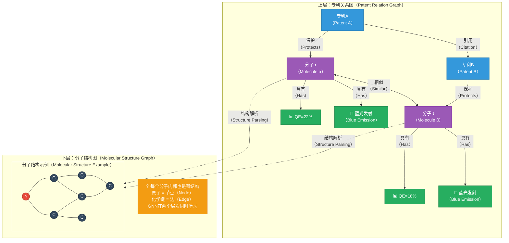
```mermaid
graph TB
    %% ============================================================
    %% 专利知识图谱双层结构（Patent Knowledge Graph Dual-Layer Structure）
    %% ============================================================

    %% 上层：专利关系图
    subgraph UPPER[上层：专利关系图（Patent Relation Graph）]
        direction TB
        
        %% 专利节点
        PA[专利A<br>（Patent A）]
        PB[专利B<br>（Patent B）]
        
        %% 分子节点
        MA[分子α<br>（Molecule α）]
        MB[分子β<br>（Molecule β）]
        
        %% 属性节点
        PROPA1[🔵 蓝光发射<br>（Blue Emission）]
        PROPA2[📊 QE=22%]
        PROPB1[🔵 蓝光发射<br>（Blue Emission）]
        PROPB2[📊 QE=18%]
        
        %% 专利间关系
        PA -->|引用<br>（Citation）| PB
        
        %% 专利-分子关系
        PA -->|保护<br>（Protects）| MA
        PB -->|保护<br>（Protects）| MB
        
        %% 分子间关系
        MA <-->|相似<br>（Similar）| MB
        
        %% 分子-属性关系
        MA -->|具有<br>（Has）| PROPA1
        MA -->|具有<br>（Has）| PROPA2
        MB -->|具有<br>（Has）| PROPB1
        MB -->|具有<br>（Has）| PROPB2
    end

    %% 下层：分子结构图
    subgraph LOWER[下层：分子结构图（Molecular Structure Graph）]
        direction TB
        
        %% 说明节点
        NOTE[💡 每个分子内部也是图结构<br>原子 = 节点（Node）<br>化学键 = 边（Edge）<br>GNN在两个层次同时学习]
        
        %% 分子结构示意
        subgraph MOL[分子结构示例（Molecular Structure Example）]
            N1((N))
            C1((C))
            C2((C))
            C3((C))
            C4((C))
            C5((C))
            C6((C))
            
            N1 --- C1
            N1 --- C2
            C1 --- C3
            C1 --- C4
            C2 --- C4
            C2 --- C5
            C3 --- C6
            C4 --- C6
        end
    end

    %% 层级连接
    MA -.->|结构解析<br>（Structure Parsing）| MOL
    MB -.->|结构解析<br>（Structure Parsing）| MOL

    %% 样式定义
    classDef patentStyle fill:#3498db,stroke:#2980b9,stroke-width:2px,color:#fff
    classDef moleculeStyle fill:#9b59b6,stroke:#8e44ad,stroke-width:2px,color:#fff
    classDef propertyStyle fill:#27ae60,stroke:#1e8449,stroke-width:1px,color:#fff
    classDef atomN fill:#e74c3c,stroke:#c0392b,stroke-width:2px,color:#fff
    classDef atomC fill:#34495e,stroke:#2c3e50,stroke-width:2px,color:#fff
    classDef noteStyle fill:#f39c12,stroke:#d35400,stroke-width:1px,color:#fff

    %% 应用样式
    class PA,PB patentStyle
    class MA,MB moleculeStyle
    class PROPA1,PROPA2,PROPB1,PROPB2 propertyStyle
    class N1 atomN
    class C1,C2,C3,C4,C5,C6 atomC
    class NOTE noteStyle

```

这个架构的精妙之处在于：**底层GNN学习分子的化学语义（什么样的结构变化会导致性能变化），上层GNN学习专利的法律语义（什么样的引用关系暗示技术演进方向），两层之间的映射学习"分子结构变化如何影响专利保护范围"**。这是目前任何竞品都不具备的能力。

#### 创新二：Markush结构智能解析与覆盖范围计算

OLED材料专利中大量使用Markush结构（通式结构）来扩大保护范围。例如，一个权利要求可能写道："通式(I)所示的化合物，其中R1选自C1-C6烷基、苯基、萘基；R2选自氢、甲基、乙基..."

传统工具只能做简单的文本匹配。KeyIP-Intelligence能够：

* 自动解析Markush结构的所有可能取代基组合
* 计算Markush结构覆盖的分子空间范围（可能是数百万个具体分子）
* 判断一个给定的具体分子是否落入某个Markush结构的保护范围
* 可视化展示Markush结构的覆盖边界

#### 创新三：对抗性分子生成（Adversarial Molecule Generation）

当检测到侵权风险时，系统不仅告诉您"有风险"，还能自动生成规避方案——具体来说，就是生成一系列"既能绕开目标专利的权利要求、又能保持目标性能"的候选分子结构。

这背后是一个受GAN（生成对抗网络）启发的架构：

* **生成器**：生成候选分子结构
* **判别器1（性能判别器）**：评估候选分子是否满足目标性能要求
* **判别器2（侵权判别器）**：评估候选分子是否落入目标专利的保护范围
* **优化目标**：最大化性能评分，同时最小化侵权风险评分

#### 创新四：联邦学习驱动的行业协同

在合作伙伴生态中，不同企业可能希望共同训练更好的AI模型，但又不愿意共享原始数据。KeyIP-Intelligence支持联邦学习模式：

* 每个企业在本地用自己的数据训练模型
* 只上传模型参数更新（梯度），不上传原始数据
* 中央服务器聚合各方的参数更新，生成更强大的全局模型
* 全局模型再分发给各方使用

这样，即使钥熠只有90+件专利和7000+正例试验数据的数据，也能通过联邦学习获得"仿佛用了整个行业数据训练"的模型效果。

#### 创新五：专利知识图谱的时序推理

传统知识图谱是静态的——它记录"现在是什么样"。KeyIP-Intelligence的知识图谱是时序的——它记录"过去是什么样、现在是什么样、未来可能是什么样"。

每个实体和关系都带有时间戳，支持：

* **历史回溯**："2020年时，UDC在蓝光材料领域的专利布局是什么样的？"
* **变化追踪**："过去3年，三星SDI的专利申请方向发生了什么变化？"
* **趋势预测**："按照当前趋势，2026年OLED材料领域的专利热点会在哪里？"

---

## 七、实施方法论与交付计划

### 7.1 实施方法论：RAPID框架

KeyIP-Intelligence的实施采用自研的**RAPID框架**，专为IP智能平台的落地设计：

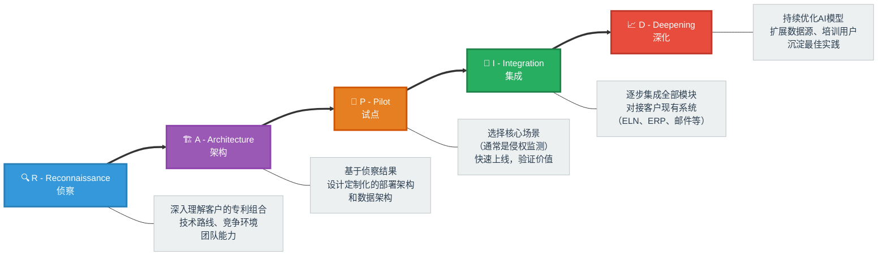
```mermaid
graph LR
    %% ============================================================
    %% RAPID 实施方法论（RAPID Implementation Methodology）
    %% ============================================================

    %% 步骤节点
    R[🔍 R - Reconnaissance<br>侦察]
    A[🏗️ A - Architecture<br>架构]
    P[🚀 P - Pilot<br>试点]
    I[🔗 I - Integration<br>集成]
    D[📈 D - Deepening<br>深化]

    %% 详细说明节点
    R1[深入理解客户的专利组合<br>技术路线、竞争环境<br>团队能力]
    A1[基于侦察结果<br>设计定制化的部署架构<br>和数据架构]
    P1[选择核心场景<br>（通常是侵权监测）<br>快速上线，验证价值]
    I1[逐步集成全部模块<br>对接客户现有系统<br>（ELN、ERP、邮件等）]
    D1[持续优化AI模型<br>扩展数据源、培训用户<br>沉淀最佳实践]

    %% 主流程连接
    R ==> A ==> P ==> I ==> D

    %% 说明连接
    R --- R1
    A --- A1
    P --- P1
    I --- I1
    D --- D1

    %% 样式定义
    classDef reconStyle fill:#3498db,stroke:#2980b9,stroke-width:3px,color:#fff
    classDef archStyle fill:#9b59b6,stroke:#8e44ad,stroke-width:3px,color:#fff
    classDef pilotStyle fill:#e67e22,stroke:#d35400,stroke-width:3px,color:#fff
    classDef intStyle fill:#27ae60,stroke:#1e8449,stroke-width:3px,color:#fff
    classDef deepStyle fill:#e74c3c,stroke:#c0392b,stroke-width:3px,color:#fff
    classDef descStyle fill:#ecf0f1,stroke:#bdc3c7,stroke-width:1px,color:#2c3e50

    %% 应用样式
    class R reconStyle
    class A archStyle
    class P pilotStyle
    class I intStyle
    class D deepStyle
    class R1,A1,P1,I1,D1 descStyle

```

### 7.2 典型实施时间线

| 阶段       | 时长   | 关键活动                        | 交付物                | 客户参与度       |
| :------- | :--- | :-------------------------- | :----------------- | :---------- |
| **R-侦察** | 2-3周 | 专利组合审计、需求访谈、竞争环境分析、技术路线梳理   | 《需求分析报告》《数据就绪度评估》  | 高（每周2-3次访谈） |
| **A-架构** | 1-2周 | 部署方案设计、数据迁移方案、集成方案、安全方案     | 《技术架构方案》《实施计划书》    | 中（方案评审）     |
| **P-试点** | 4-6周 | 核心模块部署、种子数据导入、AI模型初始化、用户培训  | 试点环境上线、《用户操作手册》    | 高（日常使用+反馈）  |
| **I-集成** | 4-8周 | 全模块上线、系统集成、数据迁移、UAT测试       | 生产环境上线、《集成测试报告》    | 中（UAT测试）    |
| **D-深化** | 持续   | AI模型优化、新数据源接入、高级功能启用、季度业务回顾 | 《季度优化报告》《AI模型性能报告》 | 低（季度回顾）     |

### 7.3 客户成功体系

KeyIP-Intelligence不是"卖完就走"的软件，而是"持续陪伴"的服务。我们的客户成功体系包括：

| 服务层级        | 启航版客户       | 远航版客户         | 旗舰版客户             |
| :---------- | :---------- | :------------ | :---------------- |
| **客户成功经理**  | 共享CSM（1:20） | 专属CSM（1:8）    | 高级CSM（1:3）        |
| **技术支持**    | 邮件（48h SLA） | 在线+电话（8h SLA） | 专属支持群（2h SLA）     |
| **培训**      | 在线视频课程      | 季度线上培训        | 年度现场培训 + 定制课程     |
| **业务回顾**    | 年度邮件报告      | 季度线上回顾        | 月度深度回顾 + 战略建议     |
| **AI模型优化**  | 通用模型更新      | 半年度微调         | 季度微调 + 定制模型       |
| **新功能优先体验** | 正式发布后       | 提前1个月Beta     | 提前3个月Alpha + 需求共创 |

---

## 八、竞争壁垒与护城河分析

### 8.1 五层护城河模型

KeyIP-Intelligence的竞争壁垒不是单一的，而是由五层相互强化的护城河构成：

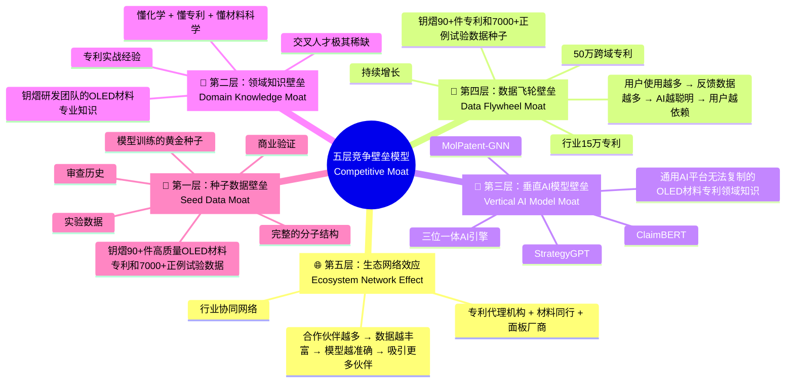
```mermaid
mindmap
    root((五层竞争壁垒模型<br>Competitive Moat))
        L5[🌐 第五层：生态网络效应<br>Ecosystem Network Effect]
            合作伙伴越多 → 数据越丰富 → 模型越准确 → 吸引更多伙伴
            专利代理机构 + 材料同行 + 面板厂商
            行业协同网络
        L4[🔄 第四层：数据飞轮壁垒<br>Data Flywheel Moat]
            用户使用越多 → 反馈数据越多 → AI越聪明 → 用户越依赖
            钥熠90+件专利和7000+正例试验数据种子
            行业15万专利
            50万跨域专利
            持续增长
        L3[🤖 第三层：垂直AI模型壁垒<br>Vertical AI Model Moat]
            通用AI平台无法复制的OLED材料专利领域知识
            MolPatent-GNN
            ClaimBERT
            StrategyGPT
            三位一体AI引擎
        L2[🧠 第二层：领域知识壁垒<br>Domain Knowledge Moat]
            钥熠研发团队的OLED材料专业知识
            专利实战经验
            懂化学 + 懂专利 + 懂材料科学
            交叉人才极其稀缺
        L1[🌱 第一层：种子数据壁垒<br>Seed Data Moat]
            钥熠90+件高质量OLED材料专利和7000+正例试验数据
            模型训练的黄金种子
            完整的分子结构
            实验数据
            审查历史
            商业验证

```

#### 各层护城河的深度解析

**第一层：种子数据壁垒 — "起跑线优势"**

钥熠的90+件专利和7000+正例试验数据不是普通的公开数据——它们附带了公开数据库中不存在的宝贵信息：

* 每个分子的完整实验数据（量子效率、寿命、色坐标等，精确到实验条件）
* 专利申请过程中的审查意见和答复策略（什么样的权利要求修改能获得授权）
* 每件专利的商业化状态（哪些分子真正用在了产品中，哪些只是防御性布局）
* 研发团队对每个技术方向的内部评估（哪些方向有前景，哪些已经放弃）

这些"暗数据"是训练垂直AI模型的关键——它们让模型不仅理解"专利文本说了什么"，还理解"专利背后的真实技术价值是什么"。任何竞争对手，即使获得了相同的公开专利数据，也无法复制这些暗数据。

**第二层：领域知识壁垒 — "跨界稀缺性"**

构建KeyIP-Intelligence需要三种知识的交叉：

* **有机化学/材料科学**：理解OLED材料的分子设计逻辑、构效关系、制备工艺
* **专利法律**：理解权利要求的撰写规则、侵权判定标准、各国专利法差异
* **人工智能/数据科学**：理解图神经网络、NLP、知识图谱等技术的能力和局限

同时精通这三个领域的人才，全球可能不超过几百人。钥熠的研发团队天然具备前两项知识，只需要补充第三项——这比一个纯AI公司试图从零学习化学和专利法要容易得多。

**第三层：垂直AI模型壁垒 — "越用越聪明"**

KeyIP的三个核心AI模型（MolPatent-GNN、ClaimBERT、StrategyGPT）都是在OLED材料专利这个垂直领域深度训练的。通用AI平台（如PatSnap）的模型需要覆盖所有技术领域，不可能在任何单一领域达到KeyIP的深度。

这就像医疗AI领域的规律：一个专门做眼底影像诊断的AI，永远比一个"什么病都能看"的通用AI更准确。

**第四层：数据飞轮壁垒 — "滚雪球效应"**

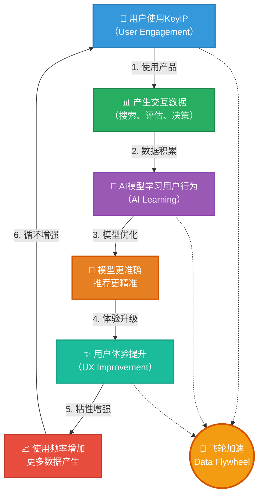
```mermaid
graph TD
    %% ============================================================
    %% 数据飞轮效应（Data Flywheel Effect）
    %% ============================================================

    %% 飞轮核心节点
    A[👤 用户使用KeyIP<br>（User Engagement）]
    B[📊 产生交互数据<br>（搜索、评估、决策）]
    C[🤖 AI模型学习用户行为<br>（AI Learning）]
    D[🎯 模型更准确<br>推荐更精准]
    E[✨ 用户体验提升<br>（UX Improvement）]
    F[📈 使用频率增加<br>更多数据产生]

    %% 飞轮中心
    CENTER((🔄 飞轮加速<br>Data Flywheel))

    %% 飞轮循环连接
    A -->|1. 使用产品| B
    B -->|2. 数据积累| C
    C -->|3. 模型优化| D
    D -->|4. 体验升级| E
    E -->|5. 粘性增强| F
    F -->|6. 循环增强| A

    %% 中心连接
    A -.-> CENTER
    C -.-> CENTER
    E -.-> CENTER

    %% 样式定义
    classDef userStyle fill:#3498db,stroke:#2980b9,stroke-width:2px,color:#fff
    classDef dataStyle fill:#27ae60,stroke:#1e8449,stroke-width:2px,color:#fff
    classDef aiStyle fill:#9b59b6,stroke:#8e44ad,stroke-width:2px,color:#fff
    classDef resultStyle fill:#e67e22,stroke:#d35400,stroke-width:2px,color:#fff
    classDef uxStyle fill:#1abc9c,stroke:#16a085,stroke-width:2px,color:#fff
    classDef growthStyle fill:#e74c3c,stroke:#c0392b,stroke-width:2px,color:#fff
    classDef centerStyle fill:#f39c12,stroke:#d35400,stroke-width:3px,color:#fff

    %% 应用样式
    class A userStyle
    class B dataStyle
    class C aiStyle
    class D resultStyle
    class E uxStyle
    class F growthStyle
    class CENTER centerStyle

```

每一次用户的搜索、每一次侵权判定的确认或否定、每一次规避方案的采纳或拒绝，都是模型学习的素材。使用KeyIP的企业越多、使用时间越长，模型就越准确——而新进入者从零开始，永远追不上这个飞轮。

**第五层：生态网络效应 — "赢家通吃"**

当KeyIP的合作伙伴生态成熟后，会形成强大的网络效应：

* 更多的材料企业使用KeyIP → 更多的专利代理机构入驻 → 代理机构带来更多的材料企业客户
* 更多的企业数据（联邦学习）→ 更强的AI模型 → 吸引更多企业加入
* 行业标准的形成：当KeyIP成为OLED材料领域的"事实标准"IP管理平台时，不使用KeyIP的企业会面临协作障碍

### 8.2 竞争对手应对策略

| 潜在竞争威胁                | 威胁来源                     | 我们的应对                           | 信心等级     |
| :-------------------- | :----------------------- | :------------------------------ | :------- |
| **PatSnap增加OLED垂直功能** | PatSnap作为通用平台，可能开发行业垂直模块 | 我们的分子级理解深度是通用平台无法快速复制的；持续加深垂直优势 | ★★★★☆ 高  |
| **UDC/三星自建IP管理系统**    | 大型竞争对手可能自建内部系统           | 他们的系统只服务自己，不会开放给行业；我们服务整个生态     | ★★★★★ 很高 |
| **通用AI公司进入IP领域**      | OpenAI/百度等可能推出AI专利工具     | 通用AI缺乏化学结构理解和专利法律知识；我们的垂直壁垒是护城河 | ★★★★☆ 高  |
| **开源社区构建类似工具**        | 开源项目可能组合RDKit+LLM做类似功能   | 开源工具缺乏产品化和商业化能力；我们的价值在于集成和领域知识  | ★★★★★ 很高 |
| **传统IP服务公司数字化转型**     | 中国专利代理机构可能开发自有平台         | 代理机构缺乏AI和材料科学能力；我们与他们是合作而非竞争关系  | ★★★★☆ 高  |

---

## 九、财务模型与投资回报

### 9.1 客户投资回报分析（ROI）

以一个拥有100件专利、10人研发团队的中型OLED材料企业为例：

#### 成本对比

| 成本项             | 使用KeyIP之前（年）                            | 使用KeyIP之后（年）                   | 节省       |
| :-------------- | :-------------------------------------- | :----------------------------- | :------- |
| **IP管理人力成本**    | 2名专职IP人员 × ¥30万 = ¥60万                  | 1名IP人员 + KeyIP = ¥30万 + ¥18.8万 | ¥11.2万   |
| **外部检索服务**      | 年度FTO检索 × 4次 × ¥8万 = ¥32万               | KeyIP内置FTO + 偶尔外部深度分析 = ¥10万   | ¥22万     |
| **专利代理沟通成本**    | 邮件/电话沟通 × 约500小时/年 × ¥200/h = ¥10万      | 合作伙伴门户自动化 × 约150小时/年 = ¥3万     | ¥7万      |
| **错过申请窗口的机会成本** | 估计每年2-3个有价值发明未及时申请 × ¥50万/件 = ¥100-150万 | AI挖掘减少遗漏至0-1件 = ¥0-50万         | ¥50-150万 |
| **侵权风险成本**      | 未及时发现的侵权风险 × 潜在损失 = 难以量化（可能数百万）         | 实时监测大幅降低风险                     | 风险显著降低   |

#### ROI计算

```
年度KeyIP投入：¥18.8万（远航版订阅）
年度直接节省：¥11.2万 + ¥22万 + ¥7万 = ¥40.2万
年度间接收益：¥50-150万（减少的机会成本）+ 风险降低价值

保守ROI = (¥40.2万 - ¥18.8万) / ¥18.8万 = 114%
综合ROI = (¥40.2万 + ¥50万 - ¥18.8万) / ¥18.8万 = 380%

投资回收期：约5.6个月
```

### 9.2 KeyIP-Intelligence自身财务预测（3年）

| 指标               | Year 1      | Year 2     | Year 3      |
| :--------------- | :---------- | :--------- | :---------- |
| **付费客户数**        | 8-12        | 25-35      | 50-70       |
| **平均客户年费（ARPU）** | ¥15万        | ¥20万       | ¥25万        |
| **SaaS订阅收入**     | ¥120-180万   | ¥500-700万  | ¥1250-1750万 |
| **专业服务收入**       | ¥50-80万     | ¥150-250万  | ¥300-500万   |
| **数据产品收入**       | ¥0          | ¥50-100万   | ¥200-400万   |
| **总收入**          | ¥170-260万   | ¥700-1050万 | ¥1750-2650万 |
| **毛利率**          | 60-65%      | 70-75%     | 75-80%      |
| **研发投入**         | ¥300-400万   | ¥400-600万  | ¥500-800万   |
| **净利润**          | -¥200~-100万 | ¥0~+200万   | ¥500-1000万  |

**关键假设：**

* Year 1以钥熠自用+3-5个种子客户验证为主，收入有限但验证了PMF（Product-Market Fit）
* Year 2进入规模获客阶段，ARPU随增值模块渗透率提升而增长
* Year 3生态效应开始显现，数据产品和合作伙伴分成贡献增量收入
* 预计Year 2末至Year 3初实现盈亏平衡

---

## 十、风险评估与缓解策略

### 10.1 关键风险矩阵

| 风险类别     | 具体风险                  | 发生概率 | 影响程度 | 风险等级  | 缓解策略                                             |
| :------- | :-------------------- | :--- | :--- | :---- | :----------------------------------------------- |
| **技术风险** | AI模型在OLED材料领域的准确率不达预期 | 中    | 高    | 🟠 高  | 分阶段验证：先在钥熠内部验证，达标后再推向市场；建立人工审核兜底机制               |
| **技术风险** | 分子结构OCR识别率不足          | 中    | 中    | 🟡 中  | 结合多种OCR引擎（PaddleOCR + OSRA + 自训练模型）；支持用户手动修正并反馈  |
| **数据风险** | 全球专利数据获取受限或成本过高       | 低    | 高    | 🟡 中  | 优先使用开放数据源（Lens.org、各国专利局API）；与数据供应商建立长期合作        |
| **数据风险** | 客户担心数据安全不愿上云          | 高    | 高    | 🔴 极高 | 提供私有化部署选项；获取等保三级和ISO 27001认证；签署严格的数据保护协议         |
| **市场风险** | OLED材料企业市场规模有限        | 中    | 中    | 🟡 中  | Phase 3向相邻领域扩展（钙钛矿、量子点、有机光伏等有机电子材料）              |
| **市场风险** | 客户付费意愿不足              | 中    | 高    | 🟠 高  | 先用免费/低价的生命周期管理功能获客，再用高价值的AI功能转化付费                |
| **竞争风险** | PatSnap等大平台推出OLED垂直功能 | 低    | 高    | 🟡 中  | 持续加深垂直优势；建立客户切换成本（数据沉淀、工作流定制、AI模型个性化）            |
| **合规风险** | 跨境数据传输合规问题            | 中    | 高    | 🟠 高  | 在主要市场（中国、欧洲、美国）分别部署数据节点；聘请专业合规顾问                 |
| **人才风险** | "化学+AI+专利"交叉人才招聘困难    | 高    | 高    | 🔴 极高 | 内部培养为主（化学背景+AI培训）；与高校合作定向培养；远程招聘全球人才             |
| **运营风险** | 侵权监测误报/漏报导致客户损失       | 中    | 极高   | 🔴 极高 | 明确产品定位为"辅助决策"而非"替代决策"；所有高风险告警标注"建议人工复核"；购买专业责任保险 |

### 10.2 最高优先级风险的详细缓解方案

#### 风险一：客户数据安全顾虑（🔴 极高）

这是最可能阻碍产品推广的风险。OLED材料企业的专利数据是核心商业秘密，任何数据泄露都可能造成不可挽回的损失。

**多层缓解方案：**

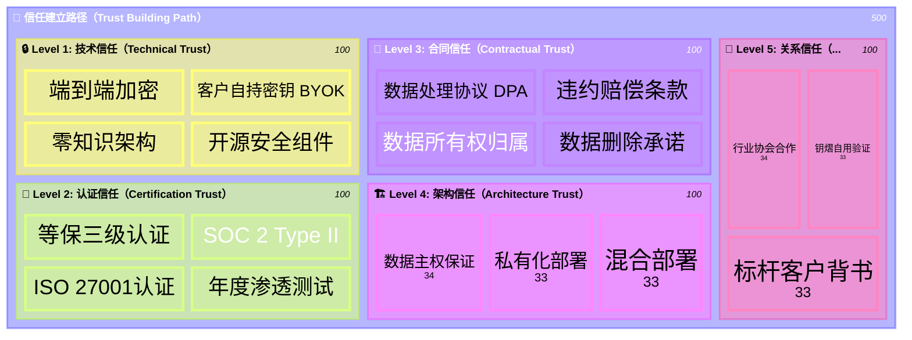
```mermaid
treemap-beta
    "🔐 信任建立路径（Trust Building Path）"
        "🔒 Level 1: 技术信任（Technical Trust）"
            "端到端加密": 25
            "零知识架构": 25
            "客户自持密钥 BYOK": 25
            "开源安全组件": 25
        "📜 Level 2: 认证信任（Certification Trust）"
            "等保三级认证": 25
            "ISO 27001认证": 25
            "SOC 2 Type II": 25
            "年度渗透测试": 25
        "📝 Level 3: 合同信任（Contractual Trust）"
            "数据处理协议 DPA": 25
            "数据所有权归属": 25
            "违约赔偿条款": 25
            "数据删除承诺": 25
        "🏗️ Level 4: 架构信任（Architecture Trust）"
            "私有化部署": 33
            "混合部署": 33
            "数据主权保证": 34
        "🤝 Level 5: 关系信任（Relationship Trust）"
            "钥熠自用验证": 33
            "标杆客户背书": 33
            "行业协会合作": 34

```

#### 风险二：交叉人才招聘困难（🔴 极高）

**创新缓解方案：**

| 策略           | 具体措施                                                  | 预期效果                  |
| :----------- | :---------------------------------------------------- | :-------------------- |
| **内部转型培养**   | 从钥熠研发团队选拔2-3名对编程有兴趣的化学博士，提供6个月的AI/ML密集培训              | 6个月内获得2-3名"懂化学的AI工程师" |
| **高校联合培养**   | 与清华、北大、中科院化学所等合作，设立"AI+化学+IP"交叉方向的实习/奖学金项目            | 12个月内建立人才管道           |
| **全球远程招聘**   | 在全球范围内招聘化学信息学（Cheminformatics）背景的远程工程师，这个领域在欧美有成熟的人才池 | 3个月内招聘1-2名资深工程师       |
| **顾问网络**     | 建立由专利律师、材料科学家、AI研究员组成的外部顾问委员会，按需咨询                    | 立即获得跨领域专家支持           |
| **AI辅助降低门槛** | 用AI工具（Copilot、Cursor等）降低编码门槛，让化学背景的人也能参与开发            | 扩大潜在人才池               |

---

## 十一、产品差异化总结与价值主张

### 11.1 一页纸价值主张

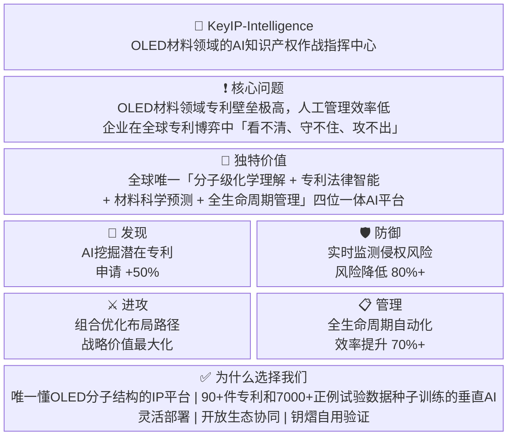
```mermaid
block-beta
    %% ============================================================
    %% KeyIP-Intelligence 产品价值概览（Product Value Overview）
    %% ============================================================
    
    columns 2
    
    %% 标题区
    HEADER["🎯 KeyIP-Intelligence<br>OLED材料领域的AI知识产权作战指挥中心"]:2
    
    %% 核心问题区
    PROBLEM["❗ 核心问题<br>OLED材料领域专利壁垒极高，人工管理效率低<br>企业在全球专利博弈中「看不清、守不住、攻不出」"]:2
    
    %% 独特价值区
    VALUE["💎 独特价值<br>全球唯一「分子级化学理解 + 专利法律智能<br>+ 材料科学预测 + 全生命周期管理」四位一体AI平台"]:2
    
    %% 四大能力区
    DISCOVER["🔬 发现<br>AI挖掘潜在专利<br>申请 +50%"]
    DEFEND["🛡️ 防御<br>实时监测侵权风险<br>风险降低 80%+"]
    ATTACK["⚔️ 进攻<br>组合优化布局路径<br>战略价值最大化"]
    MANAGE["📋 管理<br>全生命周期自动化<br>效率提升 70%+"]
    
    %% 为什么选择我们
    WHY["✅ 为什么选择我们<br>唯一懂OLED分子结构的IP平台 | 90+件专利和7000+正例试验数据种子训练的垂直AI<br>灵活部署 | 开放生态协同 | 钥熠自用验证"]:2

    %% 样式定义
    classDef headerStyle fill:#1a1a2e,stroke:#16213e,stroke-width:2px,color:#eee
    classDef problemStyle fill:#e74c3c,stroke:#c0392b,stroke-width:2px,color:#fff
    classDef valueStyle fill:#9b59b6,stroke:#8e44ad,stroke-width:2px,color:#fff
    classDef discoverStyle fill:#3498db,stroke:#2980b9,stroke-width:2px,color:#fff
    classDef defendStyle fill:#27ae60,stroke:#1e8449,stroke-width:2px,color:#fff
    classDef attackStyle fill:#e67e22,stroke:#d35400,stroke-width:2px,color:#fff
    classDef manageStyle fill:#1abc9c,stroke:#16a085

```

### 11.2 与竞品的终极对比

| 能力维度           | KeyIP-Intelligence | PatSnap      | Orbit    | IPRally  | Anaqua   | Citrine |
| :------------- | :----------------- | :----------- | :------- | :------- | :------- | :------ |
| **分子结构级专利检索**  | ✅ 原子级相似度           | ⚠️ 基础Markush | ⚠️ 子结构检索 | ❌        | ❌        | ❌       |
| **OLED材料领域深度** | ✅ 垂直专精             | ❌ 通用型        | ❌ 通用型    | ❌ 通用型    | ❌ 通用型    | ⚠️ 材料通用 |
| **AI专利挖掘**     | ✅ 主动推荐             | ⚠️ 被动搜索      | ❌        | ⚠️ 相似度排序 | ❌        | ❌       |
| **侵权实时监测**     | ✅ 分子级实时            | ⚠️ 关键词Alert  | ⚠️ 定期监控  | ❌        | ❌        | ❌       |
| **AI规避方案生成**   | ✅ 自动生成             | ❌            | ❌        | ❌        | ❌        | ❌       |
| **组合博弈优化**     | ✅ 博弈论模型            | ⚠️ 基础分析      | ⚠️ 基础分析  | ❌        | ❌        | ❌       |
| **材料性能预测**     | ✅ 集成               | ❌            | ❌        | ❌        | ❌        | ✅ 核心能力  |
| **全生命周期管理**    | ✅ 完整               | ⚠️ 部分        | ⚠️ 部分    | ❌        | ✅ 核心能力   | ❌       |
| **合作伙伴生态**     | ✅ 开放门户             | ❌            | ❌        | ❌        | ⚠️ 基础    | ❌       |
| **私有化部署**      | ✅ 完整支持             | ⚠️ 企业版       | ⚠️ 企业版   | ❌        | ✅        | ✅       |
| **知识图谱时序推理**   | ✅ 创新               | ❌            | ❌        | ❌        | ❌        | ❌       |
| **联邦学习协同**     | ✅ 创新               | ❌            | ❌        | ❌        | ❌        | ❌       |
| **年费（中型企业）**   | ¥18.8万             | ¥30-60万      | ¥40-80万  | ¥20-40万  | ¥80-150万 | 定制      |

### 11.3 电梯演讲（30秒版本）

> **面向投资人：**
> "OLED材料是一个年产值超过500亿美元的市场，但这个市场被三星、LG、UDC等巨头用专利壁垒牢牢锁住。中国OLED材料企业要突围，需要一个'懂化学、懂专利、懂AI'的智能武器。KeyIP-Intelligence就是这个武器——全球唯一能在分子级别理解OLED专利的AI平台。我们已经有90+件专利和7000+正例试验数据的种子数据和一个自用验证的MVP，现在需要资金来加速产品化和市场拓展。"

> **面向客户：**
> "您的研发团队每天都在设计新的OLED分子，但您知道哪些分子可以安全地商业化、哪些可能踩到专利地雷吗？KeyIP-Intelligence能在8秒内告诉您答案——不是靠关键词搜索，而是靠真正理解分子结构的AI。我们还能7×24小时监控全球竞争对手的专利动态，在威胁形成之前就发出预警。已经有像钥熠这样的企业在使用，专利运营效率提升了30%以上。"

> **面向合作伙伴（专利代理机构）：**
> "您的OLED材料客户是否经常抱怨现有技术检索不够精准、FTO分析耗时太长？KeyIP-Intelligence可以成为您的'AI助手'——它能在分子级别做专利检索，自动解析Markush结构的覆盖范围，还能生成FTO报告初稿。您的律师可以把时间花在真正需要专业判断的地方，而不是重复性的检索工作。我们提供合作伙伴门户，让您和客户的协作更高效、更安全。"

---

## 十二、附录

### 附录A：OLED材料专利技术分类体系

这是KeyIP-Intelligence内部使用的OLED材料专利技术分类体系，比IPC分类更精细、更贴合行业实际。该体系是知识图谱中"技术领域"实体的基础。

#### 一级分类：按器件功能层

```
OLED材料专利技术分类体系 v1.0
│
├── 1. 发光层材料 (Emitting Layer, EML)
│   ├── 1.1 荧光材料 (Fluorescent)
│   │   ├── 1.1.1 蓝光荧光主体
│   │   ├── 1.1.2 蓝光荧光掺杂
│   │   ├── 1.1.3 绿光荧光主体
│   │   ├── 1.1.4 绿光荧光掺杂
│   │   ├── 1.1.5 红光荧光主体
│   │   ├── 1.1.6 红光荧光掺杂
│   │   └── 1.1.7 白光荧光体系
│   │
│   ├── 1.2 磷光材料 (Phosphorescent)
│   │   ├── 1.2.1 铱配合物 (Ir complex)
│   │   │   ├── 1.2.1.1 蓝光铱配合物
│   │   │   ├── 1.2.1.2 绿光铱配合物
│   │   │   └── 1.2.1.3 红光铱配合物
│   │   ├── 1.2.2 铂配合物 (Pt complex)
│   │   ├── 1.2.3 磷光主体材料
│   │   │   ├── 1.2.3.1 咔唑类主体
│   │   │   ├── 1.2.3.2 螺芴类主体
│   │   │   ├── 1.2.3.3 三嗪类主体
│   │   │   └── 1.2.3.4 硅基主体
│   │   └── 1.2.4 其他磷光体系
│   │
│   ├── 1.3 TADF材料 (热活化延迟荧光)
│   │   ├── 1.3.1 D-A型TADF
│   │   │   ├── 1.3.1.1 咔唑供体型
│   │   │   ├── 1.3.1.2 吖啶供体型
│   │   │   ├── 1.3.1.3 吩噁嗪供体型
│   │   │   └── 1.3.1.4 多重共振(MR)型
│   │   ├── 1.3.2 TADF主体材料
│   │   ├── 1.3.3 TADF敏化体系
│   │   └── 1.3.4 超荧光(Hyperfluorescence)体系
│   │
│   └── 1.4 量子点发光材料 (QD-OLED相关)
│       ├── 1.4.1 CdSe基量子点
│       ├── 1.4.2 InP基量子点
│       └── 1.4.3 钙钛矿量子点
│
├── 2. 空穴注入/传输层材料 (HIL/HTL)
│   ├── 2.1 空穴注入材料 (HIL)
│   │   ├── 2.1.1 PEDOT:PSS及衍生物
│   │   ├── 2.1.2 金属氧化物 (MoO3, WO3等)
│   │   ├── 2.1.3 有机小分子HIL
│   │   └── 2.1.4 掺杂型HIL
│   │
│   ├── 2.2 空穴传输材料 (HTL)
│   │   ├── 2.2.1 三苯胺类 (NPB, TPD等)
│   │   ├── 2.2.2 咔唑类
│   │   ├── 2.2.3 螺芴类 (Spiro-OMeTAD等)
│   │   ├── 2.2.4 聚合物型HTL
│   │   └── 2.2.5 新型杂环HTL
│   │
│   └── 2.3 电子阻挡材料 (EBL)
│       ├── 2.3.1 宽带隙咔唑类
│       └── 2.3.2 三芳胺类EBL
│
├── 3. 电子注入/传输层材料 (EIL/ETL)
│   ├── 3.1 电子注入材料 (EIL)
│   │   ├── 3.1.1 碱金属化合物 (LiF, Liq等)
│   │   ├── 3.1.2 有机碱金属配合物
│   │   └── 3.1.3 n型掺杂EIL
│   │
│   ├── 3.2 电子传输材料 (ETL)
│   │   ├── 3.2.1 噁二唑类
│   │   ├── 3.2.2 三嗪类
│   │   ├── 3.2.3 嘧啶类
│   │   ├── 3.2.4 苯并咪唑类
│   │   ├── 3.2.5 膦氧化物类
│   │   └── 3.2.6 含硼ETL
│   │
│   └── 3.3 空穴阻挡材料 (HBL)
│       ├── 3.3.1 浴铜灵(BCP)及衍生物
│       └── 3.3.2 三嗪类HBL
│
├── 4. 封装与基板材料
│   ├── 4.1 薄膜封装 (TFE)
│   │   ├── 4.1.1 无机阻隔层 (SiNx, Al2O3等)
│   │   ├── 4.1.2 有机缓冲层
│   │   └── 4.1.3 有机-无机交替封装
│   │
│   ├── 4.2 柔性基板
│   │   ├── 4.2.1 PI (聚酰亚胺)基板
│   │   ├── 4.2.2 PEN基板
│   │   └── 4.2.3 超薄玻璃基板
│   │
│   └── 4.3 光取出增强
│       ├── 4.3.1 微透镜阵列
│       ├── 4.3.2 散射层
│       └── 4.3.3 纳米结构光取出
│
├── 5. 器件结构与工艺
│   ├── 5.1 叠层器件 (Tandem OLED)
│   ├── 5.2 微腔结构
│   ├── 5.3 溶液加工工艺
│   │   ├── 5.3.1 喷墨打印
│   │   ├── 5.3.2 旋涂工艺
│   │   └── 5.3.3 狭缝涂布
│   ├── 5.4 蒸镀工艺优化
│   └── 5.5 Micro-OLED (硅基OLED)
│
└── 6. 新兴方向
    ├── 6.1 可拉伸OLED
    ├── 6.2 透明OLED
    ├── 6.3 OLED照明专用材料
    ├── 6.4 生物可降解OLED材料
    └── 6.5 AI辅助分子设计方法学
```

#### 分类体系与IPC的映射关系

| KeyIP分类      | 主要IPC分类号               | 覆盖关系                    |
| :----------- | :--------------------- | :---------------------- |
| 1. 发光层材料     | C09K 11/06, H10K 85/60 | KeyIP更细粒度（区分荧光/磷光/TADF） |
| 2. HIL/HTL材料 | H10K 85/10, H10K 85/12 | KeyIP按分子骨架进一步细分         |
| 3. EIL/ETL材料 | H10K 85/30, H10K 85/60 | KeyIP区分了功能层和分子类型        |
| 4. 封装与基板     | H10K 50/84, H10K 77/10 | KeyIP增加了柔性和光取出子类        |
| 5. 器件结构与工艺   | H10K 50/10, H10K 71/00 | KeyIP按工艺类型细分            |
| 6. 新兴方向      | 跨多个IPC                 | KeyIP独有分类，IPC尚未覆盖       |

---

### 附录B：核心分子指纹算法选型与对比

分子指纹（Molecular Fingerprint）是KeyIP-Intelligence进行分子相似度计算的基础。不同的指纹算法适用于不同的场景，KeyIP采用多指纹融合策略。

| 指纹类型                  | 算法         | 维度            | 优势                | 劣势               | KeyIP中的应用场景          |
| :-------------------- | :--------- | :------------ | :---------------- | :--------------- | :------------------- |
| **MACCS Keys**        | 166个预定义结构键 | 166 bit       | 可解释性强，计算快         | 分辨率低，无法区分细微差异    | 粗筛：快速过滤明显不相关的分子      |
| **Morgan/ECFP**       | 圆形指纹，半径可调  | 1024/2048 bit | 捕获局部化学环境，业界标准     | 对全局结构不敏感         | 核心相似度计算：侵权检测的主力算法    |
| **RDKit Fingerprint** | 拓扑路径指纹     | 2048 bit      | 对线性结构敏感           | 对环状结构区分度不够       | 辅助相似度：与Morgan互补      |
| **Atom Pair**         | 原子对距离指纹    | 可变            | 捕获原子间拓扑距离         | 维度较高             | 骨架分析：识别核心骨架相似性       |
| **FCFP**              | 功能类圆形指纹    | 1024/2048 bit | 基于药效团特征而非原子类型     | 对OLED材料的电子性质不够敏感 | 功能相似度：寻找功能等价但结构不同的分子 |
| **GNN Embedding**     | 图神经网络学习的嵌入 | 256/512 dim   | 端到端学习，捕获复杂结构-性能关系 | 需要训练数据，可解释性差     | 深度相似度：最终的相似度判定       |

#### 多指纹融合策略

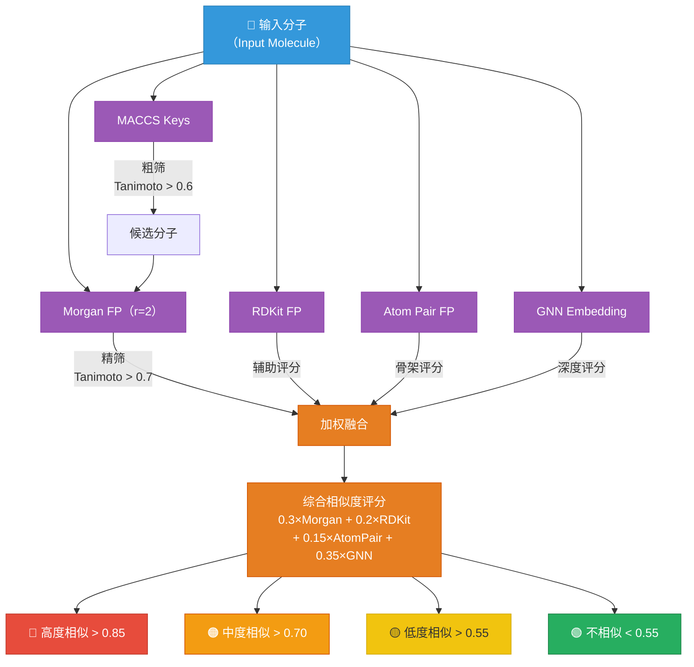
```mermaid
graph TD
    %% ============================================================
    %% 分子相似度多指纹融合评分流程（Molecular Similarity Scoring）
    %% ============================================================

    %% 输入
    INPUT[🧪 输入分子<br>（Input Molecule）]

    %% 指纹计算分支
    INPUT --> MACCS[MACCS Keys]
    INPUT --> MORGAN[Morgan FP（r=2）]
    INPUT --> RDKIT[RDKit FP]
    INPUT --> ATOMPAIR[Atom Pair FP]
    INPUT --> GNN[GNN Embedding]

    %% 筛选流程
    MACCS -->|粗筛<br>Tanimoto > 0.6| CANDIDATES[候选分子]
    CANDIDATES --> MORGAN
    MORGAN -->|精筛<br>Tanimoto > 0.7| FUSION

    %% 评分汇聚
    RDKIT -->|辅助评分| FUSION[加权融合]
    ATOMPAIR -->|骨架评分| FUSION
    GNN -->|深度评分| FUSION

    %% 综合评分
    FUSION --> SCORE[综合相似度评分<br>0.3×Morgan + 0.2×RDKit<br>+ 0.15×AtomPair + 0.35×GNN]

    %% 结果分级
    SCORE --> HIGH[🔴 高度相似 > 0.85]
    SCORE --> MED[🟠 中度相似 > 0.70]
    SCORE --> LOW[🟡 低度相似 > 0.55]
    SCORE --> NONE[🟢 不相似 < 0.55]

    %% 样式
    classDef inputStyle fill:#3498db,stroke:#2980b9,color:#fff
    classDef fpStyle fill:#9b59b6,stroke:#8e44ad,color:#fff
    classDef fusionStyle fill:#e67e22,stroke:#d35400,color:#fff
    classDef highStyle fill:#e74c3c,stroke:#c0392b,color:#fff
    classDef medStyle fill:#f39c12,stroke:#d35400,color:#fff
    classDef lowStyle fill:#f1c40f,stroke:#d4ac0d,color:#333
    classDef noneStyle fill:#27ae60,stroke:#1e8449,color:#fff

    class INPUT inputStyle
    class MACCS,MORGAN,RDKIT,ATOMPAIR,GNN fpStyle
    class FUSION,SCORE fusionStyle
    class HIGH highStyle
    class MED medStyle
    class LOW lowStyle
    class NONE noneStyle

```

---

### 附录C：权利要求解析引擎技术规格

权利要求（Claim）是专利的"灵魂"——它定义了专利的保护范围。KeyIP-Intelligence的ClaimBERT模型能够自动解析权利要求的结构和语义。

#### 权利要求解析流程

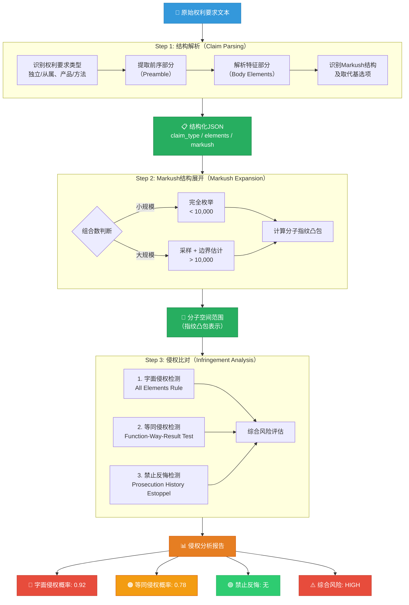
```mermaid
graph TD
    %% ============================================================
    %% 权利要求侵权分析流程（Claim Infringement Analysis Pipeline）
    %% ============================================================

    %% 输入
    INPUT[📄 原始权利要求文本]

    %% Step 1: 结构解析
    subgraph S1[Step 1: 结构解析（Claim Parsing）]
        S1A[识别权利要求类型<br>独立/从属、产品/方法]
        S1B[提取前序部分<br>（Preamble）]
        S1C[解析特征部分<br>（Body Elements）]
        S1D[识别Markush结构<br>及取代基选项]
        
        S1A --> S1B --> S1C --> S1D
    end

    %% Step 1 输出
    S1OUT[📋 结构化JSON<br>claim_type / elements / markush]

    %% Step 2: Markush展开
    subgraph S2[Step 2: Markush结构展开（Markush Expansion）]
        S2A{组合数判断}
        S2B[完全枚举<br>< 10,000]
        S2C[采样 + 边界估计<br>> 10,000]
        S2D[计算分子指纹凸包]
        
        S2A -->|小规模| S2B
        S2A -->|大规模| S2C
        S2B --> S2D
        S2C --> S2D
    end

    %% Step 2 输出
    S2OUT[🎯 分子空间范围<br>（指纹凸包表示）]

    %% Step 3: 侵权比对
    subgraph S3[Step 3: 侵权比对（Infringement Analysis）]
        S3A[1. 字面侵权检测<br>All Elements Rule]
        S3B[2. 等同侵权检测<br>Function-Way-Result Test]
        S3C[3. 禁止反悔检测<br>Prosecution History Estoppel]
        S3D[综合风险评估]
        
        S3A --> S3D
        S3B --> S3D
        S3C --> S3D
    end

    %% 最终输出
    OUTPUT[📊 侵权分析报告]
    
    %% 输出详情
    OUT1[🔴 字面侵权概率: 0.92]
    OUT2[🟠 等同侵权概率: 0.78]
    OUT3[🟢 禁止反悔: 无]
    OUT4[⚠️ 综合风险: HIGH]

    %% 流程连接
    INPUT --> S1
    S1 --> S1OUT
    S1OUT --> S2
    S2 --> S2OUT
    S2OUT --> S3
    S3 --> OUTPUT
    OUTPUT --> OUT1
    OUTPUT --> OUT2
    OUTPUT --> OUT3
    OUTPUT --> OUT4

    %% 样式定义
    classDef inputStyle fill:#3498db,stroke:#2980b9,color:#fff
    classDef stepStyle fill:#9b59b6,stroke:#8e44ad,color:#fff
    classDef outputStyle fill:#27ae60,stroke:#1e8449,color:#fff
    classDef resultStyle fill:#e67e22,stroke:#d35400,color:#fff
    classDef highRisk fill:#e74c3c,stroke:#c0392b,color:#fff
    classDef medRisk fill:#f39c12,stroke:#d35400,color:#fff
    classDef lowRisk fill:#2ecc71,stroke:#27ae60,color:#fff

    class INPUT inputStyle
    class S1OUT,S2OUT outputStyle
    class OUTPUT resultStyle
    class OUT1,OUT4 highRisk
    class OUT2 medRisk
    class OUT3 lowRisk

```

#### ClaimBERT模型训练数据规格

| 训练任务            | 数据来源                 | 数据量              | 标注方式           |
| :-------------- | :------------------- | :--------------- | :------------- |
| **权利要求结构解析**    | 中国/美国/欧洲OLED相关专利     | 50,000条权利要求      | 半自动标注（规则+人工校验） |
| **Markush结构识别** | 含Markush结构的化学专利      | 15,000条权利要求      | 专家标注           |
| **侵权判定**        | 历史侵权诉讼案例 + 专家模拟标注    | 5,000组（分子-权利要求对） | 专利律师标注         |
| **等同原则判定**      | 各国法院判例 + 专家标注        | 2,000组           | 资深专利律师标注       |
| **审查历史分析**      | 专利审查档案（File Wrapper） | 30,000份          | 自动提取 + 人工校验    |

---

### 附录D：API接口规范（核心接口预览）

以下是KeyIP-Intelligence对外提供的核心API接口预览，遵循RESTful设计规范，使用OpenAPI 3.0标准文档化。

#### 分子相似度检索API

```yaml
# POST /api/v1/molecules/similarity-search
# 在专利数据库中搜索与给定分子结构相似的专利

Request:
  Content-Type: application/json
  Authorization: Bearer {access_token}
  
  Body:
  {
    "molecule": {
      "format": "smiles",                    # smiles | inchi | molfile
      "value": "c1ccc2c(c1)c1ccccc1n2-c1ccc(-c2ccc3c(c2)c2ccccc2n3C)cc1",
      "name": "CBP-derivative-001"           # 可选，用户自定义名称
    },
    "search_params": {
      "fingerprint_types": ["morgan", "gnn"], # 使用的指纹类型
      "similarity_threshold": 0.65,           # 最低相似度阈值
      "max_results": 50,                      # 最大返回数量
      "patent_offices": ["CNIPA", "USPTO", "EPO", "JPO", "KIPO"],
      "date_range": {
        "from": "2019-01-01",
        "to": "2024-12-31"
      },
      "assignees_filter": ["Samsung SDI", "UDC", "Idemitsu"],  # 可选
      "tech_domains": ["1.2.3", "2.2"]       # KeyIP技术分类号
    },
    "analysis_options": {
      "include_claim_analysis": true,         # 是否包含权利要求分析
      "include_infringement_risk": true,      # 是否包含侵权风险评估
      "include_design_around": false          # 是否包含规避方案
    }
  }

Response (200 OK):
  {
    "request_id": "req_abc123",
    "query_molecule": {
      "smiles": "c1ccc2c(c1)...",
      "inchi": "InChI=1S/C36H24N2/...",
      "molecular_weight": 484.59,
      "morgan_fp_hash": "fp_xyz789"
    },
    "results": [
      {
        "rank": 1,
        "patent": {
          "patent_number": "CN115xxxxx",
          "title": "一种基于咔唑的有机发光化合物及其应用",
          "assignee": "Samsung SDI Co., Ltd.",
          "filing_date": "2022-03-15",
          "publication_date": "2022-09-20",
          "legal_status": "granted",
          "ipc_codes": ["C09K 11/06", "H10K 85/60"]
        },
        "matched_molecule": {
          "smiles": "c1ccc2c(c1)...",
          "location_in_patent": "Example 3, Compound 15",
          "page_reference": "p.23, Table 2"
        },
        "similarity_scores": {
          "morgan": 0.89,
          "rdkit": 0.85,
          "atom_pair": 0.82,
          "gnn": 0.91,
          "weighted_overall": 0.88
        },
        "structural_comparison": {
          "common_scaffold": "carbazole-biphenyl",
          "differences": [
            {
              "position": "R1 (9-position of carbazole)",
              "query": "phenyl",
              "matched": "naphthyl",
              "significance": "moderate"
            }
          ]
        },
        "claim_analysis": {
          "relevant_claims": [1, 3, 7],
          "claim_1_coverage": {
            "literal_match": true,
            "markush_covered": true,
            "explanation": "查询分子落入权利要求1的Markush通式范围内"
          }
        },
        "infringement_risk": {
          "level": "HIGH",
          "score": 0.88,
          "literal_infringement_probability": 0.92,
          "equivalents_probability": 0.78,
          "recommendation": "建议立即进行详细FTO分析",
          "confidence": 0.85
        }
      }
      // ... 更多结果
    ],
    "metadata": {
      "total_patents_searched": 152847,
      "total_molecules_compared": 487293,
      "search_time_ms": 8234,
      "model_versions": {
        "morgan_fp": "v2.1",
        "gnn_embedding": "v1.3.2",
        "claim_bert": "v1.2.0"
      }
    }
  }
```

#### 侵权监测配置API

```yaml
# POST /api/v1/monitoring/watchlists
# 创建一个新的侵权监测任务

Request:
  Body:
  {
    "name": "蓝光主体材料核心分子监控",
    "description": "监控与钥熠蓝光主体材料核心分子相似的新公开专利",
    "watch_type": "molecule_similarity",
    "targets": [
      {
        "molecule_smiles": "c1ccc2c(c1)...",
        "molecule_name": "KY-Blue-Host-001",
        "similarity_threshold": 0.70,
        "priority": "critical"
      },
      {
        "molecule_smiles": "c1ccc(-n2c3ccccc3c3ccccc32)cc1...",
        "molecule_name": "KY-Blue-Host-002",
        "similarity_threshold": 0.75,
        "priority": "high"
      }
    ],
    "scope": {
      "patent_offices": ["CNIPA", "USPTO", "EPO", "JPO", "KIPO"],
      "assignees_of_interest": [
        "Samsung SDI", "LG Chem", "UDC", "Idemitsu Kosan",
        "Merck KGaA", "Dupont", "Cynora", "Kyulux"
      ],
      "tech_domains": ["1.1.1", "1.2.3.1", "1.2.3.2"]
    },
    "alert_config": {
      "channels": ["email", "wechat_work", "in_app"],
      "recipients": [
        {"email": "[email]", "name": "[name]", "role": "ip_manager"},
        {"email": "[email]", "name": "[name]", "role": "cto"}
      ],
      "alert_levels": {
        "critical": {"channels": ["email", "wechat_work", "sms", "in_app"]},
        "high": {"channels": ["email", "wechat_work", "in_app"]},
        "medium": {"channels": ["email", "in_app"]},
        "low": {"channels": ["in_app"]}
      },
      "digest_frequency": "daily",
      "quiet_hours": {"start": "22:00", "end": "08:00", "timezone": "Asia/Shanghai"}
    },
    "auto_analysis": {
      "claim_analysis": true,
      "infringement_risk_assessment": true,
      "design_around_suggestions": false,
      "competitor_context": true
    },
    "schedule": {
      "frequency": "daily",
      "preferred_time": "06:00",
      "timezone": "Asia/Shanghai"
    }
  }

Response (201 Created):
  {
    "watchlist_id": "wl_def456",
    "status": "active",
    "created_at": "2024-xx-xxT10:30:00Z",
    "next_scan": "2024-xx-xxT06:00:00+08:00",
    "estimated_daily_scan_volume": 150,
    "message": "监控任务已创建，将于明日06:00执行首次扫描"
  }
```

#### 专利价值评估API

```yaml
# POST /api/v1/patents/value-assessment
# 对一组专利进行多维度价值评估

Request:
  Body:
  {
    "patent_numbers": [
      "CN115xxxxx", "CN116xxxxx", "US11,xxx,xxx",
      "EP3,xxx,xxx", "JP7,xxx,xxx"
    ],
    "assessment_dimensions": [
      "technical_value",      # 技术价值
      "legal_value",          # 法律价值
      "commercial_value",     # 商业价值
      "strategic_value"       # 战略价值
    ],
    "context": {
      "company": "钥熠科技",
      "tech_focus_areas": ["1.2.3", "2.2.1"],
      "competitors": ["Samsung SDI", "UDC"],
      "business_goals": ["defend_blue_host", "expand_htl"]
    }
  }

Response (200 OK):
  {
    "assessments": [
      {
        "patent_number": "CN115xxxxx",
        "title": "一种基于螺芴的蓝光主体材料",
        "scores": {
          "technical_value": {
            "score": 82,
            "max": 100,
            "factors": {
              "novelty": 85,
              "inventive_step": 78,
              "technical_breadth": 80,
              "performance_improvement": 88,
              "citation_impact": 75
            },
            "explanation": "该专利的螺芴骨架设计在蓝光主体领域具有较高新颖性，量子效率提升12%具有显著技术进步"
          },
          "legal_value": {
            "score": 75,
            "max": 100,
            "factors": {
              "claim_breadth": 80,
              "claim_clarity": 72,
              "prosecution_strength": 70,
              "remaining_life_years": 16,
              "family_coverage": 78
            },
            "explanation": "权利要求保护范围较宽，但Markush结构的部分取代基定义可能存在支持不足的风险，建议关注审查过程中的限缩修改"
          },
          "commercial_value": {
            "score": 88,
            "max": 100,
            "factors": {
              "market_relevance": 92,
              "product_coverage": 85,
              "licensing_potential": 80,
              "cost_of_design_around": 90,
              "industry_adoption": 88
            },
            "explanation": "该专利覆盖的蓝光主体材料已在量产产品中使用，竞争对手规避设计的成本较高，具有较强的商业变现潜力"
          },
          "strategic_value": {
            "score": 91,
            "max": 100,
            "factors": {
              "portfolio_centrality": 95,
              "blocking_power": 88,
              "negotiation_leverage": 85,
              "technology_trajectory_alignment": 93,
              "competitive_differentiation": 92
            },
            "explanation": "该专利位于钥熠蓝光主体材料专利组合的核心位置，对竞争对手具有较强的阻断效应，是交叉许可谈判中的关键筹码"
          },
          "overall_value": {
            "score": 84,
            "tier": "A",
            "tier_description": "核心资产 — 建议最高优先级维护和保护",
            "weighted_calculation": "0.2×技术(82) + 0.2×法律(75) + 0.3×商业(88) + 0.3×战略(91) = 84.5"
          }
        },
        "recommendations": [
          {
            "type": "maintain",
            "priority": "critical",
            "action": "确保所有法域的年金按时缴纳，不可放弃",
            "reason": "核心资产，放弃将导致蓝光主体材料领域的防御缺口"
          },
          {
            "type": "strengthen",
            "priority": "high",
            "action": "建议在该专利基础上申请2-3件改进专利，覆盖新发现的高性能取代基组合",
            "reason": "扩大保护范围，形成专利簇"
          },
          {
            "type": "enforce",
            "priority": "medium",
            "action": "监测到Samsung SDI的CN117xxxxx可能落入本专利保护范围，建议深入分析",
            "reason": "潜在的许可收入或谈判筹码"
          }
        ]
      }
      // ... 更多专利的评估结果
    ],
    "portfolio_summary": {
      "total_patents_assessed": 5,
      "tier_distribution": {
        "S_tier": 0,
        "A_tier": 2,
        "B_tier": 2,
        "C_tier": 1,
        "D_tier": 0
      },
      "average_score": 72.4,
      "total_estimated_annual_maintenance_cost": "¥18.5万",
      "cost_optimization_potential": "¥3.2万/年（通过放弃1件C级专利）",
      "strategic_gaps_identified": 2,
      "recommended_new_filings": 4
    }
  }
```

---

### 附录E：数据迁移与集成规范

#### E.1 支持的数据导入格式

| 数据类型       | 支持格式                                                        | 说明                                    |
| :--------- | :---------------------------------------------------------- | :------------------------------------ |
| **专利基础数据** | CSV, Excel (.xlsx), XML (ST.36/ST.96), JSON                 | 支持从PatSnap、Orbit、Innography等平台导出的标准格式 |
| **分子结构**   | SMILES, InChI, MOL/SDF (V2000/V3000), CDXML (ChemDraw), RXN | 支持批量导入，自动去重和标准化                       |
| **权利要求**   | 纯文本, XML, 结构化JSON                                           | 支持中/英/日/韩四种语言                         |
| **法律状态**   | CSV, XML (INPADOC格式)                                        | 支持从各国专利局和商业数据库导入                      |
| **年金费用**   | CSV, Excel                                                  | 支持自定义字段映射                             |
| **发明披露**   | Word (.docx), PDF, 自定义模板                                    | 支持OCR提取PDF中的文本和分子结构                   |
| **实验数据**   | CSV, Excel, JSON, ELN导出格式                                   | 支持与主流ELN系统（如Benchling、BIOVIA）的数据格式    |

#### E.2 系统集成接口

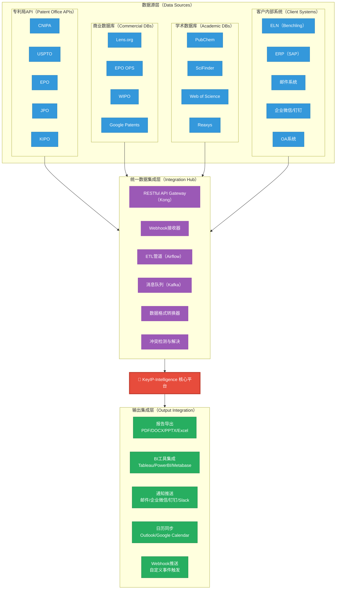
```mermaid
graph TD
    %% ============================================================
    %% KeyIP-Intelligence 集成架构（Integration Architecture）
    %% ============================================================

    %% 数据源层
    subgraph DS[数据源层（Data Sources）]
        direction LR
        subgraph PA[专利局API（Patent Office APIs）]
            PA1[CNIPA]
            PA2[USPTO]
            PA3[EPO]
            PA4[JPO]
            PA5[KIPO]
        end
        subgraph CD[商业数据库（Commercial DBs）]
            CD1[Lens.org]
            CD2[EPO OPS]
            CD3[WIPO]
            CD4[Google Patents]
        end
        subgraph AD[学术数据库（Academic DBs）]
            AD1[PubChem]
            AD2[SciFinder]
            AD3[Web of Science]
            AD4[Reaxys]
        end
        subgraph CS[客户内部系统（Client Systems）]
            CS1[ELN（Benchling）]
            CS2[ERP（SAP）]
            CS3[邮件系统]
            CS4[企业微信/钉钉]
            CS5[OA系统]
        end
    end

    %% 统一数据集成层
    subgraph IH[统一数据集成层（Integration Hub）]
        IH1[RESTful API Gateway（Kong）]
        IH2[Webhook接收器]
        IH3[ETL管道（Airflow）]
        IH4[消息队列（Kafka）]
        IH5[数据格式转换器]
        IH6[冲突检测与解决]
    end

    %% 核心平台
    CORE[🎯 KeyIP-Intelligence 核心平台]

    %% 输出集成层
    subgraph OI[输出集成层（Output Integration）]
        OI1[报告导出<br>PDF/DOCX/PPTX/Excel]
        OI2[BI工具集成<br>Tableau/PowerBI/Metabase]
        OI3[通知推送<br>邮件/企业微信/钉钉/Slack]
        OI4[日历同步<br>Outlook/Google Calendar]
        OI5[Webhook推送<br>自定义事件触发]
    end

    %% 连接关系
    PA --> IH
    CD --> IH
    AD --> IH
    CS --> IH
    IH --> CORE
    CORE --> OI

    %% 样式定义
    classDef sourceStyle fill:#3498db,stroke:#2980b9,color:#fff
    classDef hubStyle fill:#9b59b6,stroke:#8e44ad,color:#fff
    classDef coreStyle fill:#e74c3c,stroke:#c0392b,color:#fff,stroke-width:3px
    classDef outputStyle fill:#27ae60,stroke:#1e8449,color:#fff

    class PA1,PA2,PA3,PA4,PA5,CD1,CD2,CD3,CD4,AD1,AD2,AD3,AD4,CS1,CS2,CS3,CS4,CS5 sourceStyle
    class IH1,IH2,IH3,IH4,IH5,IH6 hubStyle
    class CORE coreStyle
    class OI1,OI2,OI3,OI4,OI5 outputStyle

```

#### E.3 典型集成场景

| 集成场景                  | 数据流向                                 | 触发方式              | 技术实现                                |
| :-------------------- | :----------------------------------- | :---------------- | :---------------------------------- |
| **ELN→KeyIP：新分子自动评估** | 研发人员在ELN中记录新合成分子 → KeyIP自动进行可专利性预评估  | Webhook（ELN新记录事件） | Benchling API → Kafka → 评估微服务       |
| **KeyIP→邮件：侵权告警**     | KeyIP检测到高风险专利 → 自动发送告警邮件给IP团队        | 定时扫描 + 事件触发       | 监测微服务 → Kafka → 邮件服务                |
| **专利局→KeyIP：法律状态更新**  | 各国专利局公开新的法律状态变更 → KeyIP自动同步          | 定时拉取（每日）          | Airflow DAG → 专利局API → PostgreSQL   |
| **KeyIP→ERP：年金费用同步**  | KeyIP计算的年金费用预算 → 同步到ERP系统的预算模块       | 手动触发/季度自动         | KeyIP API → 自定义适配器 → SAP RFC        |
| **KeyIP→BI：数据看板**     | KeyIP的专利组合分析数据 → 在Tableau/PowerBI中展示 | 实时/定时             | KeyIP API → Metabase嵌入 / Tableau连接器 |
| **企业微信→KeyIP：自然语言查询** | 用户在企业微信中@KeyIP机器人提问 → 返回分析结果         | 消息事件              | 企业微信API → NLQ微服务 → 结果格式化            |

---

### 附录F：术语表（Glossary）

| 术语             | 英文                                           | 定义                               |
| :------------- | :------------------------------------------- | :------------------------------- |
| **OLED**       | Organic Light-Emitting Diode                 | 有机发光二极管，一种利用有机材料在电场作用下发光的显示/照明技术 |
| **SMILES**     | Simplified Molecular Input Line Entry System | 简化分子线性输入规范，用ASCII字符串表示分子结构的标准方法  |
| **InChI**      | International Chemical Identifier            | 国际化学标识符，IUPAC开发的分子结构唯一标识符        |
| **Markush结构**  | Markush Structure                            | 专利中使用的通式化学结构，通过可变基团定义一类化合物       |
| **FTO**        | Freedom to Operate                           | 自由实施分析，评估某技术方案是否侵犯他人有效专利权        |
| **IPC**        | International Patent Classification          | 国际专利分类，由WIPO管理的专利技术分类体系          |
| **权利要求**       | Patent Claim                                 | 专利文件中定义保护范围的法律条款                 |
| **现有技术**       | Prior Art                                    | 在专利申请日之前已经公开的技术信息                |
| **新颖性**        | Novelty                                      | 发明与现有技术相比是否为新的，是专利授权的基本条件之一      |
| **创造性**        | Inventive Step / Non-obviousness             | 发明相对于现有技术是否具有非显而易见的技术进步          |
| **年金**         | Annuity / Maintenance Fee                    | 维持专利有效性需要定期缴纳的费用                 |
| **OA**         | Office Action                                | 审查意见通知书，专利局审查员发出的审查意见            |
| **GNN**        | Graph Neural Network                         | 图神经网络，一种在图结构数据上进行学习的深度学习模型       |
| **TADF**       | Thermally Activated Delayed Fluorescence     | 热活化延迟荧光，第三代OLED发光机制              |
| **MR-TADF**    | Multi-Resonance TADF                         | 多重共振TADF，一种能实现窄发射光谱的新型TADF材料     |
| **Tanimoto系数** | Tanimoto Coefficient                         | 衡量两个分子指纹相似度的指标，范围0-1             |
| **知识图谱**       | Knowledge Graph                              | 以图结构组织知识的数据模型，由实体和关系构成           |
| **联邦学习**       | Federated Learning                           | 一种分布式机器学习方法，各方在不共享原始数据的情况下协同训练模型 |
| **NER**        | Named Entity Recognition                     | 命名实体识别，从文本中自动识别特定类型实体的NLP技术      |
| **RAG**        | Retrieval-Augmented Generation               | 检索增强生成，结合检索和生成的AI架构              |
| **RBAC**       | Role-Based Access Control                    | 基于角色的访问控制                        |
| **ABAC**       | Attribute-Based Access Control               | 基于属性的访问控制                        |
| **PMF**        | Product-Market Fit                           | 产品市场契合度                          |
| **ARR**        | Annual Recurring Revenue                     | 年度经常性收入                          |
| **ARPU**       | Average Revenue Per User                     | 每用户平均收入                          |
| **NPS**        | Net Promoter Score                           | 净推荐值，衡量客户满意度和忠诚度的指标              |
| **CSM**        | Customer Success Manager                     | 客户成功经理                           |
| **SLA**        | Service Level Agreement                      | 服务等级协议                           |
| **BYOK**       | Bring Your Own Key                           | 客户自持加密密钥                         |

---

### 附录G：参考文献与行业数据来源

#### G.1 行业报告与市场数据

| 来源                                      | 报告/数据         | 用途             |
| :-------------------------------------- | :------------ | :------------- |
| DSCC (Display Supply Chain Consultants) | OLED材料市场季度报告  | 市场规模、增长率、供应商份额 |
| UBI Research                            | OLED年度报告      | 技术趋势、面板厂商产能规划  |
| Yole Développement                      | OLED显示技术与市场报告 | 技术路线图、成本分析     |
| IHS Markit (现S&P Global)                | 显示面板市场追踪      | 面板出货量、价格趋势     |
| 中国OLED产业联盟                              | 中国OLED产业年度白皮书 | 国内产业政策、企业动态    |
| WIPO                                    | 世界知识产权指标      | 全球专利申请趋势       |
| 中国国家知识产权局                               | 专利统计年报        | 中国专利申请和授权数据    |

#### G.2 技术文献与标准

| 来源                                    | 文献/标准                            | 用途           |
| :------------------------------------ | :------------------------------- | :----------- |
| SID (Society for Information Display) | Display Week论文集                  | OLED材料最新研究进展 |
| ACS (American Chemical Society)       | JACS, Chemistry of Materials等期刊  | OLED材料分子设计前沿 |
| RSC (Royal Society of Chemistry)      | Journal of Materials Chemistry C | OLED材料性能数据   |
| WIPO                                  | ST.36/ST.96 XML标准                | 专利数据交换格式标准   |
| EPO                                   | Open Patent Services (OPS) API文档 | 专利数据获取接口规范   |
| RDKit                                 | 官方文档与教程                          | 化学信息学算法实现参考  |
| Neo4j                                 | 图数据库最佳实践                         | 知识图谱存储与查询优化  |

#### G.3 竞品分析数据来源

| 竞品                           | 信息来源                           | 分析维度          |
| :--------------------------- | :----------------------------- | :------------ |
| PatSnap (智慧芽)                | 官网、产品演示、客户评价(G2/Capterra)、融资新闻 | 功能覆盖、定价、客户群体  |
| Orbit Intelligence (Questel) | 官网、白皮书、行业会议演讲                  | 化学专利检索能力、全球覆盖 |
| IPRally                      | 官网、技术博客、专利(自身专利)               | AI技术路线、差异化定位  |
| Anaqua                       | 官网、Gartner报告、客户案例              | 企业级IP管理能力     |
| Citrine Informatics          | 官网、学术论文、合作伙伴信息                 | 材料信息学能力、AI模型  |
| CAS SciFinder                | 官网、ACS文档                       | 化学结构检索能力、数据覆盖 |

---

### 附录H：团队能力需求与组织架构建议

#### H.1 核心团队配置（Phase 1: 奠基期）

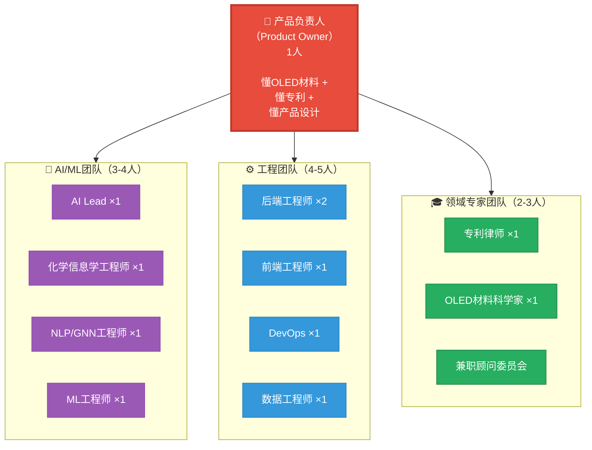
```mermaid
graph TD
    %% ============================================================
    %% KeyIP-Intelligence 团队组织架构（Team Organization）
    %% ============================================================

    %% 产品负责人
    PM[👤 产品负责人<br>（Product Owner）<br>1人<br><br>懂OLED材料 +<br>懂专利 +<br>懂产品设计]

    %% AI/ML团队
    subgraph AI[🤖 AI/ML团队（3-4人）]
        AI1[AI Lead ×1]
        AI2[化学信息学工程师 ×1]
        AI3[NLP/GNN工程师 ×1]
        AI4[ML工程师 ×1]
    end

    %% 工程团队
    subgraph ENG[⚙️ 工程团队（4-5人）]
        ENG1[后端工程师 ×2]
        ENG2[前端工程师 ×1]
        ENG3[DevOps ×1]
        ENG4[数据工程师 ×1]
    end

    %% 领域专家团队
    subgraph EXPERT[🎓 领域专家团队（2-3人）]
        EXP1[专利律师 ×1]
        EXP2[OLED材料科学家 ×1]
        EXP3[兼职顾问委员会]
    end

    %% 连接关系
    PM --> AI
    PM --> ENG
    PM --> EXPERT

    %% 样式定义
    classDef pmStyle fill:#e74c3c,stroke:#c0392b,color:#fff,stroke-width:3px
    classDef aiStyle fill:#9b59b6,stroke:#8e44ad,color:#fff
    classDef engStyle fill:#3498db,stroke:#2980b9,color:#fff
    classDef expertStyle fill:#27ae60,stroke:#1e8449,color:#fff

    class PM pmStyle
    class AI1,AI2,AI3,AI4 aiStyle
    class ENG1,ENG2,ENG3,ENG4 engStyle
    class EXP1,EXP2,EXP3 expertStyle

```

#### H.2 各角色详细职责与能力要求

| 角色                | 人数 | 核心职责                       | 必备技能                                      | 加分技能                         | 招聘难度               |
| :---------------- | :- | :------------------------- | :---------------------------------------- | :--------------------------- | :----------------- |
| **产品负责人**         | 1  | 产品战略、需求优先级、客户沟通、商业模式       | 5年+IP行业经验、产品管理能力、OLED材料基础知识               | MBA背景、创业经验                   | ★★★★★ 极难           |
| **AI技术负责人**       | 1  | AI架构设计、模型选型、技术路线决策         | 深度学习、GNN、NLP、5年+ML工程经验                    | 化学信息学背景、专利文本处理经验             | ★★★★☆ 很难           |
| **化学信息学工程师**      | 1  | RDKit集成、分子指纹算法、Markush解析   | RDKit精通、有机化学硕士+、Python                    | 专利检索经验、材料科学背景                | ★★★★★ 极难           |
| **NLP/GNN工程师**    | 1  | ClaimBERT训练、知识图谱构建、GNN模型开发 | PyTorch、Transformers、图神经网络                | 中文NLP经验、法律文本处理               | ★★★☆☆ 中等           |
| **ML工程师**         | 1  | 模型训练管道、特征工程、模型部署与监控        | MLOps、MLflow、Docker/K8s、Python            | vLLM部署经验、分布式训练               | ★★★☆☆ 中等           |
| **后端工程师**         | 2  | API开发、微服务架构、数据库设计          | Python(FastAPI)/Go、PostgreSQL、Redis、Kafka | 图数据库(Neo4j)、搜索引擎(OpenSearch) | ★★☆☆☆ 较易           |
| **前端工程师**         | 1  | 用户界面开发、数据可视化、交互设计          | React/TypeScript、ECharts/D3.js            | 3Dmol.js(分子3D可视化)、无障碍设计      | ★★☆☆☆ 较易           |
| **DevOps工程师**     | 1  | CI/CD管道、K8s运维、监控告警、安全加固    | Kubernetes、Terraform、GitLab CI、Prometheus | 私有化部署经验、等保合规                 | ★★★☆☆ 中等           |
| **数据工程师**         | 1  | 数据管道、ETL、数据质量、专利数据采集       | Airflow、Kafka、SQL、Python                  | 专利数据格式(ST.36/ST.96)、爬虫       | ★★☆☆☆ 较易           |
| **专利律师(兼职/顾问)**   | 1  | 权利要求分析标注、侵权判定规则定义、合规审查     | 中国/美国专利法、化学领域专利代理经验                       | OLED材料专利经验、诉讼经验              | ★★★★☆ 很难           |
| **OLED材料科学家(兼职)** | 1  | 技术分类体系设计、AI模型验证、领域知识输入     | OLED材料研发5年+、博士学位                          | 专利撰写经验、数据分析能力                | ★★★☆☆ 中等(可从钥熠内部借调) |

#### H.3 团队扩展路线图

```
Phase 1 (M1-M8): 奠基期
├── 核心团队: 10-12人
├── 重点: 搭建MVP，验证核心AI能力
└── 关键招聘: AI Lead + 化学信息学工程师（最难招的两个岗位，优先启动）

         │
         ▼

Phase 2 (M9-M18): 成长期
├── 团队规模: 18-25人
├── 新增角色:
│   ├── 客户成功经理 ×2（开始服务外部客户）
│   ├── 安全工程师 ×1（等保认证准备）
│   ├── 测试工程师 ×2（QA体系建设）
│   ├── 后端工程师 ×2（微服务扩展）
│   ├── AI工程师 ×2（模型迭代加速）
│   ├── 产品设计师 ×1（UX优化）
│   └── 技术文档工程师 ×1（API文档、用户手册）
└── 关键招聘: 客户成功经理（需要懂IP行业的人来做客户对接）

         │
         ▼

Phase 3 (M19-M30): 扩张期
├── 团队规模: 35-50人
├── 新增角色:
│   ├── 销售团队 ×3-5（市场拓展）
│   ├── 市场营销 ×2（品牌建设、内容营销）
│   ├── 合作伙伴经理 ×2（生态建设）
│   ├── 数据科学家 ×2（高级分析、行业报告）
│   ├── 国际化工程师 ×2（多语言、多法域支持）
│   ├── SRE工程师 ×2（大规模运维）
│   └── 合规专员 ×1（GDPR、数据出境等）
└── 关键招聘: 国际化人才（支持海外市场拓展）
```

#### H.4 外部顾问委员会建议配置

| 顾问角色             | 人数  | 参与频率 | 主要贡献                 | 理想人选画像                     |
| :--------------- | :-- | :--- | :------------------- | :------------------------- |
| **OLED材料首席科学顾问** | 1   | 月度   | 技术方向把关、AI模型验证、行业趋势洞察 | 国内OLED材料领域知名教授/研究员，有产业化经验  |
| **知识产权法律顾问**     | 1-2 | 双周   | 侵权判定规则审核、合规建议、诉讼策略   | 资深专利律师，化学领域10年+经验，有跨国诉讼经验  |
| **AI/ML技术顾问**    | 1   | 月度   | AI架构评审、前沿技术引入、模型优化建议 | AI领域知名学者/工业界专家，有化学AI或NLP背景 |
| **SaaS商业化顾问**    | 1   | 季度   | 定价策略、GTM策略、融资建议      | 成功的B2B SaaS创业者/投资人         |
| **信息安全顾问**       | 1   | 季度   | 安全架构评审、等保认证指导、渗透测试   | CISSP/CISM认证，有等保三级项目经验     |

---

### 附录I：Phase 1 详细里程碑分解

Phase 1（奠基期，M1-M8）是整个项目成败的关键。以下是按月分解的详细里程碑：

#### 月度里程碑甘特图

```
M1 ──────────────────────────────────────────────────────────
│ 🎯 目标: 团队组建 + 技术验证
│
│ Week 1-2:
│ ├── [招聘] 发布AI Lead和化学信息学工程师JD，启动招聘
│ ├── [架构] 完成技术架构设计文档v1.0
│ ├── [数据] 开始钥熠90+件专利和7000+正例试验数据的数据清洗和结构化
│ └── [环境] 搭建开发环境（GitLab、K8s dev集群、CI/CD）
│
│ Week 3-4:
│ ├── [PoC] RDKit分子指纹计算PoC — 验证OLED分子相似度计算的可行性
│ ├── [PoC] 专利文本NER PoC — 验证从专利文本中提取化学实体的可行性
│ ├── [数据] 完成钥熠专利数据的SMILES标准化和分子指纹预计算
│ └── [产品] 完成用户故事地图v1.0（与钥熠IP团队共创）
│
│ ✅ M1交付物: 技术架构文档、PoC验证报告、用户故事地图
│ 🚦 M1 Go/No-Go: RDKit PoC的分子相似度计算准确率 > 80%

M2 ──────────────────────────────────────────────────────────
│ 🎯 目标: 数据基础设施 + 核心算法原型
│
│ Week 1-2:
│ ├── [数据] PostgreSQL + Neo4j数据库schema设计和部署
│ ├── [数据] 专利数据ETL管道搭建（Airflow）
│ ├── [数据] 开始从CNIPA/USPTO/EPO批量获取OLED相关专利数据
│ └── [AI] 开始训练Morgan指纹 + GNN嵌入的融合相似度模型
│
│ Week 3-4:
│ ├── [AI] 分子相似度检索引擎原型（Milvus向量检索 + RDKit指纹）
│ ├── [后端] FastAPI后端框架搭建，核心API骨架
│ ├── [前端] React前端项目初始化，设计系统（Design System）搭建
│ └── [数据] 知识图谱schema设计（Neo4j实体和关系定义）
│
│ ✅ M2交付物: 数据库部署、ETL管道、相似度检索原型
│ 🚦 M2 Go/No-Go: 能在10万+分子中完成亚秒级相似度检索

M3 ──────────────────────────────────────────────────────────
│ 🎯 目标: 核心功能MVP — 分子级专利检索
│
│ Week 1-2:
│ ├── [AI] ClaimBERT v0.1训练 — 权利要求结构解析
│ ├── [后端] 分子相似度检索API完整实现
│ ├── [后端] 专利基础数据CRUD API
│ ├── [前端] 分子结构输入组件（SMILES输入 + 结构式绘制器集成）
│ └── [前端] 检索结果展示页面（分子对比可视化）
│
│ Week 3-4:
│ ├── [AI] Markush结构解析器v0.1 — 基础通式结构识别
│ ├── [后端] 知识图谱数据导入管道
│ ├── [前端] 专利详情页面（含分子结构3D展示）
│ ├── [测试] 核心检索功能的单元测试和集成测试
│ └── [用户] 钥熠IP团队内部试用 + 反馈收集
│
│ ✅ M3交付物: 分子级专利检索MVP（内部可用版本）
│ 🚦 M3 Go/No-Go: 钥熠IP团队确认检索结果"有用且准确"

M4 ──────────────────────────────────────────────────────────
│ 🎯 目标: 侵权风险评估引擎
│
│ Week 1-2:
│ ├── [AI] 侵权风险评分模型v0.1 — 基于多指纹融合 + 权利要求匹配
│ ├── [AI] 等同原则判定模型v0.1 — 基于功能-方式-效果三要素分析
│ ├── [后端] 侵权风险评估API
│ └── [前端] 侵权风险评估结果展示（风险等级、详细分析、建议）
│
│ Week 3-4:
│ ├── [AI] 用钥熠历史案例验证侵权评估准确率
│ ├── [后端] 批量评估功能（一次评估多个分子 vs 多件专利）
│ ├── [前端] 风险矩阵可视化（分子×专利的风险热力图）
│ └── [用户] 钥熠IP团队深度试用 + 准确率反馈
│
│ ✅ M4交付物: 侵权风险评估功能上线
│ 🚦 M4 Go/No-Go: 侵权评估在钥熠历史案例上的准确率 > 75%

M5 ──────────────────────────────────────────────────────────
│ 🎯 目标: 实时监测 + 生命周期管理基础
│
│ Week 1-2:
│ ├── [后端] 侵权监测引擎 — 每日自动扫描新公开专利
│ ├── [后端] 告警系统 — 多级预警 + 多渠道通知
│ ├── [后端] 期限管理引擎 — 各国法定期限自动计算
│ └── [前端] 监测配置界面 + 告警中心
│
│ Week 3-4:
│ ├── [后端] 年金管理模块 — 费用计算 + 缴费提醒
│ ├── [后端] 法律状态同步 — 每日从专利局拉取更新
│ ├── [前端] 生命周期管理仪表板
│ ├── [前端] 期限日历视图
│ └── [集成] 邮件通知 + 企业微信通知集成
│
│ ✅ M5交付物: 实时监测 + 生命周期管理基础功能
│ 🚦 M5 Go/No-Go: 监测引擎能在24h内检测到新公开的相关专利

M6 ──────────────────────────────────────────────────────────
│ 🎯 目标: 管理驾驶舱 + 安全加固
│
│ Week 1-2:
│ ├── [前端] 管理驾驶舱 — 战略全景视图、风险面板、机会面板
│ ├── [AI] 自然语言查询引擎v0.1 — 支持中文提问
│ ├── [后端] 报告生成引擎 — PDF/DOCX模板 + AI内容填充
│ └── [安全] Keycloak部署 + RBAC权限体系实现
│
│ Week 3-4:
│ ├── [安全] 数据加密（静态AES-256 + 传输TLS 1.3）
│ ├── [安全] 审计日志系统
│ ├── [安全] 等保二级自评估 + 整改
│ ├── [测试] 全功能回归测试
│ └── [文档] 用户操作手册v1.0
│
│ ✅ M6交付物: 管理驾驶舱、安全加固、等保二级准备
│ 🚦 M6 Go/No-Go: 安全扫描无高危漏洞

M7 ──────────────────────────────────────────────────────────
│ 🎯 目标: 集成测试 + 性能优化 + Beta准备
│
│ Week 1-2:
│ ├── [测试] 端到端集成测试（全流程场景测试）
│ ├── [测试] 性能测试（并发用户、大数据量、响应时间）
│ ├── [优化] 数据库查询优化、缓存策略优化
│ ├── [优化] AI模型推理速度优化（vLLM批处理、模型量化）
│ └── [运维] 生产环境部署准备（K8s生产集群、监控告警）
│
│ Week 3-4:
│ ├── [测试] 安全渗透测试（外部第三方）
│ ├── [修复] 渗透测试发现的问题修复
│ ├── [文档] API文档完善（OpenAPI 3.0）
│ ├── [培训] 钥熠IP团队正式培训
│ └── [准备] Beta客户招募（2-3家种子客户）
│
│ ✅ M7交付物: Beta版本就绪、性能测试报告、安全测试报告
│ 🚦 M7 Go/No-Go: 所有P0/P1 bug已修复，性能达标

M8 ──────────────────────────────────────────────────────────
│ 🎯 目标: Beta发布 + 种子客户上线
│
│ Week 1-2:
│ ├── [发布] Beta版本正式发布
│ ├── [上线] 钥熠正式切换到KeyIP进行日常IP管理
│ ├── [上线] 第一个外部种子客户数据导入和培训
│ └── [监控] 生产环境7×24监控，快速响应问题
│
│ Week 3-4:
│ ├── [上线] 第二、三个种子客户上线
│ ├── [反馈] 收集所有Beta用户的详细反馈
│ ├── [规划] Phase 2详细规划（基于Beta反馈调整优先级）
│ ├── [复盘] Phase 1全面复盘（技术、产品、团队、预算）
│ └── [庆祝] 🎉 Phase 1完成庆祝！
│
│ ✅ M8交付物: Beta版本上线运行、3个种子客户、Phase 2计划
│ 🚦 M8 Go/No-Go: 种子客户NPS > 40，无数据安全事故
```

#### Phase 1 关键风险检查点

| 检查点        | 时间  | 判定标准              | 通过则       | 不通过则         |
| :--------- | :-- | :---------------- | :-------- | :----------- |
| **PoC验证**  | M1末 | RDKit分子相似度准确率>80% | 继续Phase 1 | 重新评估技术路线     |
| **检索MVP**  | M3末 | 钥熠团队确认"有用且准确"     | 继续开发侵权评估  | 迭代优化检索功能     |
| **侵权评估**   | M4末 | 历史案例准确率>75%       | 继续开发监测功能  | 增加训练数据，优化模型  |
| **安全评估**   | M6末 | 无高危安全漏洞           | 准备Beta发布  | 安全整改后重新评估    |
| **Beta发布** | M8末 | NPS>40，无安全事故      | 启动Phase 2 | 延长Beta期，解决问题 |

---

### 附录J：成本估算（Phase 1）

#### J.1 人力成本

| 角色         | 人数     | 月薪范围(税前)       | 8个月总成本        |
| :--------- | :----- | :------------- | :------------ |
| 产品负责人      | 1      | ¥40,000-60,000 | ¥32-48万       |
| AI技术负责人    | 1      | ¥50,000-80,000 | ¥40-64万       |
| 化学信息学工程师   | 1      | ¥35,000-55,000 | ¥28-44万       |
| NLP/GNN工程师 | 1      | ¥30,000-50,000 | ¥24-40万       |
| ML工程师      | 1      | ¥30,000-45,000 | ¥24-36万       |
| 后端工程师      | 2      | ¥25,000-40,000 | ¥40-64万       |
| 前端工程师      | 1      | ¥25,000-40,000 | ¥20-32万       |
| DevOps工程师  | 1      | ¥25,000-40,000 | ¥20-32万       |
| 数据工程师      | 1      | ¥25,000-35,000 | ¥20-28万       |
| **小计**     | **10** |                | **¥248-388万** |

#### J.2 基础设施成本

| 项目          | 月费用            | 8个月总成本          | 说明                                  |
| :---------- | :------------- | :-------------- | :---------------------------------- |
| 云服务器(开发+测试) | ¥15,000-25,000 | ¥12-20万         | 阿里云/AWS，含GPU实例用于模型训练                |
| 云服务器(生产)    | ¥20,000-35,000 | ¥10-17.5万       | M6开始部署生产环境（3个月）                     |
| GPU训练资源     | ¥10,000-30,000 | ¥8-24万          | A100/H100按需租用，模型训练高峰期               |
| 数据库服务       | ¥5,000-10,000  | ¥4-8万           | PostgreSQL + Neo4j + Redis + Milvus |
| CDN/域名/SSL  | ¥1,000-2,000   | ¥0.8-1.6万       |                                     |
| 开发工具许可      | ¥3,000-5,000   | ¥2.4-4万         | GitLab Premium、设计工具等                |
| **小计**      |                | **¥37.2-75.1万** |                                     |

#### J.3 数据与服务成本

| 项目       | 费用          | 说明                       |
| :------- | :---------- | :----------------------- |
| 专利数据获取   | ¥5-15万      | Lens.org(免费) + 商业数据补充    |
| 第三方API调用 | ¥3-8万       | GPT-4o API(非敏感任务)、OCR服务等 |
| 安全渗透测试   | ¥3-5万       | 第三方安全公司，M7执行             |
| 法律顾问费    | ¥5-10万      | 专利律师顾问、数据合规咨询            |
| 培训与差旅    | ¥2-5万       | 团队培训、客户拜访                |
| **小计**   | **¥18-43万** |                          |

#### J.4 Phase 1 总成本汇总

| 成本类别       | 最低估算        | 最高估算        | 中位估算        |
| :--------- | :---------- | :---------- | :---------- |
| 人力成本       | ¥248万       | ¥388万       | ¥318万       |
| 基础设施       | ¥37.2万      | ¥75.1万      | ¥56.2万      |
| 数据与服务      | ¥18万        | ¥43万        | ¥30.5万      |
| 不可预见费(10%) | ¥30.3万      | ¥50.6万      | ¥40.5万      |
| **总计**     | **¥333.5万** | **¥556.7万** | **¥445.2万** |

> 💡 **成本优化建议：** 如果钥熠能从现有研发团队中借调1-2名化学背景的人员参与项目（作为领域专家和数据标注员），可以节省约¥50-80万的人力成本，同时获得更高质量的领域知识输入。这是最推荐的做法——让"懂化学的人"和"懂AI的人"坐在一起工作，比任何一方单独工作都更高效。

---

### 附录K：知识产权保护策略（KeyIP自身的IP保护）

作为一个知识产权管理平台，KeyIP-Intelligence自身的知识产权保护同样至关重要。以下是建议的IP保护策略：

#### K.1 可申请专利的核心技术创新

| 创新点                             | 建议保护方式         | 优先级   | 预计申请时间 |
| :------------------------------ | :------------- | :---- | :----- |
| **双层图神经网络（分子图+专利关系图）用于专利相似度计算** | 发明专利(CN+US+EP) | ★★★★★ | M4     |
| **基于Markush结构自动展开的专利覆盖范围计算方法**  | 发明专利(CN+US)    | ★★★★★ | M5     |
| **对抗性分子生成用于专利规避方案设计**           | 发明专利(CN+US)    | ★★★★☆ | M10    |
| **多指纹融合的分子级侵权风险评分方法**           | 发明专利(CN)       | ★★★★☆ | M6     |
| **时序知识图谱用于专利趋势预测**              | 发明专利(CN+US)    | ★★★☆☆ | M14    |
| **联邦学习框架用于跨企业专利模型协同训练**         | 发明专利(CN+US)    | ★★★☆☆ | M18    |
| **自然语言到专利数据库查询的转换方法**           | 发明专利(CN)       | ★★★☆☆ | M8     |

#### K.2 商业秘密保护

| 保护对象            | 保护措施                  |
| :-------------- | :-------------------- |
| **AI模型权重和训练数据** | 加密存储、访问控制、员工保密协议、离职审计 |
| **分子指纹融合权重参数**  | 代码混淆、服务端计算（不下发到客户端）   |
| **客户数据和使用行为数据** | 严格的数据隔离、加密、最小权限原则     |
| **定价策略和商业模型**   | 内部保密、分级信息披露           |

#### K.3 软件著作权

| 登记对象                        | 预计登记时间 |
| :-------------------------- | :----- |
| KeyIP-Intelligence平台软件 V1.0 | M8     |
| MolPatent-GNN分子专利图神经网络软件    | M6     |
| ClaimBERT权利要求智能解析软件         | M6     |
| OLED材料专利知识图谱构建软件            | M5     |

---

## 结语：从工具到武器，从管理到战略

回到这份蓝图的起点——钥熠科技面临的核心挑战：

> 在一个被UDC、三星、LG等巨头用专利壁垒层层封锁的OLED材料战场上，中国材料企业如何突围？

答案不是更多的人力，不是更贵的律师，而是一个**真正理解分子语言的AI战略伙伴**。

KeyIP-Intelligence的本质，不是一个"更好的专利数据库"，也不是一个"更快的检索工具"。它是一种**认知能力的跃迁**——让一个10人的IP团队拥有100人团队的视野，让一个中型材料企业拥有跨国巨头级别的专利情报能力。

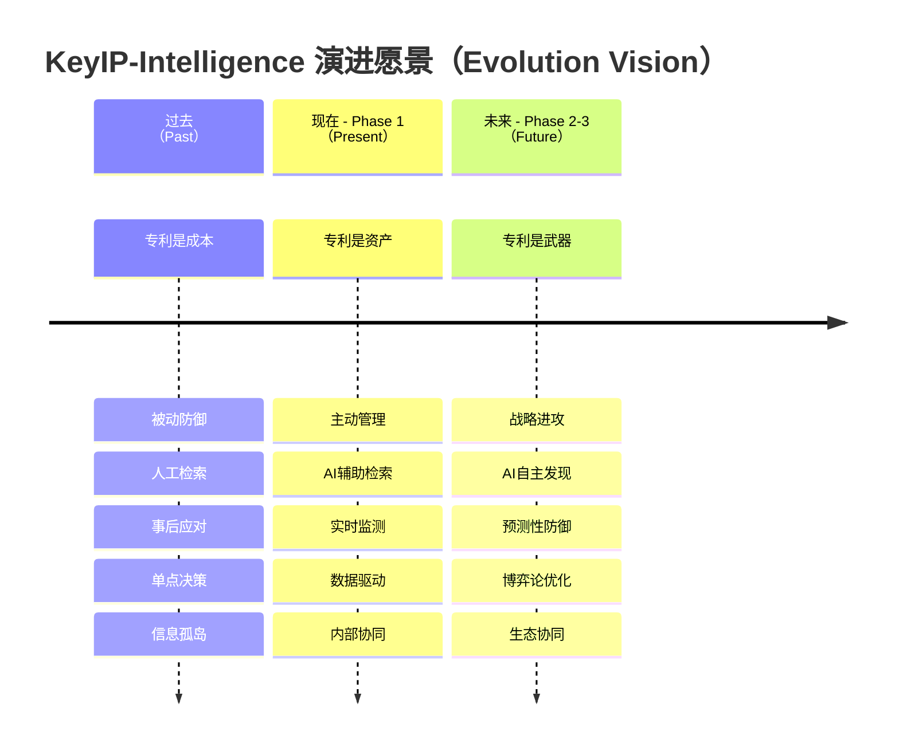
```mermaid
timeline
    %% ============================================================
    %% KeyIP-Intelligence 终极愿景（Ultimate Vision）
    %% ============================================================

    title KeyIP-Intelligence 演进愿景（Evolution Vision）

    section 过去<br>（Past）
        专利是成本 : 被动防御
                   : 人工检索
                   : 事后应对
                   : 单点决策
                   : 信息孤岛

    section 现在 - Phase 1<br>（Present）
        专利是资产 : 主动管理
                   : AI辅助检索
                   : 实时监测
                   : 数据驱动
                   : 内部协同

    section 未来 - Phase 2-3<br>（Future）
        专利是武器 : 战略进攻
                   : AI自主发现
                   : 预测性防御
                   : 博弈论优化
                   : 生态协同

```

### 三个层次的价值创造

**第一层：效率价值（Phase 1即可实现）**

把IP团队从重复性劳动中解放出来。分子级检索从3天变成8秒，期限管理从Excel变成自动化，侵权监测从季度人工变成每日AI扫描。这一层的价值是可量化的——节省的人力成本、避免的逾期风险、减少的外部服务费用。保守估计，每个客户每年节省¥40万以上。

**第二层：决策价值（Phase 2逐步显现）**

让IP决策从"拍脑袋"变成"数据驱动"。哪些专利值得维护、哪些可以放弃？新分子应该在哪些国家申请专利？竞争对手的下一步布局方向是什么？这些问题的答案，过去依赖个人经验和直觉，未来将依赖KeyIP的知识图谱和预测模型。这一层的价值更难量化，但影响更深远——一个正确的战略决策可能价值数千万。

**第三层：生态价值（Phase 3远景）**

当KeyIP成为OLED材料领域的"事实标准"IP管理平台时，它将不仅仅是一个工具，而是一个**连接材料企业、专利代理机构、面板厂商、投资机构的生态枢纽**。在这个生态中：

* 材料企业获得更精准的IP情报和更高效的管理工具
* 专利代理机构获得更多的客户和更高效的工作流
* 面板厂商获得更透明的供应商IP风险评估
* 投资机构获得更可靠的技术资产估值依据
* 整个行业获得更健康的创新生态和更合理的IP秩序

### 为什么是钥熠，为什么是现在

**为什么是钥熠？**

因为钥熠同时拥有三样东西，而这三样东西的交集在全球范围内几乎是唯一的：

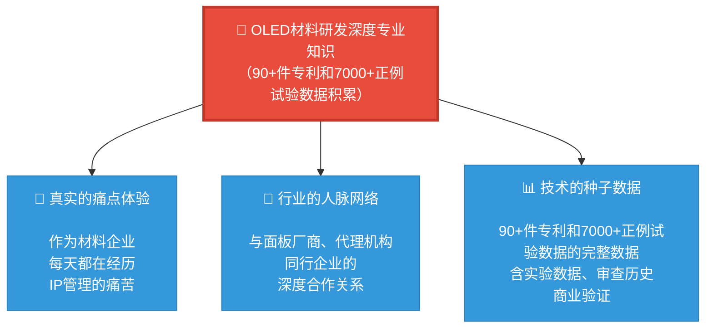
```mermaid
graph TD
    %% ============================================================
    %% 钥熠核心优势来源（Core Competitive Advantages）
    %% ============================================================

    %% 核心来源
    CORE[🔬 OLED材料研发深度专业知识<br>（90+件专利和7000+正例试验数据积累）]

    %% 三大优势
    ADV1[😤 真实的痛点体验<br><br>作为材料企业<br>每天都在经历<br>IP管理的痛苦]
    
    ADV2[🤝 行业的人脉网络<br><br>与面板厂商、代理机构<br>同行企业的<br>深度合作关系]
    
    ADV3[📊 技术的种子数据<br><br>90+件专利和7000+正例试验数据的完整数据<br>含实验数据、审查历史<br>商业验证]

    %% 连接
    CORE --> ADV1
    CORE --> ADV2
    CORE --> ADV3

    %% 样式定义
    classDef coreStyle fill:#e74c3c,stroke:#c0392b,color:#fff,stroke-width:3px
    classDef advStyle fill:#3498db,stroke:#2980b9,color:#fff

    class CORE coreStyle
    class ADV1,ADV2,ADV3 advStyle

```

一个纯AI公司没有化学知识和种子数据。一个纯IP服务公司没有AI能力和材料科学理解。一个纯材料企业没有产品化和商业化的基因。钥熠处于这三个圆的交集——这是KeyIP-Intelligence最深层的护城河。

**为什么是现在？**

```
时间窗口分析：

2020-2023: 太早
├── LLM技术尚未成熟，无法支撑自然语言查询和报告生成
├── GNN在化学领域的应用还在学术阶段
├── 中国OLED材料企业的IP意识尚未觉醒
└── 市场教育成本过高

2024-2026: 最佳窗口 ◄── 我们在这里
├── ✅ LLM技术成熟（GPT-4o、Qwen2.5等可直接使用）
├── ✅ GNN在分子性质预测领域已有成熟框架（PyG、DGL）
├── ✅ 中国OLED材料企业开始大规模出海，IP需求爆发
├── ✅ 国家政策大力支持知识产权强国建设
├── ✅ 竞争对手尚未进入这个垂直领域
└── ✅ 云计算和GPU成本持续下降，降低了技术门槛

2027+: 可能太晚
├── 通用AI平台可能开始关注垂直领域
├── 先发优势的数据飞轮已经转起来
├── 客户的切换成本已经形成
└── 市场格局可能已经初步确定
```

我们正处于一个**千载难逢的时间窗口**：技术成熟度、市场需求、政策环境、竞争格局四个维度同时对齐。错过这个窗口，不是说永远不能做，而是做的成本会高10倍，成功的概率会低10倍。

### 行动号召

这份蓝图不是一个学术论文，不是一个PPT演示，它是一份**作战计划**。

它需要的不是"讨论"和"研究"，而是**决策**和**行动**：

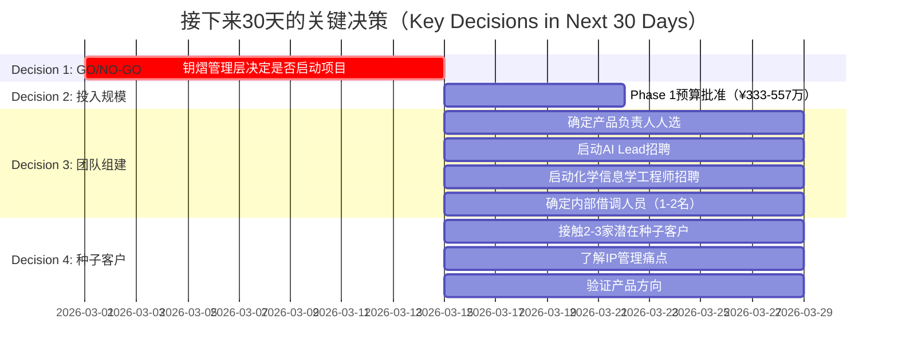
```mermaid
gantt
    %% ============================================================
    %% 30天关键决策路线图（30-Day Key Decisions Roadmap）
    %% ============================================================

    title 接下来30天的关键决策（Key Decisions in Next 30 Days）
    dateFormat  YYYY-MM-DD
    
    section Decision 1: GO/NO-GO
    钥熠管理层决定是否启动项目           :crit, d1, 2026-03-01, 14d
    
    section Decision 2: 投入规模
    Phase 1预算批准（¥333-557万）        :d2, after d1, 7d
    
    section Decision 3: 团队组建
    确定产品负责人人选                   :d3a, after d1, 14d
    启动AI Lead招聘                      :d3b, after d1, 14d
    启动化学信息学工程师招聘             :d3c, after d1, 14d
    确定内部借调人员（1-2名）            :d3d, after d1, 14d
    
    section Decision 4: 种子客户
    接触2-3家潜在种子客户                :d4a, after d1, 14d
    了解IP管理痛点                       :d4b, after d1, 14d
    验证产品方向                         :d4c, after d1, 14d

```

### 最后的话

在OLED材料这个战场上，专利不仅仅是法律文件——它们是**技术主权的边界线**，是**商业竞争的核武器**，是**创新生态的基础设施**。

中国OLED材料企业已经在分子设计和材料合成上取得了令人瞩目的进步。但如果没有与之匹配的知识产权能力，这些技术进步随时可能被专利壁垒所扼杀。

KeyIP-Intelligence的使命，就是确保这种情况不会发生。

它要做的，不是替代人类的判断，而是**增强人类的认知**——让每一个OLED材料科学家在设计新分子时，都能看到这个分子在全球专利版图中的位置；让每一个IP经理在做出决策时，都有AI提供的全景情报作为支撑；让每一个企业管理者在制定战略时，都能基于数据而非直觉。

从一个工具，到一个平台，到一个生态——这是KeyIP-Intelligence的进化路径。

从钥熠的内部需求，到OLED材料行业的标准配置，到整个有机电子材料领域的基础设施——这是KeyIP-Intelligence的扩张路径。

从效率提升，到决策优化，到战略赋能——这是KeyIP-Intelligence的价值升级路径。

**这条路很长，但第一步很清晰：从钥熠自己的90+件专利和7000+正例试验数据开始，用AI重新理解它们，然后用这种理解去改变整个行业。**

```mermaid
block-beta
    %% ============================================================
    %% KeyIP-Intelligence 产品蓝图封面（Product Blueprint Cover）
    %% ============================================================

    columns 1

    
    QUOTE["✨ The best way to predict the future is to invent it.<br><br>— Alan Kay<br><br>预测未来的最好方式，就是去创造它。"]
    

    TITLE["🎯 KeyIP-Intelligence<br>Product Blueprint v1.0"]
    
    INFO["📅 2026<br><br>Prepared for: 钥熠科技<br>Classification: 🔒 Confidential"]

    %% 样式定义
    classDef quoteStyle fill:#1a1a2e,stroke:#e94560,stroke-width:2px,color:#eee
    classDef titleStyle fill:#e94560,stroke:#0f3460,stroke-width:3px,color:#fff
    classDef infoStyle fill:#0f3460,stroke:#16213e,stroke-width:2px,color:#eee

    class QUOTE quoteStyle
    class TITLE titleStyle
    class INFO infoStyle

```

---

这份产品蓝图从第一章到附录K，完整覆盖了KeyIP-Intelligence从战略定位、技术架构、AI模型设计、产品功能、商业模式、竞争分析、财务预测、风险评估到实施路线图的全部维度。整份文档的核心逻辑链条是：

**行业痛点（OLED材料专利壁垒）→ 技术可行性（分子级AI + 垂直知识）→ 产品方案（四大功能模块）→ 商业可行性（SaaS + 增值服务）→ 竞争壁垒（五层护城河）→ 实施路径（三阶段30个月）→ 财务回报（客户ROI 380%+）**

钥熠拥有的种子数据、领域知识和行业关系，是这个项目最不可复制的起点。时间窗口已经打开，技术条件已经成熟，市场需求已经显现。剩下的，就是决策和执行。
