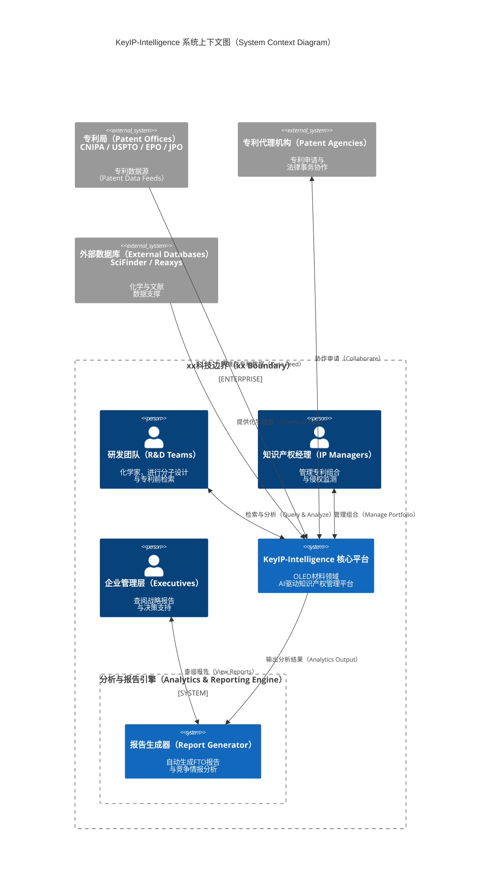

# KeyIP-Intelligence Architecture Design

> Version: 0.1.0-alpha | Last Updated: 2026-02

---

## Table of Contents

1. [Design Philosophy](#design-philosophy)
2. [System Context](#system-context)
3. [Four-Layer Architecture](#four-layer-architecture)
4. [Infrastructure Layer](#infrastructure-layer)
5. [Data Layer](#data-layer)
6. [Intelligence Layer](#intelligence-layer)
7. [Application Layer](#application-layer)
8. [Cross-Cutting Concerns](#cross-cutting-concerns)
9. [Data Flow Diagrams](#data-flow-diagrams)
10. [Deployment Topology](#deployment-topology)
11. [Complete File Listing](#complete-file-listing)

---

## Design Philosophy

KeyIP-Intelligence is designed around five architectural principles:

| Principle | Rationale | Implementation |
|:----------|:----------|:---------------|
| **Domain-Driven Design** | IP management for OLED materials is a complex domain with deep expertise requirements | Bounded contexts for Patent, Molecule, Portfolio, Lifecycle, and Collaboration |
| **Hexagonal Architecture** | Business logic must be independent of infrastructure choices | Ports-and-adapters pattern; domain layer has zero external dependencies |
| **Event-Driven Decoupling** | Patent monitoring, analysis, and notification are inherently asynchronous | Kafka-based event bus; CQRS for read-heavy analytics workloads |
| **AI-Native Integration** | ML models are first-class citizens, not bolt-on features | Intelligence layer with standardized model serving interfaces |
| **Multi-Tenancy by Design** | Platform must support isolated workspaces for different organizations and partners | Tenant-aware data partitioning, RBAC, and resource quotas |

---

## System Context



---

## Four-Layer Architecture

### Layer Dependency Rules

```

Application Layer  ──depends on──►  Intelligence Layer
Intelligence Layer ──depends on──►  Data Layer
Data Layer         ──depends on──►  Infrastructure Layer

(No reverse dependencies. No layer skipping.)

```

### Layer Responsibilities

| Layer | Responsibility | Key Technologies |
|:------|:---------------|:-----------------|
| **Infrastructure** | External service adapters, messaging, storage, auth | PostgreSQL, Neo4j, OpenSearch, Milvus, Redis, Kafka, MinIO, Keycloak |
| **Data** | Domain data management, knowledge graph, molecular indexing | Custom repositories, graph traversal engines, vector indexing |
| **Intelligence** | AI/ML model serving, NLP, chemical reasoning, strategy generation | MolPatent-GNN, ClaimBERT, StrategyGPT, ChemExtractor |
| **Application** | Business use cases, workflow orchestration, API exposure | REST/gRPC handlers, CLI, event processors, scheduled jobs |

---

## Infrastructure Layer

### Component Catalog

| Component | Purpose | Port | Justification |
|:----------|:--------|:-----|:--------------|
| **PostgreSQL 16** | Primary relational store for patents, portfolios, users, lifecycle data | 5432 | ACID compliance, JSONB for semi-structured patent metadata |
| **Neo4j 5.x** | Patent knowledge graph: citation networks, family trees, inventor graphs | 7687 | Native graph traversal for patent family and citation analysis |
| **OpenSearch 2.x** | Full-text search over patent claims, descriptions, abstracts | 9200 | Multilingual analyzers (CJK), BM25 + vector hybrid search |
| **Milvus 2.x** | Vector similarity search for molecular fingerprints and claim embeddings | 19530 | Billion-scale ANN search, GPU-accelerated |
| **Redis 7.x** | Caching, session store, rate limiting, distributed locks | 6379 | Sub-millisecond latency for hot-path data |
| **Kafka 3.x** | Event streaming: patent updates, analysis results, notifications | 9092 | Durable, ordered event log for async processing |
| **MinIO** | Object storage: patent PDFs, molecular structure files, generated reports | 9000 | S3-compatible, self-hosted for data sovereignty |
| **Keycloak 24** | Identity and access management, OAuth 2.0 / OIDC, RBAC | 8180 | Multi-tenant SSO, fine-grained permission model |
| **Prometheus + Grafana** | Metrics collection, alerting, dashboards | 9090/3000 | Observability for all services and ML model performance |

### Infrastructure Code Structure

```

internal/infrastructure/
├── database/
│   ├── postgres/
│   │   ├── connection.go          # Connection pool management
│   │   ├── migrations/            # SQL migration files
│   │   └── repositories/          # Repository implementations
│   │       ├── patent_repo.go
│   │       ├── molecule_repo.go
│   │       ├── portfolio_repo.go
│   │       ├── lifecycle_repo.go
│   │       └── user_repo.go
│   ├── neo4j/
│   │   ├── driver.go              # Neo4j driver wrapper
│   │   └── repositories/
│   │       ├── knowledge_graph_repo.go
│   │       ├── citation_repo.go
│   │       └── family_repo.go
│   └── redis/
│       ├── client.go              # Redis client wrapper
│       ├── cache.go               # Cache abstraction
│       └── lock.go                # Distributed lock
├── search/
│   ├── opensearch/
│   │   ├── client.go              # OpenSearch client
│   │   ├── indexer.go             # Document indexing
│   │   └── searcher.go            # Search query builder
│   └── milvus/
│       ├── client.go              # Milvus client
│       ├── collection.go          # Collection management
│       └── searcher.go            # Vector similarity search
├── messaging/
│   └── kafka/
│       ├── producer.go            # Event publisher
│       ├── consumer.go            # Event consumer
│       └── topics.go              # Topic definitions
├── storage/
│   └── minio/
│       ├── client.go              # MinIO client
│       └── repository.go          # File storage operations
├── auth/
│   └── keycloak/
│       ├── client.go              # Keycloak admin client
│       ├── middleware.go          # Auth middleware
│       └── rbac.go                # Role-based access control
└── monitoring/
├── prometheus/
│   ├── metrics.go             # Custom metrics definitions
│   └── collector.go           # Metrics collector
└── logging/
└── logger.go              # Structured logging (slog)

```

---

## Data Layer

### Knowledge Graph Schema (Neo4j)

```

(:Patent {
patent_number, title, abstract, filing_date, publication_date,
grant_date, legal_status, jurisdiction, assignee, inventors[],
ipc_codes[], cpc_codes[]
})

(:Molecule {
smiles, inchi, inchi_key, molecular_formula, molecular_weight,
fingerprint_morgan, fingerprint_maccs, canonical_smiles
})

(:Claim {
claim_number, claim_type, claim_text, parent_claim_number,
is_independent, elements[]
})

(:MaterialProperty {
property_type, value, unit, measurement_method,
device_structure, test_conditions
})

(:Assignee { name, country, type, aliases[] })
(:Inventor { name, affiliations[] })
(:PatentFamily { family_id, family_type })
(:IPCClass { code, description, level })

// Relationships
(:Patent)-[:CONTAINS_MOLECULE]->(:Molecule)
(:Patent)-[:HAS_CLAIM]->(:Claim)
(:Claim)-[:COVERS_MOLECULE {coverage_type}]->(:Molecule)
(:Patent)-[:CITES]->(:Patent)
(:Patent)-[:BELONGS_TO_FAMILY]->(:PatentFamily)
(:Patent)-[:ASSIGNED_TO]->(:Assignee)
(:Patent)-[:INVENTED_BY]->(:Inventor)
(:Patent)-[:CLASSIFIED_AS]->(:IPCClass)
(:Molecule)-[:HAS_PROPERTY]->(:MaterialProperty)
(:Molecule)-[:STRUCTURALLY_SIMILAR {similarity}]->(:Molecule)
(:Molecule)-[:SUBSTRUCTURE_OF]->(:Molecule)

```

### Molecular Database Design

```

-- PostgreSQL: Molecular metadata and properties
CREATE TABLE molecules (
id              UUID PRIMARY KEY DEFAULT gen_random_uuid(),
smiles          TEXT NOT NULL,
canonical_smiles TEXT NOT NULL UNIQUE,
inchi           TEXT,
inchi_key       VARCHAR(27) UNIQUE,
molecular_formula TEXT,
molecular_weight DOUBLE PRECISION,
fingerprint_morgan BYTEA,       -- Morgan fingerprint (binary)
fingerprint_maccs  BYTEA,       -- MACCS keys (binary)
oled_role       VARCHAR(50),    -- emitter, host, ETL, HTL, etc.
created_at      TIMESTAMPTZ DEFAULT NOW(),
updated_at      TIMESTAMPTZ DEFAULT NOW()
);

CREATE INDEX idx_molecules_inchi_key ON molecules(inchi_key);
CREATE INDEX idx_molecules_oled_role ON molecules(oled_role);

-- Milvus: Vector collection for molecular similarity search
-- Collection: mol_fingerprints
-- Fields:
--   id:          VARCHAR(36)   (molecule UUID)
--   morgan_2048: FLOAT_VECTOR(2048)  (Morgan fingerprint, radius=2)
--   gnn_embed:   FLOAT_VECTOR(256)   (MolPatent-GNN embedding)
-- Index: IVF_SQ8 on morgan_2048, HNSW on gnn_embed

```

### Data Layer Code Structure

```

internal/domain/
├── patent/
│   ├── entity.go              # Patent aggregate root
│   ├── claim.go               # Claim value object
│   ├── markush.go             # Markush structure representation
│   ├── repository.go          # Repository interface (port)
│   ├── events.go              # Domain events
│   └── service.go             # Domain service
├── molecule/
│   ├── entity.go              # Molecule entity
│   ├── fingerprint.go         # Fingerprint computation
│   ├── similarity.go          # Similarity metrics
│   ├── repository.go          # Repository interface
│   └── service.go             # Domain service
├── portfolio/
│   ├── entity.go              # Portfolio aggregate
│   ├── valuation.go           # Valuation model
│   ├── repository.go          # Repository interface
│   └── service.go             # Domain service
├── lifecycle/
│   ├── entity.go              # Lifecycle record
│   ├── deadline.go            # Deadline computation
│   ├── annuity.go             # Annuity fee model
│   ├── jurisdiction.go        # Jurisdiction rules
│   ├── repository.go          # Repository interface
│   └── service.go             # Domain service
└── collaboration/
├── workspace.go           # Workspace entity
├── permission.go          # Permission model
├── repository.go          # Repository interface
└── service.go             # Domain service

```

---

## Intelligence Layer

### AI Model Catalog

| Model | Purpose | Input | Output | Architecture |
|:------|:--------|:------|:-------|:-------------|
| **MolPatent-GNN** | Molecular-patent relevance scoring and structural similarity | Molecular graph + Patent claim text | Relevance score [0,1], Similarity embedding (256d) | Graph Attention Network + Cross-attention with BERT |
| **ClaimBERT** | Patent claim parsing, element decomposition, scope analysis | Claim text (multilingual) | Structured claim elements, scope boundaries | Fine-tuned multilingual BERT with CRF layer |
| **StrategyGPT** | IP strategy recommendations, FTO narrative generation | Portfolio data, competitive landscape, user query | Natural language strategy report, action items | Fine-tuned LLM with RAG over patent KG |
| **ChemExtractor** | Chemical entity recognition and structure extraction from text | Patent document text (PDF/XML) | Extracted molecules (SMILES), properties, conditions | BiLSTM-CRF + rule-based post-processing |
| **InfringeNet** | Infringement risk assessment with claim-element mapping | Target molecule + Patent claims | Risk score, element-by-element mapping, equivalents analysis | Multi-task learning: classification + explanation |

### Intelligence Layer Code Structure

```

internal/intelligence/
├── molpatent_gnn/
│   ├── model.go               # Model interface and loading
│   ├── inference.go           # Inference pipeline
│   ├── preprocessing.go       # Molecular graph construction
│   └── postprocessing.go      # Result interpretation
├── claim_bert/
│   ├── model.go               # ClaimBERT model wrapper
│   ├── tokenizer.go           # Patent-specific tokenization
│   ├── parser.go              # Claim element extraction
│   └── scope.go               # Claim scope analysis
├── strategy_gpt/
│   ├── model.go               # LLM interface
│   ├── prompt.go              # Prompt templates
│   ├── rag.go                 # Retrieval-augmented generation
│   └── report.go              # Report generation
├── chem_extractor/
│   ├── extractor.go           # Chemical entity extraction
│   ├── ner.go                 # Named entity recognition
│   ├── resolver.go            # Entity resolution to structures
│   └── validator.go           # Extracted structure validation
├── infringe_net/
│   ├── model.go               # InfringeNet model
│   ├── assessor.go            # Risk assessment pipeline
│   ├── equivalents.go         # Doctrine of equivalents analysis
│   └── mapper.go              # Claim element mapping
└── common/
├── model_registry.go      # Model version management
├── serving.go             # Model serving abstraction
├── batch.go               # Batch inference support
└── metrics.go             # Model performance metrics

```

---

## Application Layer

### Use Case Catalog

| Use Case | Module | Description |
|:---------|:-------|:------------|
| **MolecularSimilaritySearch** | Patent Mining | Search patent corpus by molecular structure similarity |
| **PatentabilityAssessment** | Patent Mining | Evaluate novelty and inventive step for a candidate molecule |
| **WhiteSpaceDiscovery** | Patent Mining | Identify unclaimed regions in molecular space |
| **InfringementRiskAssessment** | Infringement Watch | Assess infringement risk for a molecule against specific patents |
| **NewPatentMonitoring** | Infringement Watch | Continuous monitoring of new patent publications |
| **CompetitorTracking** | Infringement Watch | Track competitor filing activity |
| **PortfolioValuation** | Portfolio Optimizer | Multi-dimensional patent portfolio valuation |
| **GapAnalysis** | Portfolio Optimizer | Identify coverage gaps in portfolio |
| **DeadlineManagement** | Lifecycle | Compute and track statutory deadlines |
| **AnnuityManagement** | Lifecycle | Fee calculation and payment workflow |
| **LegalStatusSync** | Lifecycle | Synchronize legal status from patent offices |
| **WorkspaceManagement** | Collaboration | Create and manage partner workspaces |
| **ReportGeneration** | Dashboard | Generate FTO, infringement, and portfolio reports |
| **NaturalLanguageQuery** | Dashboard | Answer IP questions using knowledge graph |

### Application Layer Code Structure

```

internal/application/
├── patent_mining/
│   ├── similarity_search.go       # Molecular similarity search use case
│   ├── patentability.go           # Patentability assessment use case
│   ├── white_space.go             # White space discovery use case
│   └── chem_extraction.go         # Chemical entity extraction use case
├── infringement/
│   ├── risk_assessment.go         # Infringement risk assessment
│   ├── monitoring.go              # New patent monitoring
│   ├── competitor_tracking.go     # Competitor tracking
│   └── alert.go                   # Alert management
├── portfolio/
│   ├── valuation.go               # Portfolio valuation
│   ├── gap_analysis.go            # Gap analysis
│   ├── optimization.go            # Budget optimization
│   └── constellation.go           # Patent constellation map
├── lifecycle/
│   ├── deadline.go                # Deadline management
│   ├── annuity.go                 # Annuity management
│   ├── legal_status.go            # Legal status synchronization
│   └── calendar.go                # Holiday-aware calendar
├── collaboration/
│   ├── workspace.go               # Workspace management
│   ├── sharing.go                 # Secure file sharing
│   └── watermark.go               # Digital watermarking
├── reporting/
│   ├── fto_report.go              # FTO report generation
│   ├── infringement_report.go     # Infringement analysis report
│   ├── portfolio_report.go        # Portfolio review report
│   └── template.go                # Report templates
└── query/
├── nl_query.go                # Natural language query
└── kg_search.go               # Knowledge graph search

```

### Interface Layer Code Structure

```

internal/interfaces/
├── http/
│   ├── server.go                  # HTTP server setup
│   ├── router.go                  # Route definitions
│   ├── middleware/
│   │   ├── auth.go                # Authentication middleware
│   │   ├── cors.go                # CORS middleware
│   │   ├── ratelimit.go           # Rate limiting
│   │   ├── logging.go             # Request logging
│   │   └── tenant.go              # Tenant context extraction
│   └── handlers/
│       ├── patent_handler.go      # Patent endpoints
│       ├── molecule_handler.go    # Molecule endpoints
│       ├── portfolio_handler.go   # Portfolio endpoints
│       ├── lifecycle_handler.go   # Lifecycle endpoints
│       ├── collaboration_handler.go # Collaboration endpoints
│       ├── report_handler.go      # Report endpoints
│       └── health_handler.go      # Health check endpoints
├── grpc/
│   ├── server.go                  # gRPC server setup
│   └── services/
│       ├── molecule_service.go    # Molecule gRPC service
│       └── patent_service.go      # Patent gRPC service
└── cli/
├── root.go                    # CLI root command
├── search.go                  # Search commands
├── assess.go                  # Assessment commands
├── lifecycle.go               # Lifecycle commands
└── report.go                  # Report commands

```

---

## Cross-Cutting Concerns

### Security Architecture

```

┌─────────────────────────────────────────────────────┐
│                   API Gateway                        │
│  TLS termination │ Rate limiting │ Request validation │
└────────────────────────┬────────────────────────────┘
│
▼
┌─────────────────────────────────────────────────────┐
│                   Keycloak                           │
│  OAuth 2.0 / OIDC │ JWT validation │ RBAC policies  │
└────────────────────────┬────────────────────────────┘
│
▼
┌─────────────────────────────────────────────────────┐
│              Application Services                    │
│  Tenant isolation │ Field-level encryption │ Audit   │
└─────────────────────────────────────────────────────┘

```

### Role-Based Access Control

| Role | Patent Mining | Infringement Watch | Portfolio | Lifecycle | Collaboration | Admin |
|:-----|:-------------|:-------------------|:----------|:----------|:-------------|:------|
| **Researcher** | Read + Search | Read alerts | Read own | — | Read own workspace | — |
| **IP Manager** | Full | Full | Full | Full | Manage workspaces | — |
| **Executive** | Read reports | Read dashboards | Read reports | Read summaries | — | — |
| **Partner Agent** | Scoped read | Scoped alerts | — | Scoped lifecycle | Own workspace only | — |
| **System Admin** | — | — | — | — | — | Full |

### Observability Stack

```

Application ──metrics──► Prometheus ──dashboards──► Grafana
│                                                  │
├──traces──► OpenTelemetry Collector ──► Jaeger    │
│                                                  │
└──logs──► Structured JSON (slog) ──► Loki ───────┘

```

---

## Data Flow Diagrams

### Flow 1: Molecular Similarity Search

```

User                    API Server              Intelligence           Data Stores
│                          │                       │                      │
│  POST /molecules/search  │                       │                      │
│─────────────────────────►│                       │                      │
│                          │  Parse SMILES         │                      │
│                          │  Compute fingerprint  │                      │
│                          │──────────────────────►│                      │
│                          │                       │  MolPatent-GNN       │
│                          │                       │  Generate embedding  │
│                          │                       │──────────────────────│
│                          │                       │                      │
│                          │                       │  Vector search       │
│                          │                       │─────────────────────►│ Milvus
│                          │                       │◄─────────────────────│
│                          │                       │                      │
│                          │                       │  Fetch patent data   │
│                          │                       │─────────────────────►│ PostgreSQL
│                          │                       │◄─────────────────────│
│                          │                       │                      │
│                          │  Ranked results       │                      │
│                          │◄──────────────────────│                      │
│  JSON response           │                       │                      │
│◄─────────────────────────│                       │                      │

```

### Flow 2: New Patent Monitoring (Async)

```

Patent Office Feed      Kafka           Worker              Intelligence        Data Stores
│                   │                │                      │                  │
│  New publication  │                │                      │                  │
│──────────────────►│                │                      │                  │
│                   │  patent.new    │                      │                  │
│                   │───────────────►│                      │                  │
│                   │                │  Extract molecules   │                  │
│                   │                │─────────────────────►│                  │
│                   │                │                      │ ChemExtractor    │
│                   │                │◄─────────────────────│                  │
│                   │                │                      │                  │
│                   │                │  Store patent + mols │                  │
│                   │                │─────────────────────────────────────────►│
│                   │                │                      │                  │
│                   │                │  Check watch rules   │                  │
│                   │                │─────────────────────►│                  │
│                   │                │                      │ InfringeNet      │
│                   │                │◄─────────────────────│                  │
│                   │                │                      │                  │
│                   │  alert.trigger │                      │                  │
│                   │◄───────────────│                      │                  │
│                   │                │                      │                  │

````

---

## Deployment Topology

### Development (Docker Compose)

```yaml
# All services on a single machine
services:
  api-server:     # KeyIP API (port 8080)
  worker:         # Background worker
  postgres:       # PostgreSQL (port 5432)
  neo4j:          # Neo4j (port 7474, 7687)
  opensearch:     # OpenSearch (port 9200)
  milvus:         # Milvus standalone (port 19530)
  redis:          # Redis (port 6379)
  kafka:          # Kafka + Zookeeper (port 9092)
  minio:          # MinIO (port 9000)
  keycloak:       # Keycloak (port 8180)
  prometheus:     # Prometheus (port 9090)
  grafana:        # Grafana (port 3000)
````

### Production (Kubernetes)

```
┌─────────────────────────────────────────────────────────────┐
│                    Kubernetes Cluster                         │
│                                                              │
│  ┌──────────────┐  ┌──────────────┐  ┌──────────────┐      │
│  │  API Server   │  │  API Server   │  │  API Server   │     │
│  │  (Replica 1)  │  │  (Replica 2)  │  │  (Replica 3)  │     │
│  └──────┬───────┘  └──────┬───────┘  └──────┬───────┘      │
│         └──────────────────┼──────────────────┘              │
│                            │                                 │
│  ┌──────────────┐  ┌──────┴───────┐  ┌──────────────┐      │
│  │  Worker       │  │  Ingress     │  │  Worker       │      │
│  │  (Replica 1)  │  │  Controller  │  │  (Replica 2)  │      │
│  └──────────────┘  └──────────────┘  └──────────────┘      │
│                                                              │
│  ┌─────────────────── StatefulSets ─────────────────────┐   │
│  │  PostgreSQL (HA) │ Neo4j │ OpenSearch │ Milvus │ Redis│   │
│  └──────────────────────────────────────────────────────┘   │
│                                                              │
│  ┌─────────────────── Kafka Cluster ────────────────────┐   │
│  │  Broker 1  │  Broker 2  │  Broker 3  │  ZooKeeper    │   │
│  └──────────────────────────────────────────────────────┘   │
└─────────────────────────────────────────────────────────────┘
```

---

## Complete File Listing

```
KeyIP-Intelligence/
├── .github/
│   └── workflows/
│       ├── ci.yml                         # CI pipeline
│       └── release.yml                    # Release pipeline
├── api/
│   └── openapi/
│       └── v1/
│           └── keyip.yaml                 # OpenAPI 3.0 specification
├── cmd/
│   ├── apiserver/
│   │   └── main.go                        # API server entry point
│   ├── keyip/
│   │   └── main.go                        # CLI entry point
│   └── worker/
│       └── main.go                        # Worker entry point
├── deployments/
│   ├── docker/
│   │   ├── Dockerfile.apiserver           # API server Dockerfile
│   │   ├── Dockerfile.worker              # Worker Dockerfile
│   │   └── docker-compose.yml             # Development compose
│   └── kubernetes/
│       ├── base/                           # Kustomize base
│       └── overlays/
│           ├── dev/                        # Dev overlay
│           └── prod/                       # Production overlay
├── docs/
│   ├── architecture.md                    # This file
│   ├── apis.md                            # API reference
│   ├── deployment.md                      # Deployment guide
│   └── development.md                     # Development guide
├── internal/
│   ├── application/
│   │   ├── patent_mining/
│   │   │   ├── similarity_search.go       # Molecular similarity search use case
│   │   │   ├── patentability.go           # Patentability assessment
│   │   │   ├── white_space.go             # White space discovery
│   │   │   └── chem_extraction.go         # Chemical entity extraction
│   │   ├── infringement/
│   │   │   ├── risk_assessment.go         # Infringement risk assessment
│   │   │   ├── monitoring.go              # New patent monitoring
│   │   │   ├── competitor_tracking.go     # Competitor tracking
│   │   │   └── alert.go                   # Alert management
│   │   ├── portfolio/
│   │   │   ├── valuation.go               # Portfolio valuation
│   │   │   ├── gap_analysis.go            # Gap analysis
│   │   │   ├── optimization.go            # Budget optimization
│   │   │   └── constellation.go           # Patent constellation map
│   │   ├── lifecycle/
│   │   │   ├── deadline.go                # Deadline management
│   │   │   ├── annuity.go                 # Annuity management
│   │   │   ├── legal_status.go            # Legal status sync
│   │   │   └── calendar.go               # Holiday-aware calendar
│   │   ├── collaboration/
│   │   │   ├── workspace.go               # Workspace management
│   │   │   ├── sharing.go                 # Secure file sharing
│   │   │   └── watermark.go              # Digital watermarking
│   │   ├── reporting/
│   │   │   ├── fto_report.go              # FTO report generation
│   │   │   ├── infringement_report.go     # Infringement report
│   │   │   ├── portfolio_report.go        # Portfolio report
│   │   │   └── template.go               # Report templates
│   │   └── query/
│   │       ├── nl_query.go                # Natural language query
│   │       └── kg_search.go              # Knowledge graph search
│   ├── config/
│   │   ├── config.go                      # Configuration struct
│   │   ├── loader.go                      # Config file + env loader
│   │   └── defaults.go                    # Default values
│   ├── domain/
│   │   ├── patent/
│   │   │   ├── entity.go                  # Patent aggregate root
│   │   │   ├── claim.go                   # Claim value object
│   │   │   ├── markush.go                 # Markush structure
│   │   │   ├── repository.go              # Repository port
│   │   │   ├── events.go                  # Domain events
│   │   │   └── service.go                # Domain service
│   │   ├── molecule/
│   │   │   ├── entity.go                  # Molecule entity
│   │   │   ├── fingerprint.go             # Fingerprint computation
│   │   │   ├── similarity.go              # Similarity metrics
│   │   │   ├── repository.go              # Repository port
│   │   │   └── service.go                # Domain service
│   │   ├── portfolio/
│   │   │   ├── entity.go                  # Portfolio aggregate
│   │   │   ├── valuation.go               # Valuation model
│   │   │   ├── repository.go              # Repository port
│   │   │   └── service.go                # Domain service
│   │   ├── lifecycle/
│   │   │   ├── entity.go                  # Lifecycle record
│   │   │   ├── deadline.go                # Deadline computation
│   │   │   ├── annuity.go                 # Annuity fee model
│   │   │   ├── jurisdiction.go            # Jurisdiction rules
│   │   │   ├── repository.go              # Repository port
│   │   │   └── service.go                # Domain service
│   │   └── collaboration/
│   │       ├── workspace.go               # Workspace entity
│   │       ├── permission.go              # Permission model
│   │       ├── repository.go              # Repository port
│   │       └── service.go                # Domain service
│   ├── infrastructure/
│   │   ├── auth/
│   │   │   └── keycloak/
│   │   │       ├── client.go              # Keycloak admin client
│   │   │       ├── middleware.go          # Auth middleware
│   │   │       └── rbac.go               # RBAC implementation
│   │   ├── database/
│   │   │   ├── neo4j/
│   │   │   │   ├── driver.go              # Neo4j driver
│   │   │   │   └── repositories/
│   │   │   │       ├── knowledge_graph_repo.go
│   │   │   │       ├── citation_repo.go
│   │   │   │       └── family_repo.go
│   │   │   ├── postgres/
│   │   │   │   ├── connection.go          # Connection pool
│   │   │   │   ├── migrations/
│   │   │   │   │   ├── 001_create_patents.sql
│   │   │   │   │   ├── 002_create_molecules.sql
│   │   │   │   │   ├── 003_create_portfolios.sql
│   │   │   │   │   ├── 004_create_lifecycle.sql
│   │   │   │   │   ├── 005_create_users.sql
│   │   │   │   │   └── 006_create_workspaces.sql
│   │   │   │   └── repositories/
│   │   │   │       ├── patent_repo.go
│   │   │   │       ├── molecule_repo.go
│   │   │   │       ├── portfolio_repo.go
│   │   │   │       ├── lifecycle_repo.go
│   │   │   │       └── user_repo.go
│   │   │   └── redis/
│   │   │       ├── client.go              # Redis client
│   │   │       ├── cache.go               # Cache abstraction
│   │   │       └── lock.go               # Distributed lock
│   │   ├── messaging/
│   │   │   └── kafka/
│   │   │       ├── producer.go            # Event publisher
│   │   │       ├── consumer.go            # Event consumer
│   │   │       └── topics.go             # Topic definitions
│   │   ├── monitoring/
│   │   │   ├── logging/
│   │   │   │   └── logger.go             # Structured logging
│   │   │   └── prometheus/
│   │   │       ├── metrics.go             # Metrics definitions
│   │   │       └── collector.go          # Metrics collector
│   │   ├── search/
│   │   │   ├── milvus/
│   │   │   │   ├── client.go              # Milvus client
│   │   │   │   ├── collection.go          # Collection mgmt
│   │   │   │   └── searcher.go           # Vector search
│   │   │   └── opensearch/
│   │   │       ├── client.go              # OpenSearch client
│   │   │       ├── indexer.go             # Document indexing
│   │   │       └── searcher.go           # Search queries
│   │   └── storage/
│   │       └── minio/
│   │           ├── client.go              # MinIO client
│   │           └── repository.go         # File operations
│   ├── intelligence/
│   │   ├── chem_extractor/
│   │   │   ├── extractor.go              # Chemical extraction
│   │   │   ├── ner.go                     # Named entity recognition
│   │   │   ├── resolver.go               # Entity resolution
│   │   │   └── validator.go              # Structure validation
│   │   ├── claim_bert/
│   │   │   ├── model.go                   # ClaimBERT wrapper
│   │   │   ├── tokenizer.go              # Patent tokenization
│   │   │   ├── parser.go                 # Claim parsing
│   │   │   └── scope.go                  # Scope analysis
│   │   ├── common/
│   │   │   ├── batch.go                   # Batch inference
│   │   │   ├── metrics.go                # Model metrics
│   │   │   ├── model_registry.go         # Model versioning
│   │   │   └── serving.go               # Model serving
│   │   ├── infringe_net/
│   │   │   ├── assessor.go               # Risk assessment
│   │   │   ├── equivalents.go            # Equivalents analysis
│   │   │   ├── mapper.go                 # Claim mapping
│   │   │   └── model.go                  # InfringeNet model
│   │   ├── molpatent_gnn/
│   │   │   ├── inference.go              # Inference pipeline
│   │   │   ├── model.go                   # Model interface
│   │   │   ├── postprocessing.go         # Result interpretation
│   │   │   └── preprocessing.go          # Graph construction
│   │   └── strategy_gpt/
│   │       ├── model.go                   # LLM interface
│   │       ├── prompt.go                  # Prompt templates
│   │       ├── rag.go                     # RAG pipeline
│   │       └── report.go                # Report generation
│   └── interfaces/
│       ├── cli/
│       │   ├── assess.go                  # Assessment commands
│       │   ├── lifecycle.go               # Lifecycle commands
│       │   ├── report.go                  # Report commands
│       │   ├── root.go                    # Root command
│       │   └── search.go                # Search commands
│       ├── grpc/
│       │   ├── server.go                  # gRPC server
│       │   └── services/
│       │       ├── molecule_service.go
│       │       └── patent_service.go
│       └── http/
│           ├── handlers/
│           │   ├── collaboration_handler.go
│           │   ├── health_handler.go
│           │   ├── lifecycle_handler.go
│           │   ├── molecule_handler.go
│           │   ├── patent_handler.go
│           │   ├── portfolio_handler.go
│           │   └── report_handler.go
│           ├── middleware/
│           │   ├── auth.go
│           │   ├── cors.go
│           │   ├── logging.go
│           │   ├── ratelimit.go
│           │   └── tenant.go
│           ├── router.go                  # Route definitions
│           └── server.go                 # HTTP server
├── pkg/
│   ├── client/
│   │   ├── client.go                      # Go SDK client
│   │   ├── molecules.go                   # Molecule API client
│   │   ├── patents.go                     # Patent API client
│   │   └── lifecycle.go                  # Lifecycle API client
│   ├── errors/
│   │   ├── codes.go                       # Error codes
│   │   └── errors.go                     # Error types
│   └── types/
│       ├── molecule/
│       │   └── types.go                   # Molecule types
│       ├── patent/
│       │   └── types.go                   # Patent types
│       └── common/
│           └── types.go                  # Common types
├── scripts/
│   ├── build.sh                           # Build script
│   ├── migrate.sh                         # Migration runner
│   └── seed.sh                           # Test data seeder
├── test/
│   ├── integration/                       # Integration tests
│   ├── e2e/                               # End-to-end tests
│   └── testdata/                          # Test fixtures
├── web/                                   # Frontend (React)
│   ├── public/
│   └── src/
│       ├── components/
│       ├── pages/
│       ├── services/
│       └── App.tsx
├── .gitignore
├── CONTRIBUTING.md
├── LICENSE
├── Makefile
├── README.md
├── README-zh.md
├── go.mod
└── go.sum
```

---

## Technology Decision Records

| Decision         | Choice                 | Alternatives Considered    | Rationale                                                                                  |
| :--------------- | :--------------------- | :------------------------- | :----------------------------------------------------------------------------------------- |
| Primary language | Go 1.22                | Rust, Java, Python         | Strong concurrency, fast compilation, excellent tooling, growing ML ecosystem via CGo/ONNX |
| Graph database   | Neo4j                  | ArangoDB, TigerGraph       | Mature Cypher query language, best-in-class graph algorithms library, strong community     |
| Vector database  | Milvus                 | Pinecone, Weaviate, Qdrant | Open-source, billion-scale, GPU support, active development                                |
| Search engine    | OpenSearch             | Elasticsearch              | Apache 2.0 license, CJK analyzer support, compatible API                                   |
| Message broker   | Kafka                  | RabbitMQ, NATS             | Durable log semantics, exactly-once delivery, proven at scale                              |
| Object storage   | MinIO                  | Local filesystem, S3       | S3-compatible, self-hosted for data sovereignty, production-grade                          |
| Auth provider    | Keycloak               | Auth0, custom JWT          | Open-source, multi-tenant, OIDC/SAML, fine-grained RBAC                                    |
| ML model serving | ONNX Runtime (via CGo) | TensorFlow Serving, Triton | Language-agnostic, low latency, single binary deployment                                   |
| Frontend         | React + TypeScript     | Vue, Angular               | Largest ecosystem, strong typing, rich visualization libraries                             |
